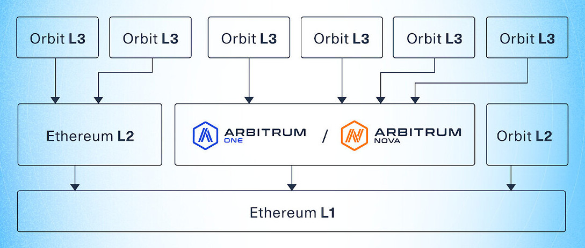

The Arbitrum suite[​](https://docs.arbitrum.io/welcome/get-started#the-arbitrum-suite "Direct link to The Arbitrum suite")
--------------------------------------------------------------------------------------------------------------------------

The Arbitrum suite includes the protocols, chains, services, and SDKs that power the Arbitrum ecosystem:

| Component | Description |
| --- |  --- |
| [Arbitrum Rollup](https://docs.arbitrum.io/how-arbitrum-works/validation-and-proving/rollup-protocol) | A **protocol** for scaling Ethereum smart contracts. |
| --- |  --- |
| [Arbitrum AnyTrust](https://docs.arbitrum.io/how-arbitrum-works/anytrust-protocol) | A **protocol** for scaling Ethereum smart contracts even further, with a mild trust assumption. |
| [Arbitrum Nitro](https://docs.arbitrum.io/how-arbitrum-works/a-gentle-introduction) | The node **software** that codifies the Rollup and AnyTrust protocols. |
| [Arbitrum nodes](https://docs.arbitrum.io/run-arbitrum-node/run-full-node) | **Machines** that run Nitro in order to service and/or interact with an Arbitrum chain. |
| [Arbitrum One](https://portal.arbitrum.io/?chains=arbitrum-one) | A public Rollup **chain**. |
| [Arbitrum Nova](https://portal.arbitrum.io/?chains=arbitrum-nova) | A public AnyTrust **chain**. |
| [Arbitrum bridge](https://bridge.arbitrum.io/) | Lets you move ETH and ERC-20 tokens between Ethereum, Arbitrum, and select Arbitrum (Orbit) chains. |
| [Arbitrum (Orbit) chains](https://orbit.arbitrum.io/) | Lets you run your own Rollup and AnyTrust chains. |
| [Arbitrum Stylus](https://docs.arbitrum.io/stylus/gentle-introduction) | Lets you write EVM-compatible smart contracts in Rust and any other language that compiles to Wasm. |

#### What's an AnyTrust chain?[​](https://docs.arbitrum.io/welcome/arbitrum-gentle-introduction#q-whats-an-anytrust-chain "Direct link to Q: What's an AnyTrust chain?")

An Arbitrum AnyTrust Chain doesn't have the same decentralization / trustlessness / permissionless security guarantees of a Rollup chain, and thus can offer lower fees. Rollup and AnyTrust are similar in many ways, though have one key difference: whereas in Rollup, all data is posted on L1 (which allows anyone to permissionless join as a validator), in AnyTrust, data is managed offchain. In the case of a Challenge, an AnyTrust chain reverts back to "rollup mode"; the security assumption here is that at least 2 of the committee members are honest (i.e., they will provide the data when it's necessary). Keeping the data offchain in the happy/common case means the system can charge the user significantly lower fees. For applications that require high transaction throughput and don't require the full decentralization that rollups provide, AnyTrust could be a sensible tradeoff.

#### Q: So builders can do all the stuff they do on Ethereum on Arbitrum, nice! But can they do *more*?[​](https://docs.arbitrum.io/welcome/arbitrum-gentle-introduction#q-so-builders-can-do-all-the-stuff-they-do-on-ethereum-on-arbitrum-nice-but-can-they-do-more "Direct link to q-so-builders-can-do-all-the-stuff-they-do-on-ethereum-on-arbitrum-nice-but-can-they-do-more")

They can; the latest version of the Arbitrum tech stack, called Stylus, keeps Nitro's Ethereum compatibility, while adding on powerful new features, namely the ability to write highly performant smart contracts in programming languages like Rust, C++, and more. Stylus is currently on public testnet; you can read more about it [here](https://docs.arbitrum.io/stylus/gentle-introduction).

#### Q: So there's more than one Arbitrum chain out there?[​](https://docs.arbitrum.io/welcome/arbitrum-gentle-introduction#q-so-theres-more-than-one-arbitrum-chain-out-there "Direct link to Q: So there's more than one Arbitrum chain out there?")

Yep! The fact that multiple chains can run in parallel is a crucial perk to offchain scaling technology.

Here's a snapshot of the chains running on Arbitrum:

-   On Ethereum mainnet:

    -   ["Arbitrum One"](https://portal.arbitrum.one/): an Arbitrum Rollup Chain operated by the [Arbitrum Foundation](https://arbitrum.foundation/)
    -   ["Nova"](https://nova.arbitrum.io/): an AnyTrust Chain operated by the [Arbitrum Foundation](https://arbitrum.foundation/)
-   On Arbitrum One and Nova:

    -   Various L3 Arbitrum (Orbit) chain
-   On other L2s:

    -   Various L2 Arbitrum (Orbit) chain

    