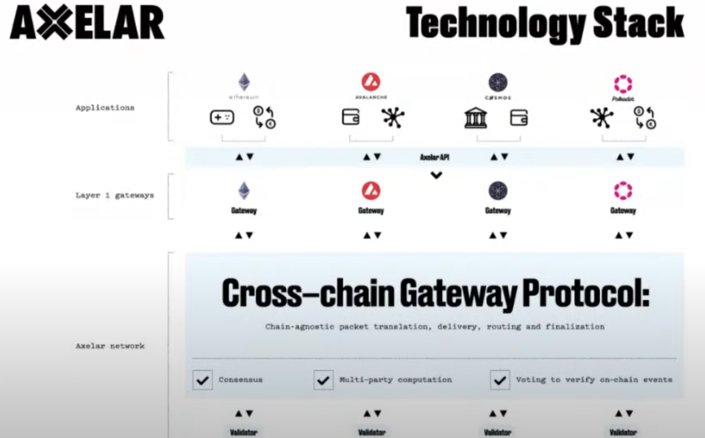

## **Section 1: Overview of Axelar Network**

### **1. What is the Axelar Network, and what problem does it solve?**  
**Answer:**  
Axelar is a **permissionless proof-of-stake (PoS) blockchain** designed to route messages across different blockchains. It solves the challenge of **interoperability** by acting as a decentralized gateway, enabling applications and users to communicate seamlessly across chains without managing cross-chain complexities.

---

### **2. How does Axelar’s cross-chain messaging work?**  
**Answer:**  
- **Gateways:** Smart contracts on each connected chain (e.g., Ethereum, Cosmos) act as entry points for messages.  
- **Validators:** Axelar validators monitor gateways, validate transactions, and use consensus to finalize cross-chain decisions.  
- **Relayers:** Third-party services route validated messages to destination chains.  
- **Gas Handling:** Users pay gas once on the source chain; Axelar automates gas conversion for destination chains.

---

### **3. What role does the Axelar blockchain play in cross-chain communication?**  
**Answer:**  
Axelar’s blockchain serves as:  
- A **routing layer** that translates messages between chains (e.g., Ethereum to Cosmos).  
- A **security layer** via PoS consensus.  
- A **programmable network** enabling features like deposit addresses (e.g., Osmosis’ USDC integration).

---

## **Section 2: Proof-of-Stake (PoS) and Security**

### **4. Why is Axelar built on a PoS model?**  
**Answer:**  
PoS provides:  
- **Decentralization:** Permissionless participation reduces centralization risks.  
- **Security:** Validators stake tokens, aligning incentives with network safety.  
- **Cost Efficiency:** Eliminates energy-intensive mining, reducing operational costs.

---

### **5. How does decentralization improve security in PoS systems?**  
**Answer:**  
Decentralization:  
- **Increases attack costs:** Compromising diverse nodes/geographies is harder.  
- **Enhances liveness:** If some nodes fail, others maintain network operations.  
- **Reduces single points of failure** (e.g., diverse software/hardware setups).

---

### **6. What is the “Nakamoto Coefficient,” and why is it important?**  
**Answer:**  
The Nakamoto Coefficient measures the **minimum number of validators** needed to compromise a network. A higher coefficient indicates **greater decentralization** and security. Axelar aims to maximize this through quadratic voting (see Section 4).

---

## **Section 3: Quadratic Voting (QV)**

### **7. What is quadratic voting, and how does Axelar use it?**  
**Answer:**  
- **Definition:** Voting power = √(stake). For example:  
  - 9% stake → 3 votes.  
  - 4% stake → 2 votes.  
- **Purpose:** Reduces stake concentration by diluting large validators’ influence and boosting smaller ones.

---

### **8. Why is quadratic voting critical for cross-chain security?**  
**Answer:**  
- **Mitigates centralization:** Prevents a few validators from dominating governance.  
- **Improves Nakamoto Coefficient:** Forces attackers to compromise more nodes.  
- **Encourages diverse participation:** Smaller validators gain meaningful voting power.

---

### **9. What are the risks of quadratic voting?**  
**Answer:**  
- **Sybil Attacks:** Attackers could split stake across fake identities to gain votes.  
- **Mitigation:** Axelar uses **key rotation** and validator reputation systems to detect malicious behavior.

---

### **10. How does key rotation enhance security?**  
**Answer:**  
Validators periodically rotate cryptographic keys to:  
- Limit exposure to compromised keys.  
- Disrupt long-term attacks.  
- Freeze suspicious nodes during investigations.

---

## **Section 4: Technical Infrastructure**

### **11. Explain Axelar’s gas payment process for cross-chain transactions.**  
**Answer:**  
1. Users pay gas on the source chain (e.g., Ethereum).  
2. A **gas receiver contract** converts fees into Axelar (AXL) and destination-chain tokens.  
3. Relayers use AXL to pay Axelar validators and destination-chain gas fees automatically.

---

### **12. What is a deposit address, and how does it simplify cross-chain transfers?**  
**Answer:**  
- **Example:** Osmosis users generate an Ethereum-compatible address to receive USDC directly from Coinbase.  
- **Workflow:**  
  1. User sends assets to the deposit address.  
  2. Axelar routes funds to Osmosis without requiring user interaction with Ethereum or Axelar.  
- **Benefits:** Eliminates manual bridging and gas management.

---

### **13. How do Axelar validators interact with external chains?**  
**Answer:**  
Validators run nodes on **all connected chains** (e.g., Ethereum, Avalanche). They:  
- Monitor gateways for incoming transactions.  
- Participate in consensus to validate messages.  
- Sign approvals for cross-chain executions.

---

## **Section 5: Ethereum Merge and Governance**

### **14. How does the Ethereum Merge relate to quadratic voting?**  
**Answer:**  
- The Merge transitioned Ethereum to PoS, aligning its security model with Axelar’s.  
- Both systems prioritize decentralization, making QV a natural fit for governance.

---

### **15. What lessons can PoS chains learn from Axelar’s QV implementation?**  
**Answer:**  
- **Decentralization ≠ token distribution alone:** QV ensures voting power reflects broader participation.  
- **Security requires active governance:** QV mitigates risks of stake concentration.

---

## **Section 6: Validators and Delegation**

### **16. What incentives do Axelar validators have?**  
**Answer:**  
- **Staking rewards:** Earn AXL tokens for processing transactions.  
- **Delegation fees:** Users delegate stakes to validators, sharing rewards.  
- **Reputation:** High-performing validators attract more delegations.

---

### **17. How does Axelar prevent validator collusion?**  
**Answer:**  
- **QV reduces large validators’ influence.**  
- **Key rotation** limits persistent attacks.  
- **Reputation systems** penalize malicious actors.

---

## **Section 7: Use Cases and Partnerships**

### **18. How did Osmosis leverage Axelar’s deposit addresses?**  
**Answer:**  
Osmosis integrated Axelar to let users:  
- Deposit assets (e.g., USDC) directly from centralized exchanges (CEXs) like Coinbase.  
- Avoid Ethereum gas fees and manual bridging.  
- **Result:** Simplified DeFi onboarding for non-technical users.

---

### **19. What industries benefit most from cross-chain interoperability?**  
**Answer:**  
- **DeFi:** Cross-chain lending/borrowing (e.g., Ethereum to Avalanche).  
- **Gaming:** NFT portability across chains.  
- **Enterprise:** Supply chain tracking using multiple ledgers.

---

## **Section 8: Future Developments**

### **20. How might Axelar evolve post-Ethereum Merge?**  
**Answer:**  
- **Enhanced PoS integrations:** Deeper alignment with Ethereum’s security.  
- **Expanded partnerships:** More DeFi protocols adopting deposit addresses.  
- **Governance experiments:** QV-inspired mechanisms for DAOs.

---

### **21. What challenges does Axelar face in scaling cross-chain communication?**  
**Answer:**  
- **Validator coordination:** Ensuring low latency across chains.  
- **Gas optimization:** Reducing costs for high-frequency transactions.  
- **Security audits:** Continuously vetting connected chains’ gateways.

---

## **Section 9: Comparative Analysis**

### **22. How does Axelar differ from other interoperability solutions?**  
**Answer:**  
- **Programmability:** Axelar’s blockchain enables advanced features (e.g., deposit addresses).  
- **Decentralization:** PoS + QV vs. centralized bridges.  
- **Universal compatibility:** Supports EVM, Cosmos, and more.

---

### **23. Why choose Axelar over Layer 2 solutions?**  
**Answer:**  
- **Scope:** Axelar connects independent blockchains; Layer 2s scale a single chain.  
- **Flexibility:** Supports heterogeneous chains (e.g., Ethereum to Cosmos).  
- **Security:** PoS with QV vs. smaller validator sets in some Layer 2s.

---

## **Section 10: Advanced Topics**

### **24. Explain the role of relayers in Axelar’s ecosystem.**  
**Answer:**  
Relayers:  
- Transport messages between Axelar and destination chains.  
- Funded by converted gas fees from users.  
- Operate independently, ensuring redundancy.

---

### **25. How does Axelar handle chain-specific transaction formats?**  
**Answer:**  
- **Translation layer:** Validators convert messages between standards (e.g., Ethereum’s ERC-20 to Cosmos’ IBC).  
- **Network-level programmability:** Axelar’s blockchain automates formatting.

---

### **26. What is the AXL token’s utility?**  
**Answer:**  
- **Staking:** Secure the network and earn rewards.  
- **Governance:** Vote on protocol upgrades.  
- **Gas fees:** Pay for cross-chain transactions.

---

## **Section 11: Governance and Community**

### **27. How does Axelar involve its community in governance?**  
**Answer:**  
- **Quadratic voting:** Balances influence between large and small stakeholders.  
- **Proposal system:** Open submissions for protocol changes.  
- **Delegation:** Users delegate votes to validators.

---

### **28. What real-world governance systems use quadratic voting?**  
**Answer:**  
- **Jersey City and Nashville:** Tested QV for budgeting decisions.  
- **DAOs:** Experimenting with QV to prevent whale dominance.

---

## **Section 12: Security Deep Dive**

### **29. How does Axelar prevent double-spending in cross-chain transfers?**  
**Answer:**  
- **Consensus finality:** Validators confirm transactions irreversibly.  
- **Gateway monitoring:** Detect conflicting transactions.  
- **Slashing:** Penalize validators for malicious behavior.

---

### **30. What is a “sybil attack,” and how does QV mitigate it?**  
**Answer:**  
- **Sybil Attack:** Creating fake identities to gain disproportionate voting power.  
- **Mitigation:** QV’s √(stake) formula makes splitting stake less effective.  

## **Section 13: Cross-Chain Security Model**

### **31. How does Axelar ensure cross-chain message integrity?**  
**Answer:**  
- **Consensus verification:** Validators collectively confirm message validity via PoS.  
- **Cryptographic signatures:** Validators sign off on transactions using rotated key shares.  
- **Replay protection:** Unique identifiers prevent duplicate transactions across chains.

---

### **32. What happens if a validator misbehaves (e.g., approves invalid transactions)?**  
**Answer:**  
- **Slashing:** Malicious validators lose staked AXL tokens.  
- **Reputation loss:** Delegators withdraw stakes, reducing the validator’s influence.  
- **Network freeze:** Key rotation halts until the issue is resolved.

---

## **Section 14: Validator Economics**

### **33. How are Axelar validators compensated?**  
**Answer:**  
- **Block rewards:** AXL tokens for processing transactions.  
- **Delegation fees:** A percentage of staking rewards from delegators.  
- **Cross-chain incentives:** Grants for supporting new chain integrations.

---

### **34. What costs do validators incur?**  
**Answer:**  
- **Infrastructure:** Running nodes on multiple chains (e.g., Ethereum, Cosmos).  
- **Gas fees:** Covering transaction costs on connected chains during relaying.  
- **Security:** Hardware/software for key management and anti-attack measures.

---

## **Section 15: Technical Challenges**

### **35. How does Axelar handle chains with different finality times?**  
**Answer:**  
- **Asynchronous design:** Axelar waits for source-chain finality before processing.  
- **Buffering:** Temporarily stores transactions until confirmations are complete.  
- **Dynamic adjustments:** Adapts to chains with variable block times (e.g., Ethereum vs. Solana).

---

### **36. What are the risks of translating messages between chains?**  
**Answer:**  
- **Format mismatches:** Differences in smart contract languages (e.g., Solidity vs. CosmWasm).  
- **Data corruption:** Errors during encoding/decoding.  
- **Mitigation:** Automated testing and validator audits of translation logic.

---

## **Section 16: Roadmap and Future Plans**

### **37. What upgrades followed the Maeve upgrade?**  
**Answer:**  
- **Quadratic voting:** Implemented to decentralize governance.  
- **Deposit addresses:** Simplified cross-chain transfers (e.g., Osmosis integration).  
- **Key rotation automation:** Enhanced security for validator operations.

---

### **38. How will Axelar leverage Ethereum’s post-Merge capabilities?**  
**Answer:**  
- **MEV resistance:** Align with Ethereum’s PoS security improvements.  
- **Efficiency:** Use Ethereum’s lower energy costs for relayer operations.  
- **Staking synergy:** Integrate Ethereum validators into Axelar’s ecosystem.

---

## **Section 17: Comparisons with Other Protocols**

### **39. How does Axelar differ from Cosmos IBC?**  
**Answer:**  
- **Scope:** IBC connects Cosmos SDK chains; Axelar supports heterogeneous chains (EVM, non-EVM).  
- **Ease of use:** Axelar abstracts gas handling and translation.  
- **Governance:** Axelar uses quadratic voting; Cosmos relies on traditional PoS.

---

### **40. Why choose Axelar over Polkadot’s parachains?**  
**Answer:**  
- **Flexibility:** Axelar doesn’t require chains to adopt a specific framework.  
- **Cost:** No auction fees (vs. Polkadot’s parachain leases).  
- **Speed:** Direct integrations vs. Polkadot’s shared security setup time.

---

## **Section 18: Developer Resources**

### **41. What tools does Axelar offer developers?**  
**Answer:**  
- **APIs/SDKs:** Simplify cross-chain smart contract interactions.  
- **Testnets:** Sandbox environments for debugging.  
- **Documentation:** Guides for deposit addresses, gas management, and QV governance.

---

### **42. How can developers integrate Axelar into their dApps?**  
**Answer:**  
1. Deploy a gateway contract on their native chain.  
2. Use Axelar’s APIs to send/receive messages.  
3. Test with Axelar’s relayer simulator before mainnet deployment.

---

## **Section 19: Community Initiatives**

### **43. How does Axelar engage its community?**  
**Answer:**  
- **Grants program:** Funds projects building cross-chain tools.  
- **Governance participation:** Quadratic voting for protocol upgrades.  
- **Ambassador programs:** Educate users/developers about Axelar’s capabilities.

---

### **44. What educational resources are available?**  
**Answer:**  
- **Blog:** Technical deep dives (e.g., [axelar.network/blog](https://axelar.network/blog)).  
- **Webinars:** Regular updates on upgrades (e.g., Maeve, QV).  
- **GitHub:** Open-source code and contribution guidelines.

---

## **Section 20: Case Studies**

### **45. How did Axelar’s deposit address feature impact Osmosis?**  
**Answer:**  
- **User growth:** Simplified onboarding from CEXs (e.g., Coinbase to Osmosis).  
- **Volume increase:** USDC liquidity rose due to frictionless deposits.  
- **UX praise:** Highlighted as a benchmark for cross-chain DeFi.

---

### **46. Can Axelar support NFT cross-chain transfers?**  
**Answer:**  
Yes!  
- **Example:** Transfer a Bored Ape from Ethereum to Polygon.  
- **Process:** Lock NFT on Ethereum, mint wrapped NFT on Polygon via Axelar.  
- **Use case:** Gaming/metaverse interoperability.

---

## **Section 21: Advanced Security Mechanisms**

### **47. How does Axelar prevent front-running in cross-chain transactions?**  
**Answer:**  
- **Sequencing:** Validators enforce transaction order via consensus.  
- **Fee prioritization:** Users pay higher gas for urgent transactions.  
- **MEV resistance:** Encryption of sensitive transaction details.

---

### **48. What is “key rotation,” and how often does it occur?**  
**Answer:**  
- **Definition:** Periodic replacement of validator signing keys.  
- **Frequency:** Configurable (e.g., weekly/monthly) based on governance.  
- **Purpose:** Limits exposure from compromised keys.

---

## **Section 22: Network Scalability**

### **49. How does Axelar handle high transaction volumes?**  
**Answer:**  
- **Sharding:** Split validation across subnetworks for parallel processing.  
- **Optimized relays:** Batch transactions to reduce gas costs.  
- **Layer 2 integration:** Partner with rollups (e.g., Optimism) for scalability.

---

### **50. What is Axelar’s plan for multi-chain congestion?**  
**Answer:**  
- **Dynamic fees:** Adjust gas costs based on destination-chain demand.  
- **Prioritization:** Critical transactions (e.g., security alerts) skip queues.  
- **Horizontal scaling:** Add more validators to increase throughput.

---

## **Section 23: Regulatory Considerations**

### **51. How does Axelar comply with cross-jurisdictional regulations?**  
**Answer:**  
- **Decentralization:** No single entity controls the network.  
- **Privacy:** Supports encrypted messages for sensitive data.  
- **Transparency:** Public ledger for auditability without exposing user identities.

---

### **52. Can Axelar block transactions from sanctioned addresses?**  
**Answer:**  
- **Design philosophy:** Axelar is neutral and permissionless.  
- **Workaround:** Applications can implement compliance at the smart contract layer.  
- **Example:** A DeFi app could reject transactions from flagged addresses.

---

## **Section 24: User Experience (UX)**

### **53. How does Axelar simplify cross-chain interactions for non-technical users?**  
**Answer:**  
- **One-click deposits:** e.g., Osmosis’ USDC integration.  
- **Auto-gas:** Users pay fees in native tokens; Axelar handles conversions.  
- **Wallet integrations:** MetaMask, Keplr, etc., support Axelar’s features.

---

### **54. What are common user pain points Axelar addresses?**  
**Answer:**  
- **Gas complexity:** No need to hold multiple tokens.  
- **Bridging delays:** Faster finality via PoS consensus.  
- **Security fears:** Decentralized validation reduces bridge hacks.

---

## **Section 25: Final Thoughts**

### **55. What is Axelar’s long-term vision?**  
**Answer:**  
- **Internet of blockchains:** Frictionless communication between all chains.  
- **Democratized access:** Let users interact with any chain from their preferred app.  
- **Governance innovation:** Pioneer models like QV for decentralized coordination.

