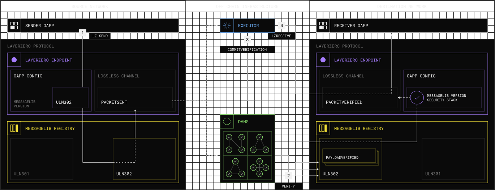

Send

Sender Contract
Onchain / Source

A user calls the 'lzSend' method inside the Sender OApp Contract, specifying a message, a destination LayerZero Endpoint, the destination OApp address, and other protocol handling options.
LayerZero Endpoint
Onchain / Source

The source Endpoint generates a packet based on the Sender OApp's message data, assigning each packet a unique, sequentially increasing number (i.e. nonce).
MessageLib Registry
Onchain / Source

The Endpoint encodes the packet using the OApp's specified MessageLib to emit the message to the selected Security Stack and Executor, completing the send transaction with a PacketSent event.

Verify

DVNs
Offchain

The configured DVNs, each using unique verification methods, independently verify the message. The destination MessageLib enforces that only the DVNs configured by the OApp can submit a verification.

Commit

Message Library
Onchain / DESTINATION

Once all of the DVNs in the OApp's Security Stack have verified the message, the destination MessageLib marks the message as verifiable.

Executor
Offchain

The Executor commits this packet's verification to the Endpoint, staging the packet for execution in the Destination Endpoint.

Receive

LayerZero Endpoint
Onchain / DESTINATION

The Destination Endpoint enforces that the packet being delivered by the Executor matches the message verified by the DVNs.

Executor
Offchain

An Executor calls the 'lzReceive' function on the committed message to process the packet using the Receiver OApp's logic.

Receiver Contract
Onchain / DESTINATION

The message is received by the Receiver OApp Contract on the destination chain.