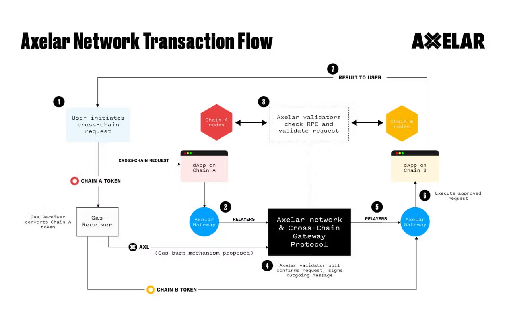

Understanding Axelar
====================

-   Axelar is more than a bridge: it offers the ability to program cross-chain logic and pass arbitrary data.
-   The upcoming Axelar VM will allow the permissionless connection of new chains.
-   Axelar's Interchain Token Service is in testnet, which supports cross-chain transfers of native tokens rather than wrapped ones.
-   Updated tokenomics have been proposed for AXL. They would allow the network to sustainably support more chains by decreasing the rate of token inflation per added chain.
-   As of this writing, 10 of the top 15 Axelar chains by activity are EVM-based. Axelar is focused on onboarding even more EVM and Ethereum-based chains.

---

The fragmentation of liquidity, services, and users creates [friction](https://axelar.network/blog/axelar-virtual-machine-future-of-interoperability) across ecosystems and sovereign networks. Axelar's technology aims to allow cross-chain functions that are more complex than simply transferring wrapped assets to different blockchains. Axelar addresses this by focusing on full-stack interoperability --- with full-stack meaning that Axelar not only supports bridging any information/asset but also permissionless [overlay](https://axelar.network/blog/how-overlay-networks-could-change-web3) programmability, executing smart contracts, and dApps across networks.

The Axelar community is working to scale the number of connected networks (55 at the time of publication) through a three-pronged approach: adjusting the network's economic structure, releasing the Axelar Virtual Machine to support permissionless connections, and exploring more efficient solutions like light clients. These initiatives aim to connect Axelar to hundreds of chains.

--------

Technology
----------

Axelar has three components:

-   A decentralized network. This is built primarily on open-source Cosmos technologies.
-   A set of gateway smart contracts that provide the connectivity between the Axelar network and its interconnected external chains.
-   A software development kit (SDK) of developer tools and APIs, including [Axelarscan](https://axelarscan.io/), a block explorer used to track cross-chain transactions.

### Network Architecture

The [Axelar network](https://axelar.network/blog/an-introduction-to-the-axelar-network) is built using the [Cosmos SDK](https://v1.cosmos.network/sdk), CometBFT, and CosmWasm VM. The [Cosmos SDK](https://docs.cosmos.network/main) is an open-source software development kit (SDK) for building sovereign, multi-asset, public, PoS blockchains. It's used to build a custom application layer, or state machine, while CometBFT is used to securely replicate that state machine on all nodes in the network. CometBFT, an application-agnostic engine, handles the networking and consensus layers through two main components:

-   A consensus algorithm, i.e., Tendermint.
-   A socket protocol, i.e., the [Application Blockchain Interface](https://cosmos-network.gitbooks.io/cosmos-academy/content/cosmos-for-developers/tendermint/abci-protocol.html) (ABCI).

Tendermint is used to validate requests on the source chain and confirm changes on the destination chain. Tendermint consensus provides instant finality and Byzantine fault tolerance. While this specific consensus approach only verifies cross-chain communication, Axelar can connect diverse forms of consensus. For example, Axelar is one of a few cross-chain protocols able to connect EVM and Cosmos chains.

#### Consensus & Security Approaches

Axelar's network uses a **Delegated Proof-of-Stake (DPoS)** consensus mechanism. Validators produce new blocks, participate in multiparty signing, and vote on external chain states. Tokenholders stake AXL by delegating tokens to a validator's staking pool. Only the top 75 validators are in the active set, a parameter that can be adjusted through onchain governance. Both delegating to validators and running a validator are permissionless.

Every PoS consensus mechanism runs the risk of concentrating voting power among a few dominant stakers. Axelar mitigates this risk with [quadratic voting](https://www.mdpi.com/2078-2489/13/6/305/htm) for its consensus mechanism. With quadratic voting, voting power does not increase linearly with stake. For Axelar validators to increase their voting power, they must increase their delegated stake exponentially.

In addition, Axelar applies network functions that enable the suspension of traffic from malicious interconnected chains and contract limits that cap how much can be transferred over a time period. The efficacy of these functions is improved by Axelar's hub-and-spoke network topology. During the [Multichain collapse](https://axelar.network/blog/hub-and-spoke-architecture), cross-chain swap services built using Axelar were able to stay safe and liquid by isolating compromised connections.

----

### Axelar Virtual Machine

The introduction of the [Axelar Virtual Machine](https://axelar.network/blog/axelar-virtual-machine-future-of-interoperability) (AVM) expands Axelar's offering from bridging and message passing to a fully programmable cross-chain layer. It enables developers to deploy smart contracts on Axelar and build cross-chain developer tooling. Smart contracts can help reduce developer overhead and simply UX by abstracting away cross-chain tasks, such as token conversions. Developers can deploy contracts on the AVM written in any language that compiles to WebAssembly (Wasm). In addition, AVM is expected to play a key role in the tokenomics of the Axelar native token, AXL. Axelar's token is designed to scale the network across an anticipated proliferation of Ethereum-based L2 blockchains (see more in the AXL Token section below).

#### Interchain Token Service

[ITS](https://axelar.network/its) is a service [designed](https://axelar.network/blog/what-is-interchain-token-service) to preserve the fungibility and custom functionality of native tokens across multiple blockchains. These preserved tokens are known as Interchain Tokens. This would be a familiar feature to anyone aware of LayerZero's Omnichain Fungible Tokens and IBC-connected networks that use [Interchain Accounts](https://blog.pstake.finance/2022/10/18/interchain-accounts-queries-a-new-chapter-for-liquid-staking-in-cosmos/) (ICA) and [Interchain Queries](https://blog.pstake.finance/2022/10/18/interchain-accounts-queries-a-new-chapter-for-liquid-staking-in-cosmos/) (ICQ).

Unlike these alternatives, Axelar ITS supports canonical wrappers and standardized tokens; these features enable one-click deployments across multiple chains. ITS also offers native support for arbitrary data and fast-finality gadgets.

With ITS, developers can deploy Interchain Tokens on multiple chains at once and automate tasks, such as managing supply. Interchain Tokens are backed by the security protocols of the Axelar network and can operate on any EVM-compatible chain connected to Axelar's network.

#### Interchain Amplifier

Once launched, Interchain Amplifier will enable developers to permissionlessly connect new blockchains to the Axelar network. This benefits new ecosystems, such as modular blockchains building on Ethereum, as well as dApps that wish to customize cross-chain flows.

#### Interchain Maestro

Interchain Maestro is a set of orchestration contracts and templates to assist in designing, deploying, and managing dApps across multiple chains. It is similar to Kubernetes. ITS is a single component of the broader Interchain Maestro.

### Axelar is an Overlay Network

The internet, like the crypto space, is composed of diverse networks. Protocols, [BGP](https://www.cloudflare.com/learning/security/glossary/what-is-bgp/) and [HTTP](https://www.cloudflare.com/learning/ddos/glossary/hypertext-transfer-protocol-http/), make it possible for these diverse networks to communicate on a best-efforts basis: without guarantees, improvements, or added functionality. [Overlay networks](https://people.cs.umass.edu/~ramesh/Site/PUBLICATIONS_files/overlays-chapter.pdf) are networks that are built on top of existing networks to provide a richer and more seamless level of service. Examples of overlay networks include Akamai and Cloudflare.

Axelar can be thought of as an [overlay network for blockchains](https://axelar.network/blog/how-overlay-networks-could-change-web3). It employs various cross-chain communication protocols and smart contract logic to facilitate its connectivity and interoperability.

#### General Message Passing

Since [launching to mainnet](https://twitter.com/axelarnetwork/status/1522267693998653440) in May 2022, [General Message Passing](https://axelar.network/blog/general-message-passing-and-how-can-it-change-web3) (GMP) has allowed Axelar-connected applications to move any payload cross-chain, including function calls and other logic. GMP uses Axelar's validator set for security and a decentralized protocol for routing and translation. Unlike basic [cross-chain bridges](https://axelar.network/blog/how-to-bridge-into-cosmos-transferring-stablecoins-from-polygon-to-osmosis), it supports the secure transfer of arbitrary data, including function calls enabling composable liquidity and computing across blockchains. For example, an application can bridge tokens along with instructions to deposit them in a contract or swap them on a DEX, delivering one-click UX, regardless of blockchain boundaries.

#### Cross-Chain Gateway Protocol

The Cross-Chain Gateway Protocol (CGP) operates like the internet's [Border Gateway Protocol](https://www.cloudflare.com/learning/security/glossary/what-is-bgp/) (BGP). BGP is essentially a relay center designed to securely pass data among internet networks, the way a post office sorts and delivers mail. In the same way, Axelar's CGP has two critical functions: state synchronization and asset transfers.

#### Cross-Chain Transfer Protocol

The Cross-Chain Transfer Protocol (CTP) is similar to the Hypertext Transfer Protocol (HTTP) on the Internet. It's an application-level, file-transferring mechanism that sits atop the CGP. CTP allows dApps to interact with various blockchains, enabling the transfer of assets and arbitrary messages across chains.

The AXL Token
-------------

The [AXL](https://messari.io/project/axelar) utility token serves the following functions for the Axelar network:

-   Paying transaction fees on Axelar. This includes fees for services built atop Axelar's programmable interoperability layer, like developer automation, cross-chain gas conversions, and fast-finality gadgets.
-   Paying transaction fees on connected networks. AXL tokens can be automatically [converted](https://docs.axelar.dev/dev/reference/pricing) into the necessary gas tokens for connected chains.
-   Staking or delegating to participate in consensus and rewarding consensus participants.
-   Voting on governance proposals.

The token was launched in 2022 to make Axelar's network permissionless. AXL had an initial supply of 1 billion, which will finish vesting in 2026. [Release schedules](https://medium.com/@axelar-foundation/an-overview-of-axl-token-economics-4dc701c9054d) for the team, company, backers, and community programs began three months after the token launch; community sale token release began earlier, on an accelerated schedule.

Due to the issuance of staking rewards, AXL is inflationary. However, this may change as new tokenomics models have been proposed.

### New Tokenomics

The [proposed new AXL tokenomics](https://community.axelar.network/t/adjusting-axelar-network-incentives-a-proposal-to-scale-to-thousands-of-chains-call-for-comments/2515) introduces a series of changes to improve AXL utility and value capture as the Axelar network scales. In the long run, these changes could make AXL overall deflationary with increased activity from new chains. The changes include adding a step to the process flow, where gas is burned between the Gas Receiver and the network.

#### Flow: Gas Receiver converts native tokens to AXL

#### Reducing Inflation Rate

Until recently, Axelar validators were incentivized to support more chain connections by increasing rewards linearly by 0.75% with each externally supported chain (e.g., EVM chains). This implied a total inflation rate of 11.5% (1% base inflation + 14 externally supported chains at 0.75% each).

In October, new AXL tokenomics were proposed to gradually reduce the per-chain reward from 0.75% to 0.3%. The proposal was approved via onchain vote and effected incrementally, with the final leg [locked in on Dec. 8, 2023](https://twitter.com/Axl_Foundation/status/1734338927215947825). This would bring annual inflation down from 11.5% to 5.2%, based on an equivalent number of chains. Since the proposal post was published, two new chains (Scroll, followed by Centrifuge) have been added, bringing Axelar's current inflation rate to 5.8%.

#### Gas-Burning Mechanism

Currently, gas fees paid in AXL are distributed to validators and stakers. Axelar Foundation's proposal would instead burn these fees, applying deflationary pressure to the total supply. This variable supply pressure could turn the network deflationary with enough activity.

#### Increased Demand from New-Chain Connections

Currently, connecting new chains to the Axelar network is a complex process. It requires both support from Axelar developers and a vote of Axelar validators. Axelar is developing a more permissionless path that is non-inflationary and may generate buy pressure for the AXL token.

Once fully developed, Interchain Amplifier will allow developers to instantiate a series of smart contract templates to plug a new chain into the Axelar network. This largely automated process will include a way to bootstrap validator incentives by setting up AXL-funded reward pools for early-stage validator rewards. These AXL-funded reward pools will be necessary for new chains, except those that already have large transaction volumes with fees that can be routed to validators in lieu of rewards.

With Ethereum-based infrastructure like dAppchain ecosystems and tools like Rollups-as-a-Service, it will become easier to launch new L2 blockchains on Ethereum. Axelar is positioning itself for expected growth in this category as the permissionless connectivity component. If the L2 category expands and the strategy is successful, it could become a significant driver of AXL demand.

State of the Axelar Ecosystem
-----------------------------

### Connected Ecosystems

Axelar is known for its connectivity within and between the [Cosmos and Ethereum](https://axelar.network/blog/axelar-general-message-passing-now-connects-the-cosmos-and-all-evm-chains) ecosystems. However, it also has the capability to connect with unique VMs and consensus mechanisms. Axelar has 55 [connected](https://axelar.network/ecosystem#ecosystem-chains) chains at the time of writing, including Arbitrum, Avalanche, Base, BNB Chain, Ethereum, Optimism, Polkadot, Polygon, Scroll, Sui, and a variety of Cosmos-based chains. Additionally, connections to one chain in a multichain ecosystem grant users access to the whole ecosystem, albeit not directly. For example, a connection to Avalanche provides a secure path to subnets, while a connection to Polkadot provides a secure path to parachains, and so on.

At the time of this report's publication, Polygon, Avalanche, and Osmosis are the top 30-day source and destination chains; and AXL, ETH, and USDC are the top assets, according to [Axelarscan](https://axelarscan.io/). EVM users are particularly active on Axelar, with 10 of the top 15 chains by activity being EVM-based.

#### Ethereum Ecosystem

Ethereum's [rollup-centric](https://ethereum-magicians.org/t/a-rollup-centric-ethereum-roadmap/4698) roadmap is still in the early stages, with [new](https://l2beat.com/scaling/summary) rollups and rollup development kits being announced and released regularly. Ethereum [modularity](https://messari.io/report/the-modular-blockchain-landscape) will potentially see hundreds of L2 and L3 networks. Without full-stack [interoperability](https://axelar.network/blog/layer-2-interoperability) between L2s, UX and developer capabilities will suffer from the fragmentation of liquidity and users. Full-stack interoperability consists of both bridging any information/asset and permissionless overlay message passing. The Axelar network satisfies both of those criteria with its existing communication protocols and its new AVM.

#### Cosmos Ecosystem

Axelar is the source of the majority of cross-chain activity on Osmosis, the largest Cosmos DEX by volume. Community members have even [explored](https://messari.io/intel/event/3f8a66d8-6c9b-42e2-8696-3b179820edba) forms of shared security between the two networks due to their symbiotic relationship. One of these ideas is [Mesh Security](https://osmosis.zone/blog/mesh-security-initiative-announcement), a bi-directional security leveraging both networks' validator sets. While it may only be a concept, there are other ecosystem collaborations already taking place. A portion of AXL tokens was [airdropped](https://messari.io/intel/event/1aaea6e6-c3ee-4d0a-a50a-b390de2aeef0) to Osmosis users in early 2023.

#### Applications Using Axelar

Axelar is already integrated and being leveraged by a diverse set of applications and services:

-   DeFi: dYdX, Frax Finance, Lido, PancakeSwap, Uniswap
-   Enterprise: Mastercard, Microsoft, Onyx by J.P. Morgan
-   RWAs: Centrifuge, Circle, Ondo Finance, Provenance
-   Wallets: Blockchain.com, Ledger, MetaMask, TrustWallet

### Cross-Chain Use Cases

Axelar's Gateway smart contracts allow for cross-chain token transfer -- i.e., bridging using wrapped tokens. Until recently, this was the top use case for Axelar by far. In September 2023, for the first time, GMP usage surpassed basic bridging in both transaction count and notional volume. GMP has remained ahead of basic bridge uses since.

As of this writing, Axelar has executed over 1 million transactions with a cumulative volume nearing $7 billion.

#### Intents: Squid & MetaMask

[Squid](https://www.squidrouter.com/) is an Axelar-based liquidity router that uses GMP to enable cross-chain swaps and bridging. Recently, it implemented a feature called GMP Boost, enabling fast finality. Normal cross-chain transactions often take several minutes, as bridges wait for transaction finality on one chain before taking an action (such as minting a wrapped token) on another. Essentially, GMP Boost allows dApps like Squid to deliver the desired asset in seconds, taking on the risk of a chain reorg in exchange for a small fee.

Using an offchain path to achieve an onchain outcome is an innovative [application](https://axelar.network/blog/cross-chain-intents) of [intents](https://www.youtube.com/watch?v=G0nFyq9DDPw&t=1206s). Unlike standard transactions, which are [imperative](https://stackoverflow.com/questions/1784664/what-is-the-difference-between-declarative-and-imperative-paradigm-in-programmin) and explicitly outline all steps, intents are declarative and instead focus on the achieved outcome.

#### Cross-Chain Governance: Filecoin & Uniswap

Uniswap was first built on Ethereum and has since expanded to multiple chains. This makes it difficult to deploy updates beyond Ethereum. After selecting Axelar as one of two interoperability platforms qualified to support upgrades cross-chain, Uniswap [used Axelar](https://axelar.network/blog/uniswap-filecoin-bridge-cross-chain-governance) to deploy on Filecoin's smart contract blockchain, Filecoin Virtual Machine (FVM).

#### Real-World Assets (RWAs): J.P. Morgan & Provenance

Onyx by J.P. Morgan [recently announced](https://www.businesswire.com/news/home/20231114571641/en/Onyx-by-J.P.-Morgan-and-Apollo-Explore-Tokenization-in-Investment-Portfolios-Across-Blockchains-as-Part-of-Project-Guardian) a proof-of-concept in which Axelar was used to connect Apollo funds tokenized on the Provenance blockchain with the Onyx Digital Assets blockchain, where Onyx applied logic used to automate portfolio rebalancing.

#### DeFi Onramps: dYdX & Squid

At the time of this writing, dYdX is rolling out its V4, built on a dedicated appchain. The largest perp-swap DEX by volume, dYdX, is [using Axelar and Squid](https://axelar.network/blog/dydx-v4-bridge) to facilitate streamlined deposits from any connected chain.

#### Connecting Traditional Tech

Axelar and Microsoft [announced](https://www.businesswire.com/news/home/20230711669103/en/Axelar-and-Microsoft-Partner-for-a-More-Integrated-and-Intelligent-Web3) in 2023 a collaboration to integrate Axelar as an interoperability provider in Microsoft's Azure Marketplace. Doing so enabled companies using Azure to connect seamlessly with crypto applications, protocols, and blockchains.

Roadmap
-------

A [proposal](https://community.axelar.network/t/adjusting-axelar-network-incentives-a-proposal-to-scale-to-thousands-of-chains-call-for-comments/2515) has been presented to scale Axelar from dozens to hundreds or even thousands of chains. L2 and modular Ethereum networks are a large focus of this strategy. The proposal features a short, medium, and long-term strategy for scaling.

The short-term strategy was explored in the AXL Token section above. It aims to both reduce the rate of inflation as new external chains are added and increase deflationary pressure by burning transaction fees.

The medium-term strategy is based on the Axelar VM. The AVM will allow permissionless connection of new chains. AVM-enabled features, such as the Interchain Amplifier, can automate much of the technical overhead that new-chain connections require. Unlike the current system of increasing inflation to incentivize validators to support new chains, third-party sources can pool AXL to directly fund supporting validators.

The long-term strategy is all about light clients. Given that they are also connected to the Interchain Amplifier, light clients would eliminate the need for external validators. Only relayers would need to be incentivized, as packets would still need to be relayed.

Competitive Landscape
---------------------

Many protocols and teams are focused on interoperability, but most of them are looking at it with a more limited scope. Axelar's full-stack interoperability bridges any information/asset, arbitrary data (GMP), and permissionless overlay message passing (programmability). Most interoperability solutions are essentially bridges, capable of transmitting only wrapped assets. There are other interoperability solutions that can transmit arbitrary data. But very few, besides Axelar, have a function like overlay networks, which provides the ability to program cross-chain logic into the cross-chain environment.

LayerZero and Chainlink are two prominent competing cross-chain networks. LayerZero's Omnichain Fungible Tokens (OFT) and Chainlink's Cross-Chain Interoperability Protocol (CCIP) are analogous to Axelar's various cross-chain protocols and ITS in many ways. That said, one of the main differences between Axelar and both of these solutions is Axelar's permissionless validator set. It uses this set to facilitate interchain messaging instead of a multisig.

Among other interoperability solutions that use decentralized validator sets, Axelar validators may choose which chains they support. This allows for a more diverse validator set supporting Axelar's security model, as distinct ideological niches can form to support certain networks. Enforcing validation from the entire validator set is not inherently better or worse, but it can decrease participation from opinionated operators who have their own agendas, potentially limiting scalability. Axelar has more validators (75 at this writing) than any other cross-chain network.

### LayerZero

[LayerZero](https://messari.io/report/inside-layerzero-s-usd120m-series-b-raise-how-the-cross-chain-protocol-is-driving-growth) allows for flexible and customized configurations with oracles and relayers, but ultimately operates on a 2-of-2 multisig of those two offchain entities (oracles and relayers). Axelar, on the other hand, has an entire validator set already built out to sit between chains and secure interchain messages. LayerZero's [default configuration](https://layerzero.gitbook.io/docs/technical-reference/testnet/default-config) relies on an oracle managed by Google and a relayer operated by LayerZero Labs. Protocols can specify a custom validation library, oracle, and relayer, which makes the decentralization dependent on the specific implementation. More trust is placed in these standard configurations of oracles and relayers than in individual Axelar validators, as two-thirds of the voting majority is required to verify Axelar messages.

Closing Summary
---------------

Axelar continues to distance itself from classical bridges as it adds new features for cross-chain programmability. The upcoming Axelar VM will be at the heart of many of these new features, such as Interchain Token Service. Other features and connections will be permissionlessly built by chains wishing to leverage the cross-chain capabilities.

The development of the Axelar VM and Interchain services will complement Axelar's existing general messaging and transfer protocols, but another upcoming change deals with the economics of the ecosystem. The AXL token has several proposed changes to economically position the network to accommodate tens, hundreds, or even thousands of new networks. Modular roadmaps, such as Ethereum's, are presenting the need for such a scale of connectivity.