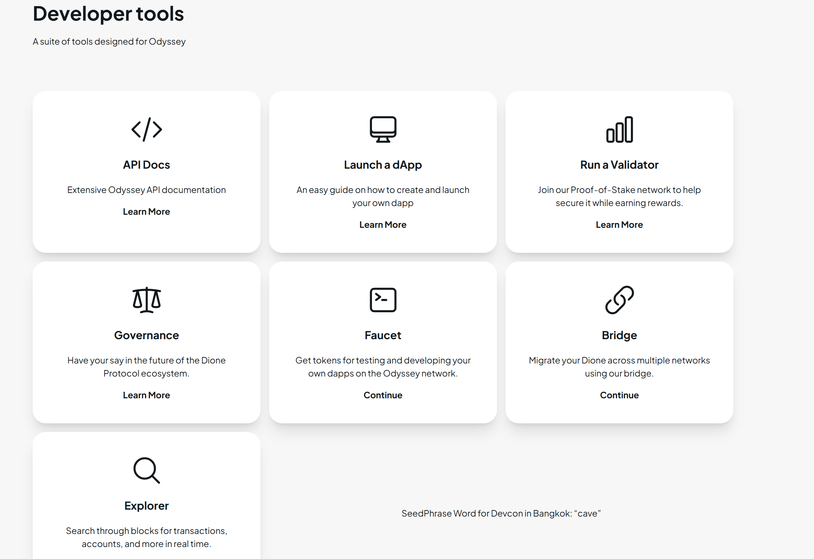

[D:\Work\Learning\awesome-blockchain](https://www.dioneprotocol.com/)

At Dione, our mission is to revolutionize the way we interact with technology and the environment. In a world that is increasingly reliant on digital technology, the demand for more efficient, secure, and sustainable solutions is greater than ever. We believe that blockchain technology, powered by green energy, holds the key to unlocking a brighter future for everyone.

Introduction to Odyssey

The crypto industry has experienced a significant trend shift in the last few years, where institutional adoption has grown exponentially. However, the overall industry faces several limitations that the Odyssey blockchain aims to address

Odyssey's architecture utilizes a core system of three interconnected blockchains. Each blockchain addresses a distinct function within the ecosystem, including asset creation and trading, smart contract implementation, and facilitating interactions between infi-nets and validators.

Odyssey is a heterogeneous network of blockchains. As opposed to homogeneous networks, where all applications reside in the same chain, heterogeneous networks allow separate chains to be created for different applications.

In contrast to homogeneous networks where all applications inhabit a single chain, Odyssey leverages a heterogeneous approach. This enables the creation of dedicated blockchains tailored to specific applications, enhancing efficiency and scalability.

The Primary Network serves as a central Subnet housing all validators, including those supporting custom Subnets. Participation as a Primary Network validator necessitates staking DIONE coins and fulfilling the outlined [minimum requirements](https://www.dioneprotocol.com/odyssey/staking)

Infi-nets

Infi-Nets are an extension of our core architecture and play a pivotal role in handling increased network usage and customized requirements that vary from one business to another. They also facilitate a more modularized architecture and hence, provide a greater degree of scalability.

The Parent Network of the Odyssey Chain is an Infi-Net that consists of the following blockchains - the "DAO":

D

**Delta Chain**

Runs the EVM and all the contracts written in Solidity run on this chain. It is also meant to improve developer onboarding by enabling developers to launch EVM-compatible dApps on this network.

A

**Alpha Chain**

Responsible for the issuance and exchange of Dione coins and other digital assets. This network supports the creation of new tokens, NFTs, stablecoins, and more.

O

**Omega Chain**

Serves as a platform for launching and customizing Infi-Nets, and blockchains and enables developers to create their own unique rules and logic.

