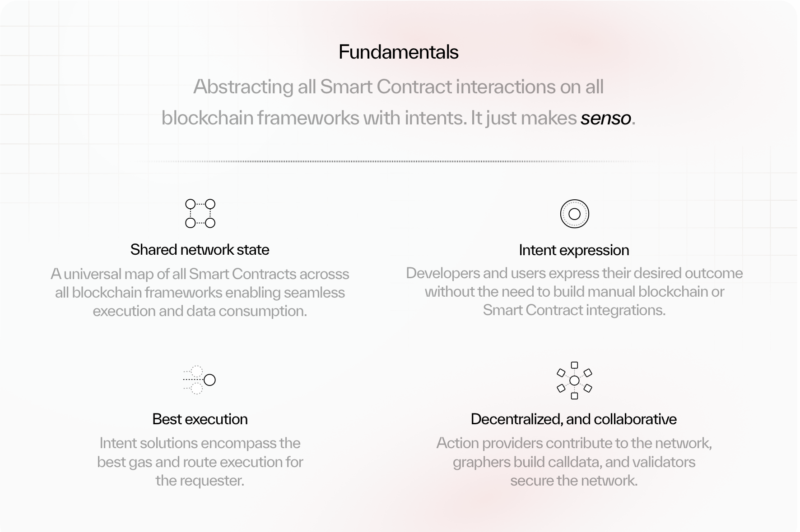

# Network Intro

[Get Started Building (enso.finance)](https://api-docs.enso.finance/)

[EnsoFinance on X: "1/ Intents are not real without the intent engine. Today, we introduce the Enso Intent Engine - the world's first fully decentralized shared network state for building transactable data across all blockchain frameworks. Bringing an intent-centric future to reality 🧵 https://t.co/nagTVPWuHC" / X](https://x.com/EnsoFinance/status/1795499192674353267)

Introduction to the Enso Network.

## 

[​](https://docs.enso.finance/content/get-started/network-intro#overview)

Overview

Enso is the connectivity layer of crypto. Connecting all ecosystems within one network, enabling application developers and users to express their desired outcome as an intent, allowing truly composable applications to be built without the necessity of building manual integrations.

##   
Shared Network State

Each individual blockchain framework stores individual state data, which is not shared across other blockchain frameworks. For example, if Aave is deployed on Ethereum mainnet and not on Arbitrum, then the state data of Aave on Ethereum mainnet is not shared with Aave on Arbitrum or accessible. Resulting in developers building manual integrations for each blockchain framework, and smart contract.

The Enso Network stores all data required for execution, and data fetching for each smart contract on each framework. In the above example for Aave, Aave is represented as an entity in the graph, and the relevant ChainIDs associated to associate the blockchains that Aave is deployed on. Particular data such as function signatures, inputs, outputs, validation, and getters for state validation are added within the Aave entity.

The underlying action that within the protocol entity is identified as an action type, such as:  `Lend`,  `Borrow`,  `Swap`,  `NFT`,  `Transfer`,  `Approve`,  `Deposit`,  `Repay`, and many more. By having each action type identified, consumption can be easily done, and developers are able to embed more smart contract types into their applications. For example, a LLM wishes to do data harvesting and analysis across all lending protocols, they can easily consume the  `Lend`  action type from the Enso Network.

## Consumption

By having a shared network state aware of all information across all blockchain frameworks, developers can now simply express their disired outcome as an  `intent`  request. An  `intent`  reuqest does not explicitly need to be for only one usecase, it can encompass multiple smart contract interaction types across multiple blockchain frameworks. The Enso Network participants will then build a solution to the request and return the solution to the consumer

# Use Cases

Potential use cases.

## 

[​](https://docs.enso.finance/content/get-started/use-cases#overview)

Overview

The Enso network builds transactable data used for execution, and can also be consumed for fetching data for an associated smart contract on any blockchain framework. It is the all seeing, and aware network.

**You can build however, wherever, and whatever using Enso.**

### 

[​](https://docs.enso.finance/content/get-started/use-cases#data)

Data

Below are a few examples of products we see being built consuming only data on the Enso Network:

-   DeFi metadata API
-   NFT metadata API
-   Large language models for data harvesting and analysis
-   Smart contract interaction data analytics
-   Google maps for smart contracts
-   Interpretation and contexualization of onchain information
-   and many more…

### 

[​](https://docs.enso.finance/content/get-started/use-cases#transactable-data)

Transactable data

Below are a few examples of products we see being built consuming only for transactable data on the Enso Network:

-   AI execution bot to act on a consumers behalf
-   Smart contract interaction automation
-   DePIN consolidation
-   Swap aggregator
-   Lending aggregator
-   NFT aggregator
-   Cross chain bridge aggregator
-   and many more…

It should be made aware as all smart contracts, and their relationships with each other are available for consumption through the Enso network, the types of applications that can be built on Enso are limitless, and future proof. If a new innovative primitive of blockchain technology is released, it can be easily integrated into the Enso network, and consumed by developers.

# 

[​](https://docs.enso.finance/content/get-started/use-cases#support)

Support

At Enso we want to support all developers that are building on the Enso Network. If you have an incredibly innovative idea, or need help building on the Enso Network you can join our dedicated telegram channel where we can assist in any questions, and even offer grants to help build. We are here to support you, and your vision.

# Graphers

Individuals who build algorithms to solve consumer requests on the Enso Network

Graphers build algorithms to solve consumer requests by combining smart contract abstractions into executable bytecode. They continuously seek optimal solutions, as only the best one is selected for execution. Graphers work with validators and action providers to ensure solution accuracy and validity, maintaining a comprehensive map of smart contract interactions across blockchains.

## 

[​](https://docs.enso.finance/content/network-participants/graphers#function-and-role)

Function and Role

Graphers use abstractions provided by action providers to create pathways that fulfill consumer intents. This simplifies blockchain interactions by focusing on desired outcomes rather than specific steps.

## 

[​](https://docs.enso.finance/content/network-participants/graphers#incentives-and-rewards)

Incentives and Rewards

Graphers participate in a competitive environment where they are rewarded for providing the best solution. They earn a share of consumption fees, which motivates them to optimize their algorithms. In this competitive setup, Graphers can capture value by delivering the best result while also securing a piece of the reward for themselves, similar to how solvers operate.

## 

[​](https://docs.enso.finance/content/network-participants/graphers#conclusion)

Conclusion

Graphers are crucial to the Enso network, simplifying blockchain interactions and enabling developers to engage with decentralized applications across multiple blockchains. Their contributions enhance the network’s usability and efficiency.

# Action Providers

Developers who publish smart contract abstractions on the Enso Network

Action providers are developers who publish smart contract abstractions on the Enso Network. These abstractions are used by Graphers to build algorithms that solve consumer requests. Action providers are incentivized to create high-quality abstractions that are secure, efficient, and easy to use.

## 

[​](https://docs.enso.finance/content/network-participants/action-providers#function-and-role)

Function and Role

Developers contribute smart contract abstractions to the Enso network, enabling Graphers to construct pathways that fulfill consumer intents. These pre-defined modules describe interactions with specific smart contracts, simplifying blockchain interactions for end users.

## 

[​](https://docs.enso.finance/content/network-participants/action-providers#incentives-and-rewards)

Incentives and Rewards

Developers earn rewards based on the usage of their abstractions. Whenever their contributions are used in solutions generated by Graphers, they receive a share of the fees. This system incentivizes the creation of robust, secure, and efficient abstractions.

## 

[​](https://docs.enso.finance/content/network-participants/action-providers#conclusion)

Conclusion

Action providers are crucial to the Enso network, supplying essential building blocks for Graphers. Their contributions enhance the functionality, security, and efficiency of the network, supporting a wide range of decentralized applications across multiple blockchains.

# Validators

Participants who secure the Enso Network by validating solutions and maintaining integrity

## 

[​](https://docs.enso.finance/content/network-participants/validators#overview)

Overview

Validators secure the Enso network by accepting valid consumer requests, authenticating abstractions contributed, and determining the winning solution provided by the Graphers.## Function and Role

## 

[​](https://docs.enso.finance/content/network-participants/validators#incentives-and-rewards)

Incentives and Rewards

Validators earn rewards for their essential work in securing the network and validating solutions. They receive a portion of the network fees, which incentivizes them to perform their duties accurately and efficiently. In this competitive environment, validators strive to quickly authenticate and validate the best solutions to maximize their earnings.

## 

[​](https://docs.enso.finance/content/network-participants/validators#conclusion)

Conclusion

Validators are key to the Enso network, ensuring that the solutions generated by Graphers are accurate, secure, and reliable. Their work upholds the network’s integrity, making it a trustworthy platform for decentralized applications across multiple blockchains.