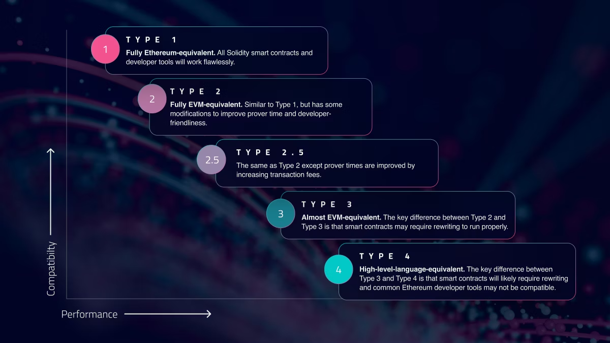
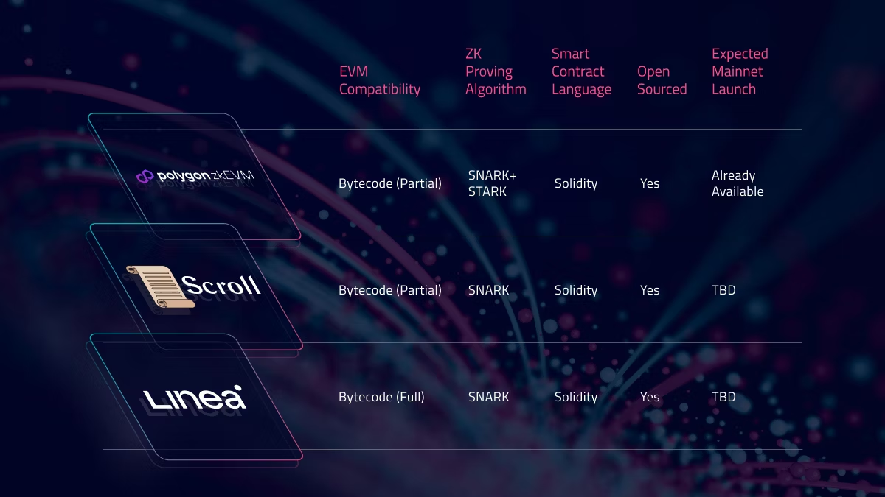

# Linea: A New Ethereum Layer 2 Solution

## Introduction

- **Developer**: Consensys (company behind Metamask, Infura, and Truffle)
- **Launch**: Mainnet launched last month after successful testnet phase
- **Testnet participation**: Over 5.5 million unique wallets
- **Ecosystem support**: Linea Ecosystem Investment Alliance established with over 30 VC firms

## What is Linea?

- Ethereum-equivalent zkEVM Layer 2 rollup
- Addresses Ethereum's scaling challenges
- Competes with:
  - Optimistic rollups (e.g., Arbitrum, Optimism)
  - Zk-rollups (e.g., ZkSync, Starknet)

### Comparison with Other Rollups

1. **Optimistic rollups**:
   - Assume transactions are valid unless proven false
   - Cause delays in finality
   - Withdrawals to mainnet take up to a week
   - Widely used due to ease of implementation

2. **Zero-Knowledge rollups**:
   - Use complex math and cryptography to validate transactions
   - Provide faster confirmations and higher security
   - Challenge: Generating and proving Zero-Knowledge proofs is complex and computationally intensive

## Linea's Unique Features

1. **Lattice-based Cryptography**:
   - Creates Zero-Knowledge proofs for each transaction
   - Requires less computational power
   - Computes faster and easier to implement
   - Results in cheaper and faster transactions

2. **Canonical Message Service**:
   - Uses "Postbots" to exchange data between Linea and Ethereum mainnet
   - Listens for calls on smart contracts and relays information

3. **EVM-equivalent zkEVM**:
   - Bytecode EVM-compatible
   - Allows seamless deployment of applications from Ethereum to Linea without code modifications
   - More developer-friendly compared to other zk-rollups

## Bridging and Token

- **Bridging time**:
  - Ethereum to Linea: About 20 minutes
  - Linea to Ethereum: At least 8 hours
- **Token**: No native token currently; ETH used for gas fees
- **Linea Voyage campaign**: Incentivized testnet stress testing (47 million transactions)

## Ecosystem and Partnerships

- 64 projects listed in ecosystem directory
- Upcoming integration with major projects (Aave, Sushiswap, Pancakeswap)
- Wallet support: MetaMask, FoxWallet, Krystal, Nabox, Desig
- Current DeFi TVL: Approximately $14M across 9 dApps

## Decentralization Roadmap

1. **Phase 0** (Current):
   - Introduction of EVM-equivalent zkEVM
   - Establishment of Security Council

2. **Phase 1**:
   - Open-sourcing software stack
   - Full EVM function coverage

3. **Phase 2**:
   - Expansion of Security Council
   - Implementation of Censorship Resistant Withdrawals

4. **Phase 3**:
   - Decentralization of Operators and governance

5. **Phase 4**:
   - Implementation of Multi-prover rollup system
   - Balancing of Governance Power

## Current Status and Potential

- Over 500,000 wallet addresses participating in transactions since mainnet launch
- Shows promising potential for growth as the ecosystem matures