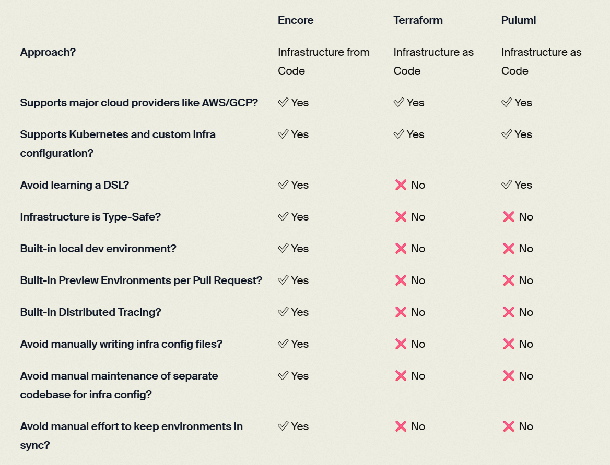

Here’s a comprehensive look at **Encore.dev**, a modern backend framework designed to simplify and accelerate cloud-native development:

---



## 🤖 What is Encore?

**Encore** is an open-source framework (in Go and TypeScript) for building **type-safe, distributed systems**, combining a backend runtime with **infrastructure-as-code** and powerful developer tooling ([Encore][1]).

---

## 🔧 Key Features

### 1. **Type-safe Backend Framework**

* Encore.ts (TypeScript) and Encore.go (Go) let you define APIs, services, databases, pub/sub topics, cron jobs, secrets, caches, and more — all in code with strong types ([GitHub][2]).

### 2. **Type-Aware Infrastructure-as-Code**

* Define infra—like databases or message queues—directly in your app. Encore analyzes it and automatically provisions everything locally or in the cloud ([GitHub][2]).

### 3. **Local Development Dashboard**

* Built-in dashboard with live request tracing, API exploration, schema docs, generated architecture diagrams, service catalog, and hot reload ([DEV Community][3]).

### 4. **Performance Gains**

* Benchmarks show Encore.ts handles \~9× more requests than Express.js, and \~3× more than Fastify ([Encore][1]).

### 5. **Cloud Deployment & Encore Cloud**

* Deploy on your own AWS/GCP account or use **Encore Cloud**, which offers CI/CD, PR preview environments, automated infra provisioning (Databases, Pub/Sub, IAM), tracing, and architecture diagrams ([Encore Cloud][4]).

### 6. **AI-Enabled Workflow**

* Encore’s declarative model integrates with AI tools to generate complete systems (services, infra, docs) and validate code automatically ([Encore][1]).

---

## 👨‍💻 Example: A Simple API (TypeScript)

```ts
import { api } from "encore.dev/api";

export const get = api(
  { expose: true, method: "GET", path: "/hello/:name" },
  async ({ name }: { name: string }) => {
    return { message: `Hello ${name}!` };
  }
);
```

That’s it—you get a fully typed HTTP endpoint in under 10 lines ([GitHub][2]).

---

## 📈 Why Use Encore?

| Benefit                 | Description                                                                      |
| ----------------------- | -------------------------------------------------------------------------------- |
| **Rapid development**   | Skip boilerplate, infra setup, and documentation—focus on core logic.            |
| **Scale easily**        | Build distributed/microservices systems with integrated tools.                   |
| **Robust tooling**      | Local dev dashboard, CI/CD, preview environments, infra diagrams.                |
| **Cost-effective**      | Automated provisioning, less manual DevOps, and multi-cloud support.             |
| **Open source + cloud** | Use CLI and self-hosted infrastructure, or leverage Encore Cloud for operations. |

---

[Encore Crash Course – TypeScript Backend Framework & Toolset](https://www.youtube.com/watch?v=tL01EzN2-xA&utm_source=chatgpt.com)

Check out this \~10-min crash course to see how quickly you can get started!

---

## 🚀 Getting Started

1. **Install** the CLI:

   * macOS: `brew install encoredev/tap/encore`
   * Linux: `curl -L https://encore.dev/install.sh | bash`
   * Windows: `iwr https://encore.dev/install.ps1 | iex` ([Encore Cloud][4], [GitHub][2], [DEV Community][5])

2. **Create** a new app, for example:

   ```bash
   encore app create --example=ts/hello-world
   encore run
   ```

3. Encore auto‑provisions local infra, runs your service, and generates the dashboard ([GitHub][2]).

4. **Deploy** to cloud with Encore Cloud, or generate Docker images to self-host.

---

## ✅ In Summary

Encore.dev is an end-to-end development platform built for modern distributed systems. It combines a high-performance, type-safe backend framework with fully integrated infrastructure, powerful local tooling, and optional cloud automation—all designed to reduce complexity and increase developer productivity.

If you're building cloud-native services in Go or TypeScript and crave a seamless, full-stack development experience, Encore is definitely worth exploring.

