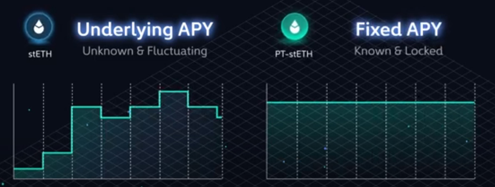

# 📈 **Fixed Yield on Pendle: Mastering Principal Tokens (PT)**



## 🧠 **Understanding Yield Dynamics in DeFi**

* **Yield in most DeFi protocols** is *variable*, often fluctuating with:

  * Market demand/supply
  * Asset-specific risk
  * Staking reward dynamics

* **Pendle** offers *fixed yield*, allowing you to:

  * Lock in **predictable returns**
  * Avoid yield volatility

---

## 🔍 **What is a Principal Token (PT)?**

* **PT (Principal Token)** represents the *future redemption value* of a tokenized yield-bearing asset.

* For example:

  * `PT-stETH` is the principal token for Lido's **stETH**
  * 1 `PT-stETH` = *1 ETH worth of stETH at maturity*

```text
If you buy PT-stETH for $2,200 and at maturity it redeems for $2,400 → 
Your fixed return = ~$200 → Yield is known & locked
```

---

## 💡 **How Fixed Yield Works on Pendle**

1. **You buy PT at a discount** to the full value of the underlying asset.
2. **At maturity**, PT redeems for full value.
3. **Profit = Price appreciation over time**

📘 *Example:*

```text
Buy PT-stETH at $2,200 → Redeems at $2,400 in 12 months
Effective APY ≈ (2400 - 2200) / 2200 ≈ 9.09%
```

---

## 📊 **Key Concepts: Underlying APY vs. Fixed APY**

### 🔹 *Underlying APY*

* *Definition:* The **current yield** of the underlying asset (e.g. stETH).
* *Fluctuates* over time.
* Example: If stETH yields **3.7%**, this is your return from just holding it.

### 🔹 *Fixed APY*

* *Definition:* The **guaranteed yield** when buying PT.
* *Locked in* at the time of purchase.
* Example: PT-stETH with **4% fixed APY** guarantees that return at maturity.

---

## ✅ **When is PT a Good Buy?**

* **Compare:** Fixed APY vs Underlying APY
* **Buy PT if**:

  * *Fixed APY > Expected Underlying APY*
  * You want a **guaranteed** yield

🧠 *Example Decision:*

```text
Fixed APY = 4% | Expected stETH APY = 3.2% → BUY PT-stETH
```

---

## 📈 **Trading PT for Capital Gains**

* PT price *increases* as demand grows and time approaches maturity.
* **Sell PT early** for a profit if the price rises.

📘 *Trading Example:*

```text
Buy PT at $2,200 → Sell at $2,300 two weeks later
Instant $100 profit (without waiting for maturity)
```

---

## 📌 **What Affects PT Profitability?**

* **Future yield expectations**:

  * *Staking trends*: More ETH staked = lower yield
  * *Burning trends*: More ETH burnt = higher yield

* **Market factors**:

  * Liquidity in the AMM pool
  * Market sentiment

🧠 *Ask Yourself:*

* Will more ETH be staked next quarter?
* Is Ethereum usage (and fee burning) increasing?

---

## 🔄 **How to Trade PT on Pendle**

1. **Visit:** Pendle Trade interface

2. **Select Asset:** Choose from supported tokens (e.g., stETH, aUSDC, wstETH)

3. **Click on Green PT Tab**

4. **Review Details**:

   * Minimum PT received
   * Fixed APY shown
   * Price impact (AMM mechanics)

5. **Swap & Sign Transaction**

🎉 *You're now in a fixed yield position!*

---

## 🧪 **Sample PT Trade via Smart Contract**

```solidity
// Solidity snippet for redeeming PT on maturity
pendleRouter.redeemAfterExpiry({
    market: stETHMarket,
    to: msg.sender
});
```

---

## 🛠 **Tips for Yield Traders**

* Track historical yield data using tools like **Dune Analytics**
* Compare APY curves: Fixed vs Variable
* Watch Pendle's UI for **shifts in fixed APY**
* Use PT as a **hedge** against yield volatility

---

## 📘 **Next Steps**

In the next module:
🔄 *How to trade YT (Yield Token) like a pro on Pendle*

Stay tuned for:

* Advanced yield farming strategies
* YT leverage mechanisms
* Dynamic yield arbitrage techniques

---
