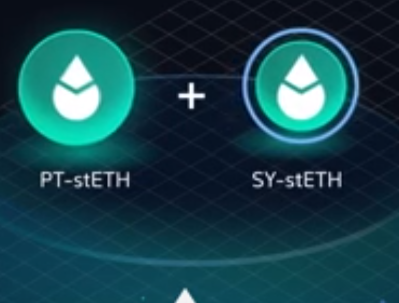

# Understanding Impermanent Loss (IL)

  * **Impermanent Loss (IL)** is a risk associated with providing liquidity to a standard Automated Market Maker (AMM) liquidity pool (e.g., Uniswap V2).
  * *Definition:* It's the difference in value between holding assets in a liquidity pool versus simply holding them in your wallet.
  * It occurs when the **prices of the tokens** in the pool diverge from when you deposited them. The more they diverge, the greater the impermanent loss.
  * The loss is *"impermanent"* because if the prices return to their original ratio, the loss is minimized or erased. However, it becomes **permanent** if you withdraw your liquidity at a different price ratio.

## A Simple Example

Imagine a 50/50 ETH/USDC pool:

1.  You deposit 1 ETH and 4,000 USDC when 1 ETH = \$4,000.Total value = \$8,000.
2.  The price of ETH rises to $5,000 on external markets.
3.  Arbitrageurs rebalance the pool. Your share is now approximately 0.894 ETH and 4,472 USDC. Total value = **$8,944**.
4.  If you had just held your assets, you would have 1 ETH and 4,000 USDC. Total value = **$9,000**.
5.  Your **Impermanent Loss** is `$9,000 - $8,944 = $56`.

-----

# The Pendle Approach: Liquidity Without Impermanent Loss

  * Pendle Finance liquidity pools are designed to **mitigate impermanent loss** for liquidity providers at the point of maturity.
  * This design allows LPs to earn multiple sources of yield without the typical risk of value drain from asset price fluctuations.
  * The key is in the unique composition of its liquidity pools, which do not pair two volatile assets in the traditional sense.

## Core Components of a Pendle Pool

Pendle pools are composed of two specific types of assets:

  * **Principal Token (PT)**: Represents the principal component of a yield-bearing asset.
  * **Standard Yield Token (SY)**: A wrapped version of the underlying yield-bearing asset, making it compatible with the Pendle protocol. For simplicity, we can think of this as the **underlying asset** itself.

-----

# Anatomy of a Pendle Pool: PT & SY

## Principal Token (PT)

  * *Definition:* A token that represents the principal portion of an underlying yield-bearing asset, redeemable 1:1 for the underlying asset upon maturity.
  * **Example:** For a Lido Staked ETH (`stETH`) pool, the Principal Token is **`PT-stETH`**.
  * Owning 1 `PT-stETH` entitles you to redeem it for exactly 1 `stETH` after the pool's maturity date.
  * PTs trade at a discount to their underlying asset, and their price gradually converges towards the underlying's price as maturity approaches. This price difference represents the market's implied fixed yield.

## Standard Yield Token (SY)

  * *Definition:* A wrapped version of the underlying yield-bearing asset used within the Pendle ecosystem.
  * **Example:** For a Lido Staked ETH (`stETH`) pool, the Standard Yield Token is **`SY-stETH`**.
  * For all practical purposes, `SY` can be considered the same as the underlying asset (e.g., `SY-stETH` $\\approx$ `stETH`).

A typical Pendle pool pairs **`PT-Asset`** with **`SY-Asset`**.

-----

# How Pendle Achieves "Zero Impermanent Loss"

The "zero IL" guarantee applies **at the moment of maturity**.

  * **The Core Principle:** The price of a Principal Token (`PT`) is designed to converge to the price of its underlying asset as the maturity date nears.
  * **At Maturity:** The exchange rate between `PT` and the underlying asset becomes exactly 1:1.
      * `1 PT-stETH = 1 stETH`
  * **Pool Composition at Maturity:** Since all `PT` in the pool is now worth the same as the underlying `stETH`, the entire liquidity pool effectively consists of a single asset: `stETH`.
  * **The Result:** When a pool contains only one asset (or two assets trading at a fixed 1:1 ratio), there is no divergence in price, and therefore, **no impermanent loss**. The LP's position value is not affected by previous `PT` price fluctuations.

-----

# The Role of Yield Tokens (YT) & Flash Swaps

  * You might wonder: *If Yield Tokens (YT) aren't in the liquidity pool, how are they traded?*
  * **Yield Tokens (YT)** represent the right to the future yield generated by the underlying asset. They are traded, but not by being paired directly in the main LP.
  * Trades involving `YT` are facilitated by the same `PT`/`SY` pool through a mechanism called **Flash Swaps**.

## Flash Swaps (Conceptual Overview)

1.  A user wants to sell `YT`.
2.  Pendle's router "flash borrows" the underlying asset (`SY`) from the pool.
3.  It combines the user's `YT` with the borrowed `SY` to mint `PT` and `SY`.
4.  The newly minted `PT` is sold into the `PT`/`SY` pool for more `SY`.
5.  The original flash loan of `SY` is repaid, and the user receives the difference.

This clever mechanism allows for `YT` trading without requiring a separate `YT` liquidity pool.

-----

# Maximizing Yield: LP Revenue Streams on Pendle

Liquidity Providers on Pendle earn yield from up to **four distinct sources** simultaneously.

  * **Underlying Asset Yield:**

      * The inherent yield from the underlying asset itself (e.g., the staking rewards from `stETH`). A portion of this yield is passed on to the LP.

  * **Swap Fees:**

      * Fees generated from all trades that occur within the liquidity pool, just like in a traditional AMM.

  * **Fixed Yield from PT:**

      * LPs hold `PT` as part of their position. As `PT` appreciates in value towards its peg at maturity, this gain is realized by the LP as a form of fixed yield.

  * **PENDLE Incentives:**

      * The Pendle protocol often provides additional rewards in its native `$PENDLE` token to incentivize liquidity for specific pools.

-----

# How to Provide Liquidity on Pendle: Step-by-Step

## Step 1: Navigate and Select

1.  Go to the **"Pools"** page on the Pendle app.
2.  Browse the available pools and **select your desired pool**. We'll use the `stETH` pool for this example.
3.  Choose the asset you wish to deposit with from the **"Zap In"** dropdown menu (e.g., ETH, USDC, stETH).

## Step 2: Choose Your "Zap In" Mode

You have two primary options for providing liquidity.

  * ### Standard Mode (Default)

      * **How it works:** Pendle automatically swaps your input asset to acquire the necessary `PT-stETH` and `SY-stETH` in the correct proportions for the pool.
      * **Consideration:** This is simple but will incur **price impact** (slippage) because you are market-buying `PT`.

  * ### Zero Price Impact Mode

      * **How it works:** Toggling this mode on initiates a more gas-intensive but often cheaper process.
        1.  Your input asset is converted into the underlying asset (`stETH`).
        2.  A portion of the `stETH` is used to mint brand new `PT-stETH` and `YT-stETH`.
        3.  The `PT-stETH` is paired with the remaining `stETH` to provide liquidity.
      * **Benefit:** You avoid slippage from buying `PT`. The newly created **`YT-stETH` is sent to your wallet**, which you can hold or sell.

-----

# How to Provide Liquidity: Final Steps

## Step 3: Deposit and Confirm

1.  Enter the **amount** of the asset you wish to deposit.
2.  **Approve** the Pendle contract to spend your selected asset. This is a one-time transaction per asset.
3.  Click **"Zap In"** and confirm the final transaction in your wallet.

Your LP position is now active and earning yield\!

### Conceptual Smart Contract Interaction

```solidity
// This is a simplified, conceptual example
interface IPendleRouter {
    // Standard Zap In
    function zapIn(
        address pool,
        address tokenIn,
        uint256 amountIn
    ) external returns (uint256 lpTokensOut);

    // Zero Price Impact Zap In
    function zapInZeroImpact(
        address pool,
        address tokenIn,
        uint256 amountIn
    ) external returns (uint256 lpTokensOut, uint256 ytTokensOut);
}
```

-----

# How to Withdraw Liquidity

You can withdraw your LP position at any time before maturity.

**Important Note:** The "zero impermanent loss" is only guaranteed *at maturity*. Withdrawing early means the `PT` price has not yet converged to its face value, so you are exposed to market price fluctuations. *However, studies have shown that the longer an LP position is held, the more likely the combined yields are to outperform simple holding.*

## Standard Withdrawal ("Zap Out")

1.  Navigate to your position and select the **"Zap Out"** tab.
2.  Use the slider to choose the **amount** of your LP position you wish to withdraw.
3.  Select the **single asset** you wish to receive your funds in (e.g., ETH, USDC).
4.  Click **"Zap Out"** and confirm the transaction. Pendle will automatically sell your `PT` and `SY` components into your chosen asset.

-----

# Advanced Withdrawal: Exiting a "Zero Price Impact" Position

If you used the **"Zero Price Impact"** mode to enter, this manual method helps you exit with the least slippage.

## Step 1: Manual Withdrawal

1.  In your pool position, navigate to the **"Withdraw"** section and select the **"Manual"** tab.
2.  Slide to the amount you wish to withdraw.
3.  Confirm the withdrawal. You will receive two tokens back in your wallet: the underlying asset (`stETH`) and its Principal Token (`PT-stETH`).

## Step 2: Redeem with YT

1.  Remember the `YT-stETH` you received when you first deposited? Now you can use it.
2.  Navigate to the **"Redeem"** section.
3.  Combine the `PT-stETH` from Step 1 with your `YT-stETH` to redeem them for the underlying asset (`stETH`) at a 1:1 ratio, with no price impact.

## Step 3: Settle Leftovers

  * The amounts of `PT` and `YT` will likely not match perfectly.
  * You can sell any leftover `PT` or `YT` on the market for the underlying asset. This is the **only step** in this process that incurs price impact.