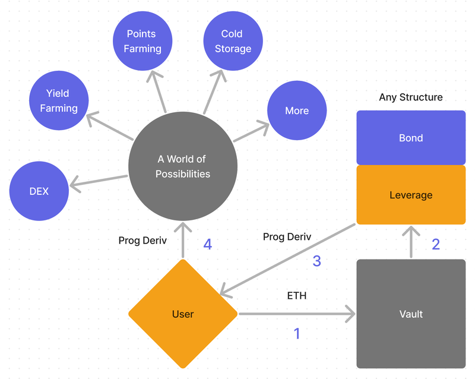

# Plaza Finance

Plaza Finance is a **cross-ecosystem hub** for **programmable derivatives**, focused on delivering better financial products for everyone. To stay up to date on Plaza Finance and programmable derivatives, follow [@plaza_finance](https://docs.plaza.finance/www.x.com/plaza_finance).

The Ethereum ecosystem created the term "**programmable money**" to describe how smart contracts have greatly expanded what the Ethereum blockchain can do compared to older blockchains like Bitcoin. Plaza Finance introduced the term "**programmable derivative**" to explain a similar advancement in blockchain technology. This new term highlights the ability to create custom financial products without needing to trust a central authority for handling transactions or assets.

**Programmable derivatives** are tokenized versions of structured asset vaults on a blockchain. Any tokenized asset like ETH, BTC, SOL, tokenized US treasuries, or tokenized gold can be the base for a programmable derivative. The total return of this asset can be split into different forms like **bonds, options, or leverage.** Users can then mint and redeem these forms, called programmable derivatives, on the blockchain without needing permission. These programmable derivatives can be used in various applications like exchanges and vaults. They are always redeemable for a part of the vault assets, so they share the liquidity of the base asset.

## Why are they needed?

Many decentralized exchanges are working towards the ability to trade any asset permissionlessly via fully **synthetic contracts (perpetual futures)**. These fully  **synthetic markets** have two major downsides: **lack of composability and limited liquidity, both solved by programmable derivatives.**

While it is theoretically possible to create a **perpetual future** for any asset, the users' exposure and assets are **trapped in the exchange**. Users must completely entrust the exchange with holding their funds, and they cannot use those assets for other purposes, like borrowing, lending, and depositing for yield and airdrop farming. Programmable derivatives allow users to create any structure, and use the tokenized representation of that structure for any purpose, even hiding those assets away in cold storage if they desire, which is not possible with **perpetual futures**.

Another limitation of perpetual futures is that the liquidity of the **synthetic contract** for an asset, like ETH, is limited to the synthetic contract's liquidity on the exchange venue. ETH spot liquidity is far deeper than any decentralized exchange's ETH perpetual futures liquidity. With ETH-based programmable derivatives, the liquidity of the structure is only limited by the liquidity of spot ETH, since all tokenized structures on ETH are redeemable back for ETH. Programmable derivatives are fully asset-backed, and not synthetic.

## Use Cases

Programmable derivatives unlock new possibilities not previously seen in decentralized finance. Examples include a fully decentralized ETH-backed **bond** that pays coupons in USDC, liquidation-proof leverage on BTC with an attractive **convexity profile**, and many more. There is an infinite array of structures that can be created on any number of assets, all without increasing network complexity and congestion, and without **sacrificing liquidity** for users.

