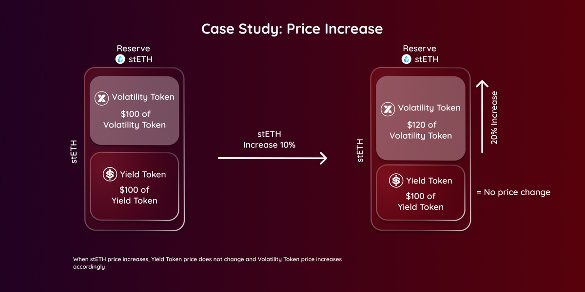
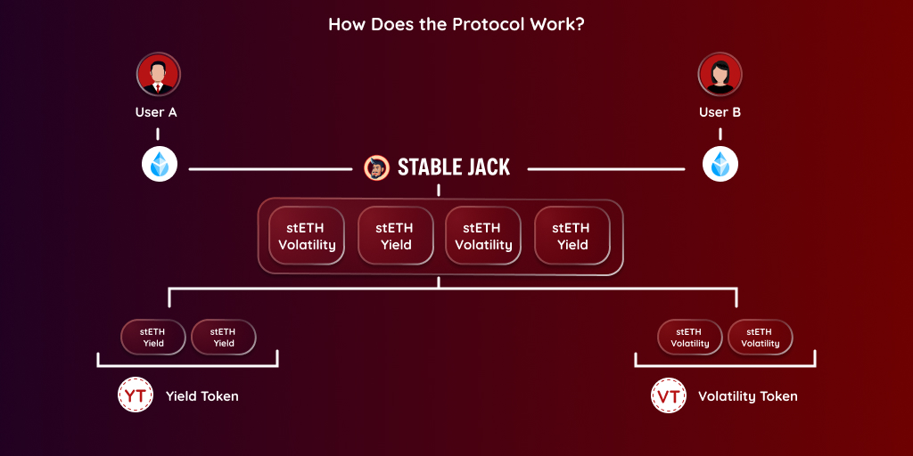

Stable Jack's smart contract divides the collateral asset into two tokens: the Yield Token and the Volatility Token. The protocol allows users to retain their principal while the yield and volatility of the collateral are split between the two tokens.

Stable Jack's smart contract divides the collateral asset into two tokens: the Yield Token and the Volatility Token. The protocol allows users to retain their principal while the yield and volatility of the collateral are split between the two tokens.

The **Volatility Token** functions like a junior tranche, absorbing the full volatility of the collateral. This makes it capable of generating higher returns but also positions it as the first to bear any downside risk. On the other hand, the **Yield Toke**n acts like a senior tranche, receiving the entire yield from the collateral and earning leveraged yield returns.

