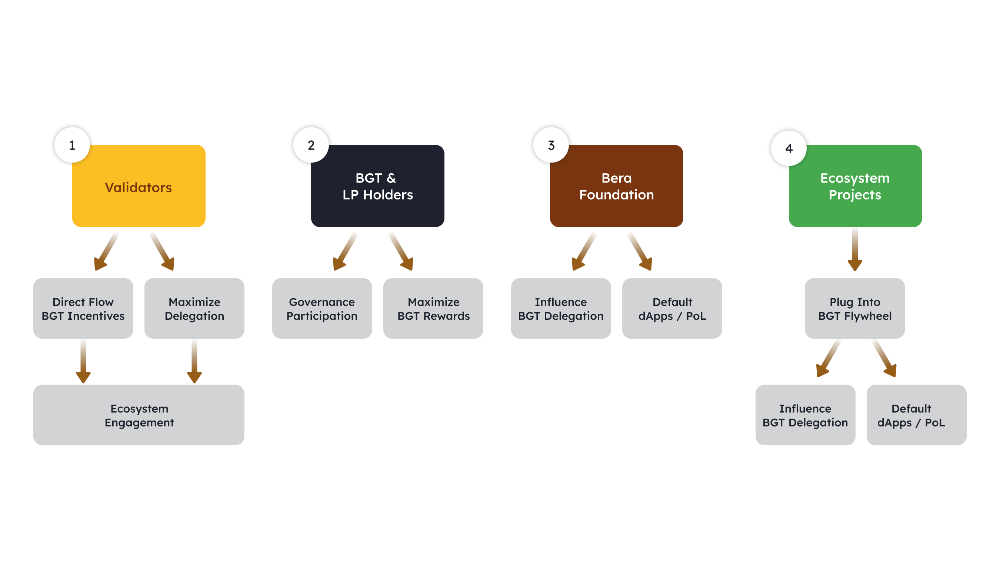

**Key Issues with Current Proof of Stake Systems**

-   **Token Locking:** In traditional proof of stake systems, users stake tokens to secure the network, which results in these tokens being locked and unavailable for use, leading to liquidity constraints.
-   **Value Mismatch:** There is a disconnect between validators (who secure the network) and protocols (which drive ecosystem activity). Validators receive minimal benefits beyond transaction fees for the support they provide to protocols.

**Bar Chain's Solution**

-   **Dual Token System:** Bar Chain introduces a dual token system consisting of:
    -   **BAR:** Used for gas fees and network security.
    -   **BGT:** Used for governance and on-chain incentivization.

**How the System Works**

1.  **Staking Process:** Users stake BAR with validators. Validators also stake BAR, activating their stake.
2.  **BGT Emission:** The staking of BAR leads to the emission of BGT, which is utilized to provide liquidity across various protocols within the Bar Chain ecosystem, such as AMM and lending pools.
3.  **Liquidity Providers:** Users providing liquidity earn BGT, which they can delegate to activated validators.
4.  **Increased Emissions:** The more BGT a validator receives, the higher the BGT emissions, creating a cycle of benefits.

**Benefits of the Mechanism**

-   **Enhanced Liquidity:** This system ensures liquidity within the ecosystem.
-   **Mutually Beneficial Relationships:** Validators benefit from increased BGT emissions tied to their support from liquidity providers, while protocols enjoy improved liquidity and security.
-   **Overall Ecosystem Health:** This symbiotic relationship contributes to the strength and efficiency of the Bar Chain ecosystem.