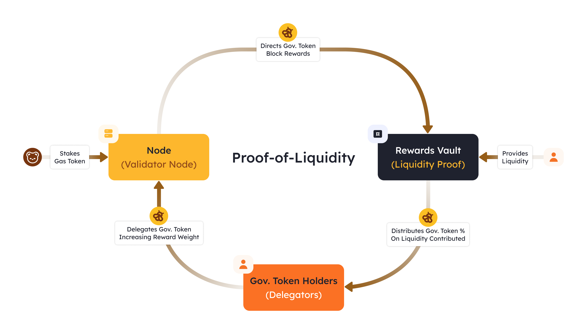
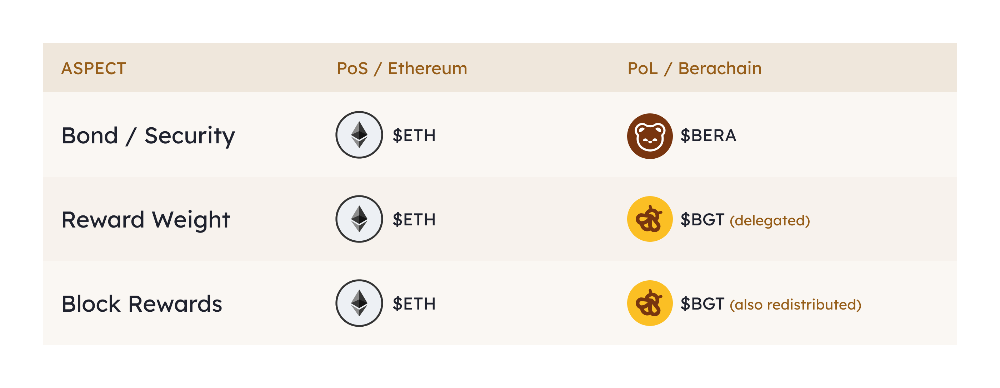
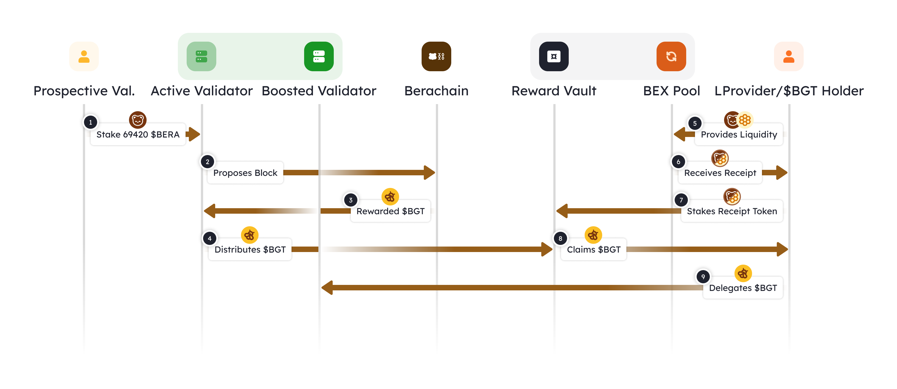

Proof-of-Liquidity (PoL) is a new way to secure a blockchain by increasing the amount of liquidity (funds) on the network.

It's similar to Proof-of-Stake (PoS), where users secure the chain by staking the native token. However, PoL adds a special governance token that:

-   Decides how much reward a staker can earn, based on delegation from others.
-   Is given to those who provide liquidity to the network through reward vaults.

Proof-of-Liquidity Overview 📓[​](https://docs.berachain.com/learn/pol/#proof-of-liquidity-overview-%F0%9F%93%93)
=================================================================================================================

One of the main [shortcomings](https://docs.berachain.com/learn/what-is-proof-of-liquidity#shortcomings-of-pos) of Proof-of-Stake is the lack of incentive for different ecosystem players to collaborate. Validators have little reason to interact with the protocols and end-users for whom they are ultimately running the infrastructure, yet they receive the majority of the economic incentives. On the other hand, projects launch on this infrastructure but retain the majority of the project tokens for themselves.

A healthier equilibrium can be achieved between projects, validators, and the chain when all actors share in the network's growth.

Proof-of-Liquidity (PoL) involves the participation and influence of all the chain's stakeholders. PoL requires different stakeholders to work in sync to maximize liquidity on the chain, ensuring they receive the greatest benefit.

The following sequence diagram represents the different steps that Proof-of-Liquidity (PoL) undergoes from the perspective of a validator and delegator.

