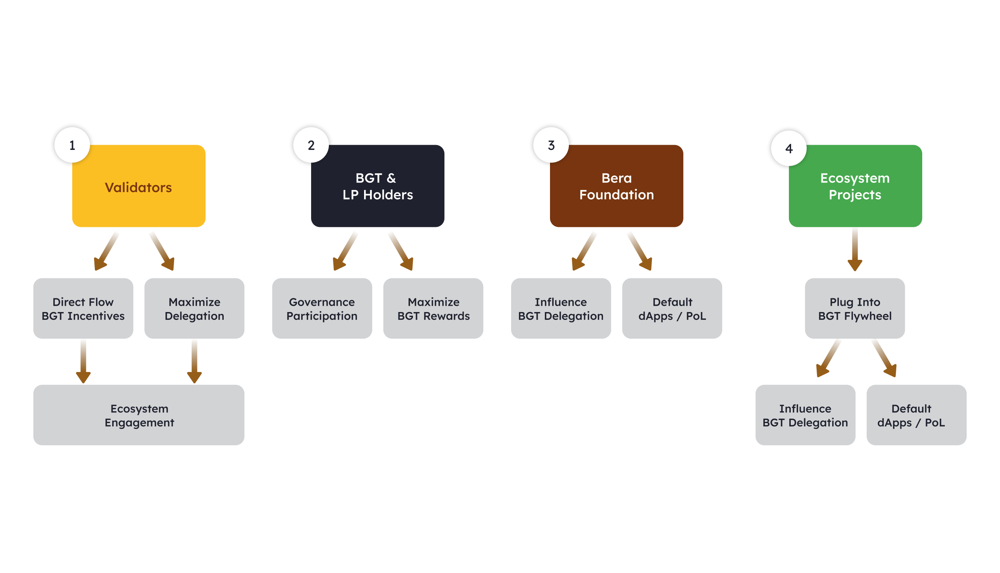

**Limitations of PoS**:

*   Staked tokens reduce liquidity as they are locked up.
*   Applications built on PoS chains have limited influence on chain security.
*   Validators receive minimal rewards from the applications they support, leading to a **misalignment of incentives**.

**Collaboration**:

In PoS, validators have little incentive to engage with protocols or users, leading to a fragmented ecosystem.

In PoL, validators, protocols, and users must work together to maximize liquidity and benefits.

**Polaris EVM**: An EVM-compatible L1 built on the Cosmos SDK

**Three core primitives**:

1.  BeEx (decentralized exchange)
2.  Perps (perpetual swaps)
3.  Bend (lending market)

### Key components:

*   **BGT**: Non-transferable governance token
*   **Beer**: Gas token
*   **Honey**: Stablecoin

It's similar to Proof-of-Stake (PoS), where users secure the chain by staking the native token. However, PoL adds a special governance token that:

*   Decides how much reward a staker can earn, based on delegation from others.
*   Is given to those who provide liquidity to the network through reward vaults.

## Aligning Protocols and Validators 🤝[​](https://docs.berachain.com/learn/pol/#aligning-protocols-and-validators-%F0%9F%A4%9D)

Because validators are given the responsibility of distributing governance tokens to Reward Vaults, when chosen to propose a block, it introduces a new dynamic where rewards are essentially shared with the ecosystem protocols.

Validators will share a stronger relationship with protocols, as their reward weight is determined by the governance tokens delegated to them, creating a symbiotic relationship.

Protocols can also convince Validators to start directing rewards to them by offering _Incentives_ in exchange for the `$BGT` rewards directed to their specific _Reward Vaults_.

----------

**Key Issues with Current Proof of Stake Systems**

-   **Token Locking:** In traditional proof of stake systems, users stake tokens to secure the network, which results in these tokens being locked and unavailable for use, leading to liquidity constraints.
-   **Value Mismatch:** There is a disconnect between validators (who secure the network) and protocols (which drive ecosystem activity). Validators receive minimal benefits beyond transaction fees for the support they provide to protocols.

**Bar Chain's Solution**

-   **Dual Token System:** Bar Chain introduces a dual token system consisting of:
    -   **BAR:** Used for gas fees and network security.
    -   **BGT:** Used for governance and on-chain incentivization.

**How the System Works**

1.  **Staking Process:** Users stake BAR with validators. Validators also stake BAR, activating their stake.
2.  **BGT Emission:** The staking of BAR leads to the emission of BGT, which is utilized to provide liquidity across various protocols within the Bar Chain ecosystem, such as AMM and lending pools.
3.  **Liquidity Providers:** Users providing liquidity earn BGT, which they can delegate to activated validators.
4.  **Increased Emissions:** The more BGT a validator receives, the higher the BGT emissions, creating a cycle of benefits.

**Benefits of the Mechanism**

-   **Enhanced Liquidity:** This system ensures liquidity within the ecosystem.
-   **Mutually Beneficial Relationships:** Validators benefit from increased BGT emissions tied to their support from liquidity providers, while protocols enjoy improved liquidity and security.
-   **Overall Ecosystem Health:** This symbiotic relationship contributes to the strength and efficiency of the Bar Chain ecosystem.