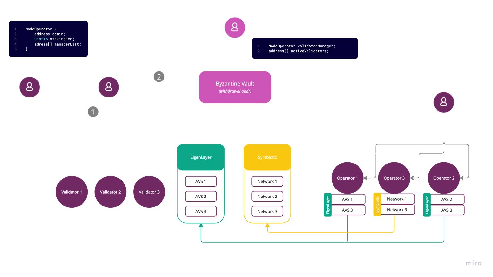

Operators are an essential part of the Byzantine ecosystem. They run both Staking and Restaking nodes to allow Stakers to benefit from the best possible yields.

Operators have several roles :

- **Staking**
    
    - Run and maintain Ethereum validators as part of a Native Restaking vault.
        
    - Act as Validator Managers for [Partner Validated Vaults](https://docs.byzantine.fi/byzantine-vaults/types-of-native-vaults/partner-validated-vaults). Validator managers are the addresses that can register validator deposit data for a native restaking vault.
        
    
- **Restaking**
    
    - Run restaking operators for different restaking protocols (operator set, subnetwork, ...)
        
    - Create on demand restaking operator to match specific staker demands (a specific set of operator set and subnetwork for example).
        
    

To get the most out of staking/restaking synergies, you can register as an operator with Byzantine team to become a verified partner in the Byzantine ecosystem!

Note that :

- In Solo Staker Vaults, there is no third-party Validator Manager role, and the vault creator will register the validators.
    
- In Distributed Validator Vaults, Byzantine will register the Validators from a set of DVs run by the Partners.