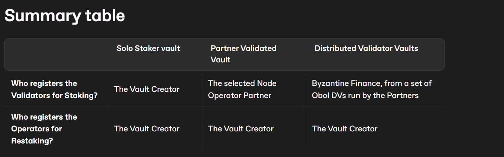

# Types of Native Vaults

Byzantine architecture allows the Vault Creator to create 3 types of Native Restaking ByzVaults:

- [Solo Staker Vaults](https://docs.byzantine.fi/byzantine-vaults/types-of-native-vaults/solo-staker-vaults)
    
- [Partner Validated Vaults](https://docs.byzantine.fi/byzantine-vaults/types-of-native-vaults/partner-validated-vaults)
    
- [Distributed Validator Vaults](https://docs.byzantine.fi/byzantine-vaults/types-of-native-vaults/distributed-validator-vaults)
    

Their main differences lie in the way that validator management is handled. In Native Restaking Vaults, validator management refers to the method used to choose/register the Staking Validators, who handle the staking of native assets in the blockchain.

Each native vaults have a **validator manager** which is responsible to make sure that enough validators are registered to a vault to support all new incoming stake. In other words, the **validator manager** simply register existing validator's [deposit data](https://github.com/ethereum/consensus-specs/blob/dev/specs/phase0/beacon-chain.md#depositdata) to a vault so that all new incoming ETH is automatically deposited into the Beacon Chain.

Here is a summary table on how Staking and Restaking Nodes are chosen, depending on the type of native vault. Refer to the detailed pages for more information.

## 

