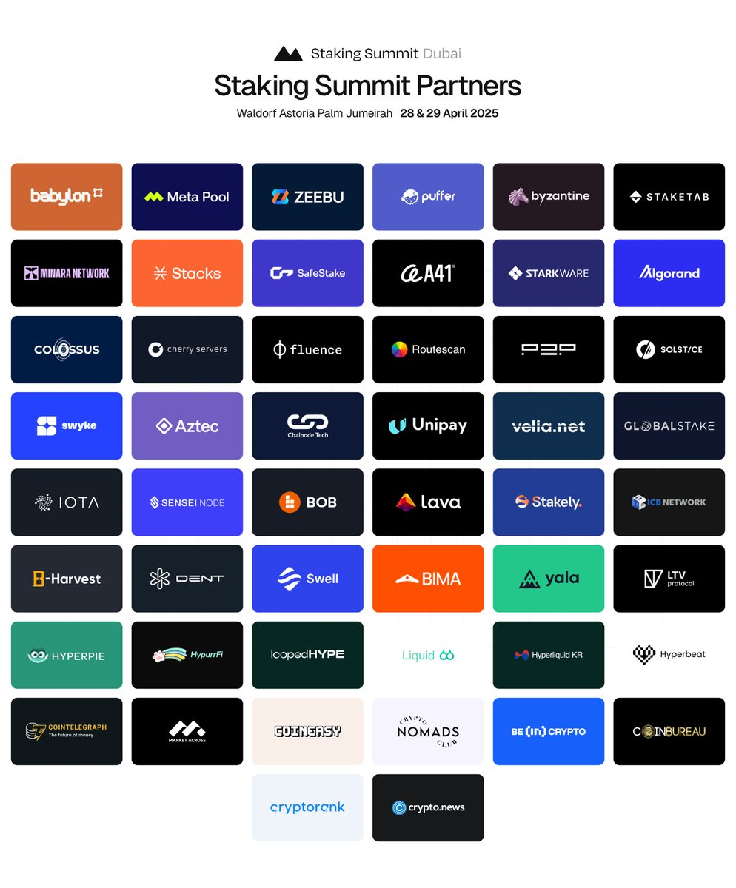

Byzantine 

---

## **Company Overview**  

### **1. What is Byzantine Finance?**  
**Answer:**  
Byzantine Finance is building the **first re-staking aggregation layer** to democratize access to re-staking. It enables permissionless vault creation across chains, protocols, and AVS (Actively Validated Services), allowing users to customize strategies based on risk profiles.  

### **2. What problem does Byzantine Finance solve?**  
**Answer:**  
- **Fragmentation**: Re-staking use cases are siloed.  
- **Technical Complexity**: Costly integrations hinder adoption.  
- **Inefficiency**: Monolithic platforms reduce rewards over time.  
Byzantine unifies fragmented re-staking options, simplifies cross-chain/protocol integration, and separates infrastructure from risk management for agility.  

### **3. Who are Byzantine Finance’s target customers?**  
**Answer:**  
- **Protocols/AVSs**: Seeking security and liquidity.  
- **DAOs**: Managing treasury via custom strategies.  
- **Institutions**: Requiring KYC-compliant, segregated funds.  
- **Funds**: Diversifying risk across AVSs.  

---

## **Re-staking Fundamentals**  

### **4. How does re-staking differ from traditional staking?**  
**Answer:**  
- **Staking**: APR is maintained as TVL grows (blockchains emit more rewards).  
- **Re-staking**: Fixed AVS budgets mean **rewards decrease as TVL increases**, pushing capital to explore newer/long-tail AVSs.  

### **5. Why do re-staking rewards diminish with higher TVL?**  
**Answer:**  
AVS budgets are **fixed**, so more participants dilute individual payouts. This creates incentives for capital to seek underutilized opportunities.  

### **6. What are the three main challenges in today’s re-staking ecosystem?**  
**Answer:**  
1. **Fragmentation**: Disjointed use cases.  
2. **Technical Complexity**: Costly cross-protocol integrations.  
3. **Inefficiency**: Monolithic platforms with one-size-fits-all risk management.  

---

## **Product & Technology**  

### **7. What is a “re-staking aggregation layer”?**  
**Answer:**  
A unified infrastructure enabling:  
- **Permissionless Vaults**: Customizable across AVSs/chains.  
- **Cross-Chain Execution**: Swaps and bridging for multi-chain strategies.  
- **Risk Management Decoupling**: Separates infrastructure (Byzantine’s role) from risk strategies (users’ choice).  

### **8. How does Byzantine Finance address AVS fragmentation?**  
**Answer:**  
By allowing vaults to **simultaneously interact with multiple AVSs** (e.g., Babylon, Eigen Layer, Symbiotic) without requiring direct integrations.  

### **9. Can vaults restake across multiple chains?**  
**Answer:**  
Yes. Byzantine uses **cross-chain swaps** (e.g., bridging assets) to deploy capital on AVSs across Ethereum, Solana, and others.  

### **10. What is Distributed Validator Technology (DVT)?**  
**Answer:**  
A **decentralized validation mechanism** integrated into Byzantine’s MVP to enhance security and reduce reliance on centralized node operators.  

### **11. What is the difference between liquid and native re-staking?**  
**Answer:**  
- **Liquid Re-staking**: Users receive liquid tokens representing staked assets (tradeable while earning rewards).  
- **Native Re-staking**: Directly stake assets without liquidity tokens.  
Byzantine supports both models.  

---

## **Market Validation & Traction**  

### **12. What traction has Byzantine Finance achieved?**  
**Answer:**  
- **Clients**: 6 PCCs (Private Crypto Clients) with $1B+ AUM.  
- **MVP**: Live on testnet with DVT, liquid/native re-staking.  
- **Partners**: 7 re-staking protocols across chains.  

### **13. How large is the re-staking market opportunity?**  
**Answer:**  
- **Current Market**: $14B.  
- **Projections**: Expected to **double annually** due to re-staking overtaking traditional staking.  

### **14. Why do institutions prefer Byzantine?**  
**Answer:**  
- **Fund Segregation**: Institutions avoid mixing funds with non-KYC capital.  
- **Custom Strategies**: Tailored risk/reward profiles.  

---

### **16. How does the team’s background support Byzantine’s goals?**  
**Answer:**  
- **Technical Depth**: Experience in DEXs, validators, and decentralized systems.  
- **Growth Expertise**: Scaling products and fundraising.  

---

## **Competitive Landscape**  

### **17. How does Byzantine differ from monolithic re-staking platforms?**  
**Answer:**  
- **Modular Approach**: Splits infrastructure (handled by Byzantine) from risk management (user-defined).  
- **Permissionless Innovation**: Users create vaults without platform restrictions.  

### **18. What are the flaws in current re-staking solutions?**  
**Answer:**  
- **Centralized Risk Management**: Inflexible, non-specialized strategies.  
- **Low Rewards**: Capital concentrates in top AVSs, diluting payouts.  

---

## **Use Cases & Applications**  

### **19. How can DAOs use Byzantine Finance?**  
**Answer:**  
DAOs can deploy treasury funds into **custom vaults** that balance security (via AVSs) and yield across chains.  

### **20. What is an AVS, and why is it critical to re-staking?**  
**Answer:**  
An **Actively Validated Service** (e.g., oracle, rollup) requires security. Re-staking lets AVSs “rent” security from stakers, solving the **cold start problem** (no need for own token/validators).  

---

## **Risk & Security**  

### **21. How does permissionless risk management work?**  
**Answer:**  
Users define parameters (e.g., slashing conditions, AVS diversification) when creating vaults. Byzantine enforces these rules autonomously.  

### **22. How does Byzantine mitigate centralization risks?**  
**Answer:**  
- **Capital Redistribution**: Incentivizes stakers to support smaller AVSs.  
- **Decentralized Validation**: DVT ensures no single node operator dominates.  

---

## **Future Outlook**  

### **23. What chains/protocols will Byzantine integrate next?**  
**Answer:**  
- **Near-term**: Solana, Babylon.  
- **Long-term**: Expand to all major L1s/L2s.  

### **24. What’s next after the MVP?**  
**Answer:**  
- **Mainnet Launch**: Post-testnet validation.  
- **Institutional Tools**: Enhanced KYC/audit features.  

---

## **Addressing Skepticism**  

### **25. How would you respond to re-staking skeptics?**  
**Answer:**  
Re-staking solves **three critical problems**:  
1. **Security Cost**: AVSs avoid bootstrapping validators/tokens.  
2. **Capital Efficiency**: Stakers earn rewards across multiple services.  
3. **Decentralization**: Prevents centralization by redistriByzantineg capital.  

---

## **Tokenomics & Incentives**  

### **26. How are stakers incentivized to explore long-tail AVSs?**  
**Answer:**  
- **Higher Rewards**: Newer AVSs offer better payouts due to lower competition.  
- **Aggregation Tools**: Byzantine simplifies discovery/participation.  

---

## **Regulatory Compliance**  

### **27. How does Byzantine handle KYC for institutions?**  
**Answer:**  
- **Segregated Vaults**: Isolate institutional funds.  
- **Compliance APIs**: Integrate third-party KYC providers.  

