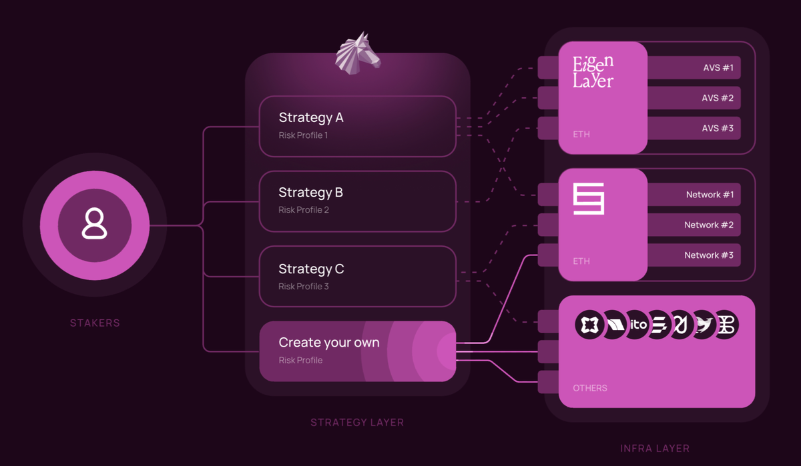

What is Byzantine Finance?
==========================

Byzantine is a trustless and efficient restaking layer with permissionless strategy creation. We enable the deployment of minimal, individual, and isolated restaking strategy vaults by specifying:

-   A restaking strategy, composed of:

    -   A set of AVSs / networks

    -   One or multiple restaking protocols

-   A collateral asset

-   Portfolio flexibility (immutable or modifiable strategy)

-   Investor permissions (open or whitelisted stakers)

-   An (optional) liquidity token

The Byzantine protocol is trustless and designed to be more efficient, modular, and flexible than any other decentralized restaking platform.

All vaults are entirely independent of each other: Funds are fully segregated between them and risk is completely isolated. Vaults are not affected by governance.

Separating risk management & infrastructure
--------------------------------------------

Byzantine achieves this flexibility by separating the [risk management ("strategy layer")](https://docs.byzantine.fi/the-basics/strategy-layer-and-infrastructure-layer-explain-like-im-5#the-strategy-layer) from the [infrastructure ("infrastructure layer")](https://docs.byzantine.fi/the-basics/strategy-layer-and-infrastructure-layer-explain-like-im-5#meet-the-infra-layer):

Strategy vaults are only one example of permissionless risk management built on Byzantine. Any protocol, DAO, or individual can build on the Byzantine infrastructure layer to either help users manage risk or integrate restaking yields into existing service offerings.

Crucially, risk management is performed externally from Byzantine. Therefore, Byzantine is not tied to any particular investment outcomes.

Permissionless strategy vaults
==============================

The existing paradigm around restaking pools is a highly centralised one:

1.  Governance (or the core team) decides AVS / protocol mix and updates

2.  Assets are pooled into a single one-size-fits-all strategy

3.  Limited predictability of portfolio changes

Instead of relying on governance to make decisions, Byzantine is designed to leave choices up to the users. We allow anyone to create AVS strategy vaults with any AVS / protocol mix & any collateral asset and for users to interact with any deployed (open) strategy.

This flexibility is urgently necessary in an increasingly complex and fragmented space. Right now, there are no solutions for users:

-   Whose juridiction banned certain AVS

-   Who have specific requirements around risk / rewards

-   Who want their own liquidity token

-   Who want to accept specific input tokens

The vault parameters are set when it is created. They are either immutable or can be adjusted by the vault creator in the future. This means that Byzantine applies to use cases requiring either:

-   Certainty in the stability of the portfolio in the future, or

-   Trust in a dedicated entity to adapt the portfolio to market changes

It is left up to the vault creator to set immutability at launch and up to the staker to invest in vaults representing their preferred investment philosophy.

Vault risk as well as fund flows (including rewards) are fully segregated at all times.