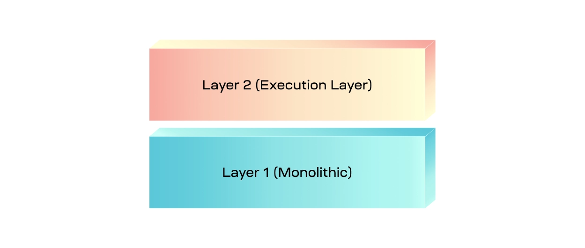

#### The Modular Blockchain Stack

The four functions that modular blockchains can consist of are execution, settlement, consensus, and data availability.

-   Execution: The environment where applications live and state changes are executed.
-   Settlement: An optional hub for execution layers to verify proofs, resolve fraud disputes, and bridge between other execution layers.
-   Consensus: Agreement on the order of transactions.
-   Data availability: Verification that transaction data is available to download.
-   

#### Layer 1 and 2

The most prominent type of layer 2 is a rollup, which provides an environment for applications to be deployed to, and for transactions to be processed that interact with those applications. Layer 1 supports the rollup by allowing it to publish its blocks, which at minimum ensures that the transaction data in the block is ordered and available. Since layer 1 also has execution capabilities, it can ensure the validity of transactions if the layer 2 requires. Additionally, the layer 1 can also act as a hub to connect layer 2s, allowing them to bridge tokens and liquidity between them.

Essentially, the layer 1 is a monolithic chain that receives additional scale from layer 2. In most cases, the capacity of layer 2 is also dependent on layer 1s capacity. As a result, this implementation of a layer 1 & layer 2 stack is suboptimal for scalability.

#### Execution, settlement, and data availability

The settlement layer is unique to that of regular layer 1s that provide settlement because it decouples the settlement functionality from the rest of the functions. The result is an execution chain that can be used specifically for settlement, enabling a [trust-minimized bridge](https://celestia.org/glossary/trust-minimized-bridge) between the execution and settlement layer and providing a way by which execution layers can bridge between each other.

The execution layer may choose to publish its full blocks to the settlement layer, after which the settlement layer will build its own blocks that include transactions from the execution layer and publish the transaction data to the consensus and data availability layer. This is only one of multiple ways that the settlement layer could function within the modular stack.

At the bottom of this construction is the consensus and data availability layer. As the name suggests, it only provides consensus over the order of transactions and verifies that their data is available. Because there is no execution functionality, only transaction data is published by the settlement layer rather than the contents of the entire block.