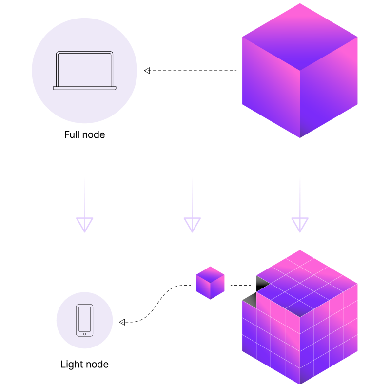

Data availability answers the question, has the data for this blockchain **been published**? It is critical to the security of any blockchain because it ensures that anyone can inspect the ledger of transactions and verify it.

Users of a **monolithic** blockchain usually download all the data to check that it is available.

As blocks get bigger, it becomes impractical for normal users to download all the data meaning that they can't verify the chain. Modular chains solve this problem by making it possible for users to verify very large blocks using a technology called **data availability sampling**.

