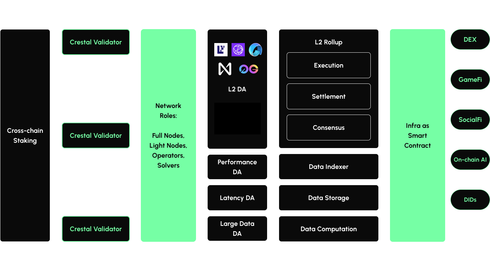

## Dynamic Modular Services Platform
**Crestal Enables** **Dynamic** **Modular Service Economy**
Builders trust Crestal Blockchain to discover, deploy and upgrade Modular Services by binding decentralized Providers to a verifiable **Proof of Performance** (PoPTM).  
‍  
Anyone can stake along Service Providers and get rewarded for maintaining quality modular infrastructure that powers web3 builders across all chains.

An L1 built on the Cosmos SDK, validating modular infrastructures' Proof of Performance (PoP™) Backed by Math, Crestal Math