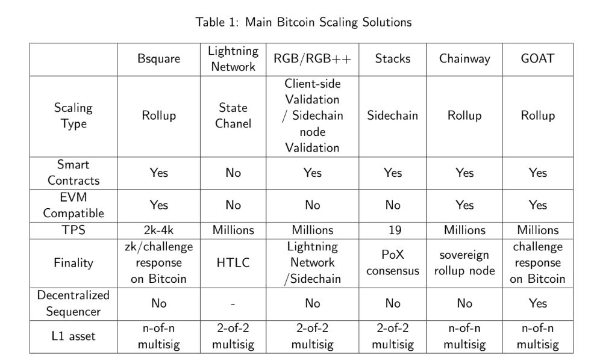

The essence of a Rollup is its ability to inherit the security of the underlying L1 chain; we call this native security. **Two aspects** determine the security of a Bitcoin Rollup. 

- First, the user's asset should be controlled by Bitcoin script and can be withdrawn from Rollup chain under 1-of-n honestly assumption. 
- Second, the Rollup chain's transaction inclusion and finalization can be verified by Bitcoin and for Bitcoin. The inclusion is the process of packing offchain transactions into a batch fairly, and the finalization verifiably settles down the batch on Bitcoin.

https://github.com/BitVM/BitVM

 To achieve the above security goals, we introduce an **Optimistic Challenge Protocol** (GOAT-OCP) based on **BitVM2**, and apply this mechanism on GOAT's Rollup, including the asset peg-in and peg-out, and the verification of the offchain transaction batch. Furthermore, to realize GOAT's higher liveness and fairness, we are the **first L2 that introduces Bitcoin Script based Locking **Mechanism, which is a concrete instance of GOAT OCP, to decentralize the GOAT's sequencer network. In combination with ZKM Entangled Rollup's trust-minimized and universal settlement infrastructure, this results in a decentralized and secure Bitcoin Layer 2 (L2) solution.