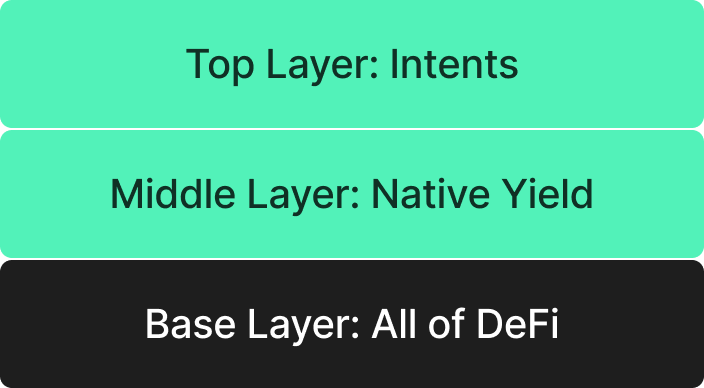

The Solution[​](https://docs.mantis.app/concepts/learn#the-solution "Direct link to The Solution")
--------------------------------------------------------------------------------------------------

**Mantis allows end users to tap into DeFi from a single point of entry: simply entering their intents for a desired outcome into the Mantis interface.** From there, Mantis handles the rest. This includes:

-   Expression of the intent to solvers
-   Execution of the intent
-   Settlement of the intent as a finalized transaction

Mantis also introduces native yield. Users holding assets on the Mantis rollup will earn native yield from the L1. This increases capital efficiency: users' assets are not stagnating when not being actively used.

Combining native yield with optimized chain-agnostic intent settlement provides users with a yield-bearing way to interact with the entirety of the crypto space. Users simply load their accounts on Mantis, submit intents to be optimally settled via our solver network, and earn yield on their assets in the process:

