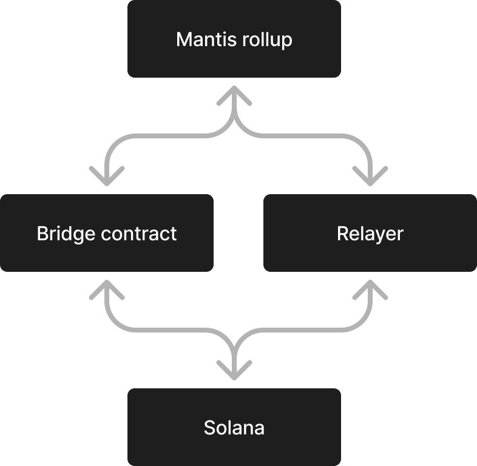
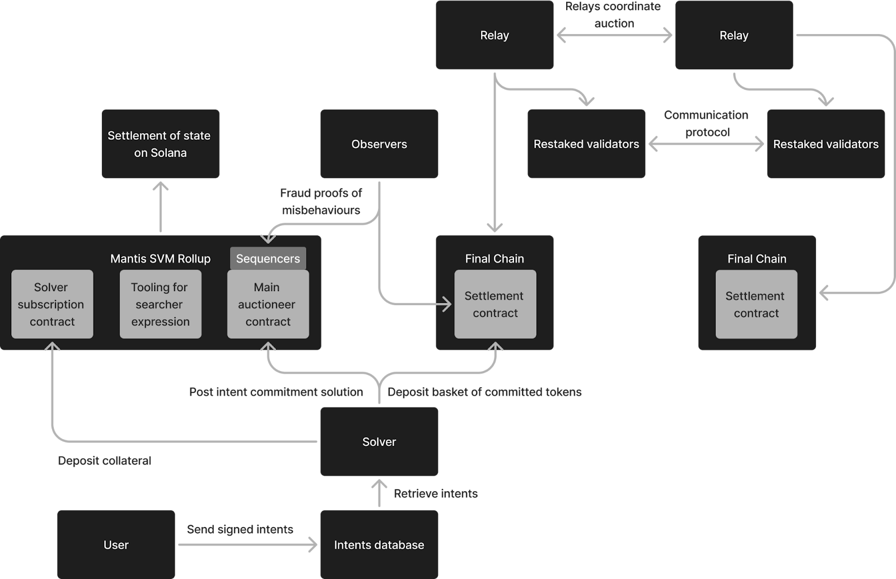

Why a Rollup?
=============

Rollups are layer 2 (L2) blockchains that enable transaction processing off of the main layer 1 (L1) chain. Their name is derived from their ability to "roll up" a number of transactions into a single piece of data that is sent to the L1 chain. Benefits of rollups are as follows:

**Scalability:**

Rollups were created as a scaling solution to address the computational overload on Ethereum that resulted in significant delays and skyrocketing transaction costs. Rollups and other L2 scaling solutions successfully lessened these issues on Ethereum, mitigating delays and lowering transaction costs.

**Security, Decentralization, and Native Interoperability of the L1:**

Rollups leverage the security and decentralization of the underlying L1. That is because the transactions from rollups are settled and recorded on the L1. Rollups are further natively interoperable with their L1 and any other ecosystems and applications built on that network.

**Additional Security from Proofs:**

Security on rollups is further enhanced by their use of proofs that ensure the state root is correct. For optimistic rollups, these are fraud proofs. For zero knowledge (ZK) rollups, they are ZK proofs. If these proofs find that the state root is incorrect, all batches dating back to the incorrect batch can be reverted.

**Independent Liveness:**

Importantly, rollups do not go down when the base L1 chain goes down. This is important to help us maintain liveness of the Mantis ecosystem.

**Sovereign Blockspace:**

Rollups also have sovereign blockspace from the underlying base chain. This means that Mantis can manage the blockspace of its own rollup. For example, Mantis blockspace could easily be sold in a blockspace marketplace. This would result in more efficient blockspace allocation.

**Customizability:**

Another major advantage of rollups is that they are extremely customizable. This feature was very important to Composable in its creation of Mantis: the Mantis rollup is a complex design that is carefully tailored and optimized for facilitating cross-chain user intent settlement. For example, rollups can have their own fee structures independent from their underlying L1 blockchains. This was particularly important given that we are building Mantis within the Solana ecosystem. The existing Solana fee structure has been largely regarded as the cause for the network's recent congestion issues. Therefore, we can implement our own fee structure to protect against these issues occurring on Mantis.

**Privacy:**

L2s act as an additional layer for processing. This allows for selective preprocessing auction rights to various searchers or other entities. As a result, intents and solutions on the Mantis rollup are able to remain private.

On Mantis, we use a validator client to make order flow private. On the Solana blockchain, the mempool leader (the person proposing the block) is a predetermined validator. Since Mantis will run the only validator on the Mantis rollup, we will be able to preserve the privacy of transactions. This protects against frontrunning and other malicious forms of MEV that can result from transactions not being private.