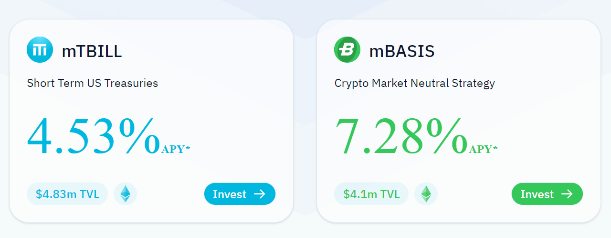

### Institutional Grade 

-   **High-quality assets**: Midas provides access to investment-grade assets, such as U.S. Treasury Bills or crypto-basis, offering stability and predictable returns for tokenholders. In doing so, Midas partners with the leading financial institutions and licensed asset managers to ensure the highest quality standards for all assets.

-   **Bankruptcy-remote**: Midas' products are safeguarded within a bankruptcy-remote structure, meaning that assets are held separately from Midas's operational risks. The independent verification agent, Ankura Trust, ensures that assets remain secure and protected in the unlikely event of third party failure. Details can be viewed under [Bankruptcy Remoteness](https://docs.midas.app/token-mechanics/mtbill/bankruptcy-remoteness).

-   **Independent data-reporting:** Midas provides full transparency through daily independent reports. Ankura Trust, a regulated third-party, verifies and reports on our assets, ensuring you have accurate, up-to-date information at all times.