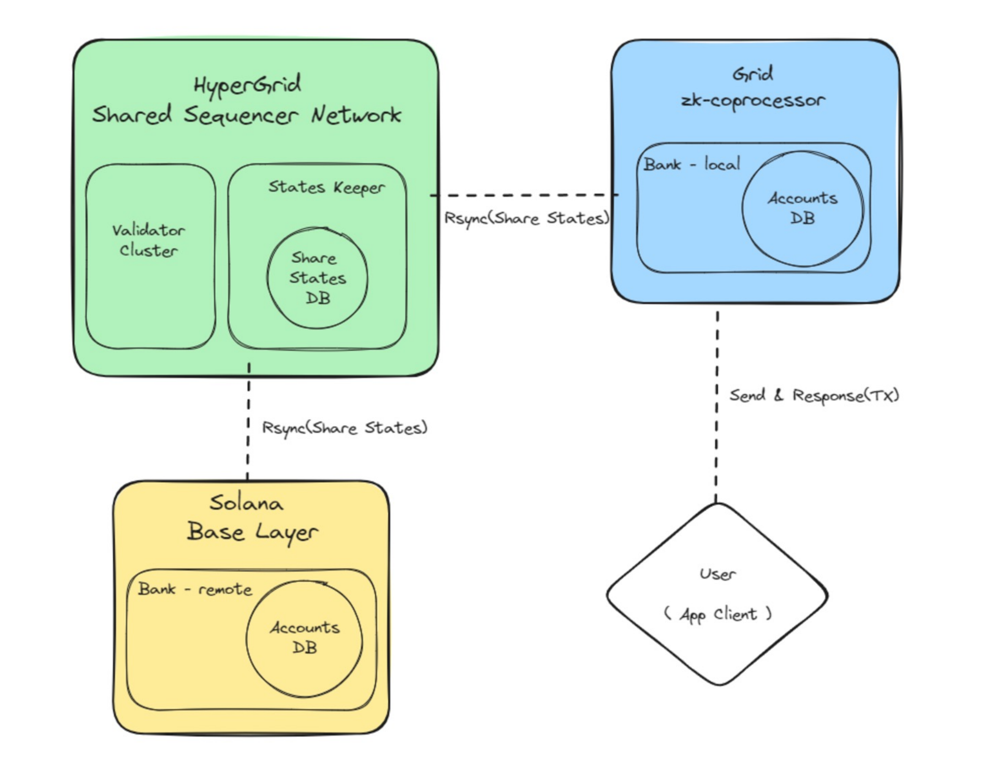
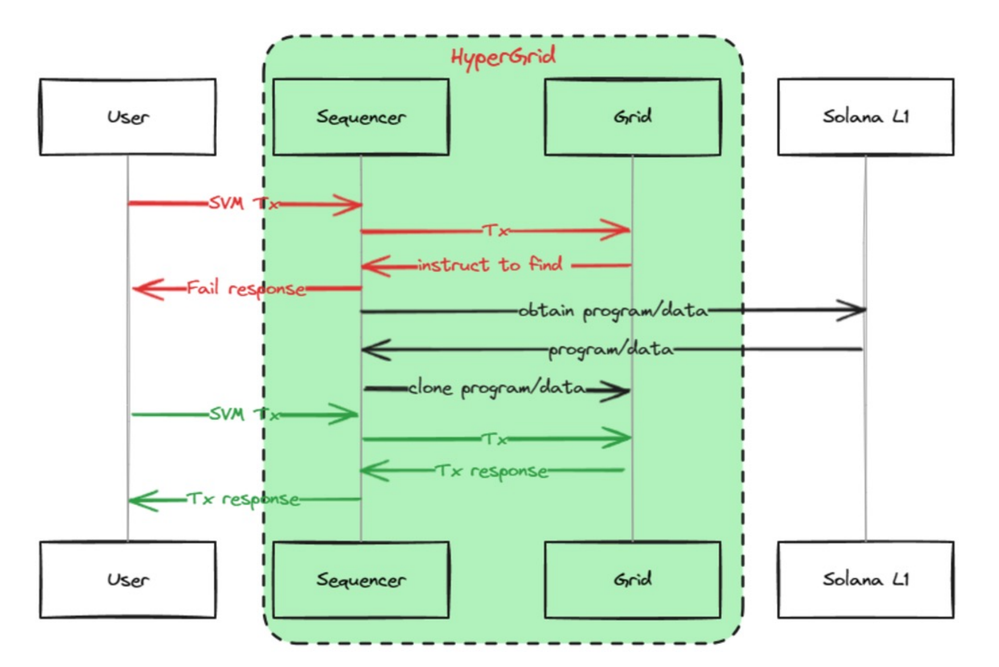

## 🔗 Interoperability with Solana L1 — Key Points

### 📖 **Definition of Interoperability**

* 🔄 **Seamless communication & exchange** *between HyperGrid and Solana*.
* 💱 **Use cases**:

  * 📤 Transactions on Solana L1 & asset management on HyperGrid.
  * ⚡ High-performance trading on HyperGrid with secure settlement on Solana L1.
  * 🔗 Asset & data transfer between different Grids in HyperGrid.
* 🚀 **Benefits**: *enhances scalability, security, liquidity, availability, and fosters dApp ecosystem growth*.

---

### 🏗 **Interoperability Features of HyperGrid Architecture**

#### 🌐 **Sonic Shared Sequencer Network (SSSN)**

* 🛠 **Facilitates cross-chain execution** *of transactions, program synchronization, and account data exchange*.
* 🔒 **Leverages Sonic ecosystem** *for privacy and scalability*.
* 🕸 **Decentralized mesh topology routing** for robust and fault-tolerant operations.

---

### 🕸 **Mesh Routing**

* 🚀 **Advancement over star routing** *enables program calls, asset, and data transfer between Solana L1 and any Grid, and between different Grids*.
* 🛡 **Fault tolerance** — *programs can be recovered from other Grids or Solana L1 even if deleted locally*.
* 🎮 **Developer benefits** — *reuse of existing program code for faster dApp/game development*.
* 📈 **Enhances ecosystem diversity** *and ensures smooth user experience*.

---

### 🧠 **Intelligent Scheduling**

* 📊 **Real-time load assessment** *for each Grid with minute-level prediction based on historical data*.
* ⚖ **Dynamic routing allocation** *optimizes system performance*.
* 🛡 **Abnormal access detection** — *tags or cleans behaviors like repeated errors or attacks to reduce failures*.
