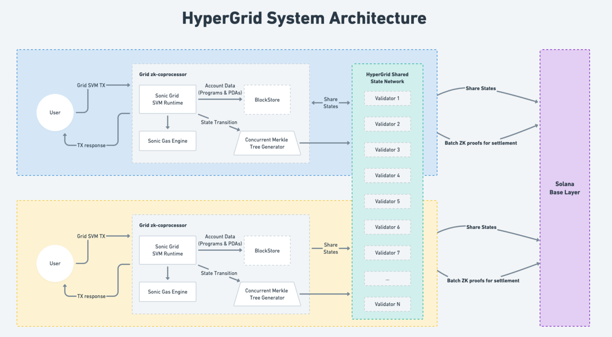
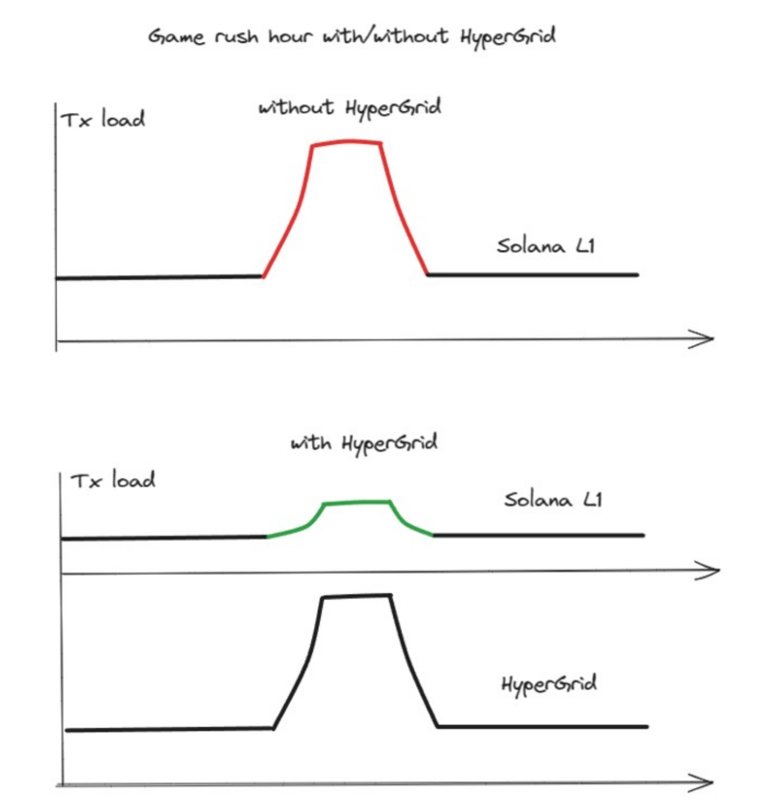

## 🧠 **Core Concepts of Grids and Network Relationships**

### 🕸️ **Grid Architecture**
- **HyperGrid Design**  
  *Supports a large number of decentralized applications (dAPPs) with minimal performance impact on Solana L1.*
- **FOCGs (Fully On-Chain Games)**  
  *Sonic’s implementation focuses on enabling large-scale FOCGs through HyperGrid.*

### ⚙️ **Performance Isolation**
- **Minimized Interference**  
  *Each dAPP operates independently, reducing cross-application performance degradation.*
- **Independent Transaction Processing**  
  *Verification, recording, and reading of transactions are handled separately for each grid.*

### 🧱 **Scalability Options**
- **Public vs. Exclusive Grids**  
  *Developers can choose between using the shared public grid or creating their own dedicated grid.*
- **Horizontal Scaling**  
  *Exclusive grids allow horizontal expansion tailored to specific application needs.*

### 💡 **Developer Flexibility**
- **Custom Grid Deployment**  
  *Grids can be created or shut down without affecting others.*
- **Performance vs. Cost Trade-off**  
  *Grid choice depends on the developer’s evaluation of performance requirements and cost efficiency.*

-------------

## 🔗 **Bridging Mechanism & Program Deployment**

### 🌉 **Asset Bridging**
- **HyperGrid Bridging Protocol**  
  *Facilitates secure and efficient asset movement between Solana L1 and individual grids.*
- **No Direct Grid-to-Grid Bridge**  
  *All cross-grid interactions are routed through Solana L1 via the HyperGrid network.*

### 🧠 **Cross-Grid Data Access**
- **Unified HyperGrid Network**  
  *Enables seamless access to data across different grids through Solana L1.*

### 🛠️ **Developer Control**
- **Grid Form Selection**  
  *Developers choose grid types based on application-specific requirements.*

### 🚀 **High-Performance dAPP Deployment**
- **TPS Thresholds for Scaling**  
  *Recommended to deploy a new independent grid if dAPP exceeds:*  
  - *100,000 average TPS*  
  - *1,000,000 peak TPS*
- **Horizontal Scaling Strategy**  
  *Creating a dedicated grid ensures performance isolation and operational stability for high-throughput dAPPs.*

---

## 🎮 Integration Scenarios

- **SDK Grid Construction**  
  *Use the HyperGrid SDK to build a grid and stake a fee to register on the Shared Sequencer Network.*

- **Independent Sequencer Network**  
  *Deploy a standalone Sequencer Network alongside your grid that runs autonomously without continuous service connections.*

## 🚀 Developer Deployment Options

- **Public Grid Deployment**  
  *Ideal for early-stage dAPPs or those with low-frequency interactions to leverage the HyperGrid public Grid.*

- **EVM/SVM Contract Deployment**  
  *dAPPs simply upload and deploy contract or program code compatible with EVM or SVM, regardless of grid form.*

## 🔄 Cross-Compatibility

- **Sonic SVM Compatibility**  
  *Supports contracts and code from EVM or SVM environments at native performance for seamless deployment and migration.*

---
## 🔗 Bridging SOL to HyperGrid

### 🧭 **Initial Transfer Process**
- **SOL Sent to Program Address**  
  *Users initiate the bridge by sending SOL to a specific address managed by HyperGrid validators on Solana Mainnet.*

### 🔐 **Validator Verification**
- **Multi-Signature Aggregation**  
  *Validators use BLS (Boneh-Lynn-Shacham) signatures to securely combine multiple signatures into one compact proof.*
- **Transaction Attestation**  
  *The aggregated signature confirms the transaction’s authenticity for Grid recognition.*

### 🪙 **SOL Minting on Grid**
- **Grid Verification**  
  *Once verified, the Grid mints an equivalent amount of SOL.*
- **State Binding**  
  *Minted SOL on the Grid is bound to the state of the original SOL on the Mainnet, ensuring consistency and trust.*
----------

## 🔄 Exiting SOL from Grids to Mainnet — Key Points

### 1️⃣ **Standard Withdrawal Transaction**

* 📝 **User initiates withdrawal** *within the Grid*.
* 🛡 **Grid validators generate BLS signature** *reflecting the quorum's approval*.
* 📤 **Signature sent to Mainnet** *triggers unlocking and release of corresponding SOL*.

### 2️⃣ **Emergency Exit Protocol**

* 🚨 **Triggered when Grid is inoperative** *user issues emergency exit directly on Mainnet*.
* 🔍 **Mainnet detects lapse** *in Grid’s state commitments — indicates operational failure*.
* 🛠 **Automatic claim mechanism** *secures user funds based on last known Grid state*.
* 📌 **State root updated** *on Mainnet to reflect user’s adjusted holdings after exit*.

### 🛡 **Continuous Access Assurance**

* 🔄 **Two-tiered system** *ensures users can always retrieve assets, even during Grid anomalies*.

---------------

### 🚀 Program Deployment on HyperGrid

#### 🔧 Developer Experience  
- **Seamless Deployment** 🔄  
  *Deployment on a Grid mirrors Mainnet processes—familiar tools and workflows are fully supported.*  
- **No Learning Curve** 📈  
  *Developers use existing EVM/SVM tools without adaptation, ensuring smooth onboarding.*

#### ⚙️ Sonic SVM Capabilities  
- **Dual Compatibility** 💡  
  **Sonic SVM** runs both **EVM** and **SVM** programs natively with full parity in:  
  - **Parallelism** ⚡  
  - **Security** 🔒  
  - **Speed** 🚀  
- **Native-Level Performance** 🏎️  
  *EVM/SVM programs run on Sonic SVM with no performance degradation.*

#### 💸 Deployment Advantages  
- **Lower Gas Fees** 💰  
  *Grids offer cost-efficient execution compared to Mainnet.*  
- **Enhanced Performance** ⚡  
  *Optimized infrastructure enables faster processing and scalability.*

#### 🧩 Supported Executables  
- **Solana-Compatible Executables** 🌐  
  ✅ Native support for Solana smart contracts  
  ✅ Leverages **high throughput** and **low latency** of Solana’s architecture  
- **EVM-Compatible Executables** 🔗  
  ✅ Supports Ethereum-based dApps and tools  
  ✅ Enables cross-chain portability from Ethereum and other EVM chains  

#### 🔐 Security & Reliability  
- **Mainnet-Grade Security** 🛡️  
  *Deployment maintains the same high standards of security and reliability as Solana Mainnet.*  
- **Optimized Infrastructure** 🛠️  
  *Built to scale without compromising integrity or performance.*

  ---------------