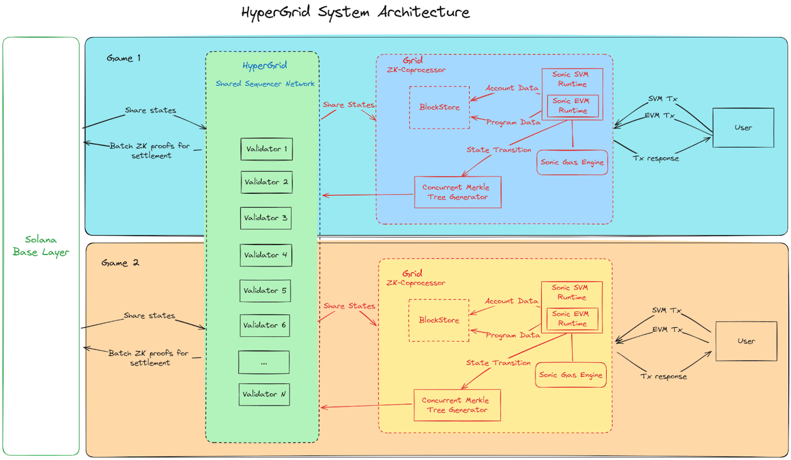

### 🏛️ Architectural Overview

*   **Multi-Grid Approach**: HyperGrid uses a network of **semi-autonomous grids**.
*   **Anchoring**: Each grid is anchored to the **Solana mainnet** for *consensus and finality*. ⚓

### 🏗️ HyperGrid System Architecture

#### Key Components

*   **Solana Base Layer** 🧱
    *   *The foundational layer providing ultimate consensus and finality.*
*   **HyperGrid Shared State Network (HSSN)** 🌐
    *   *Central to the architecture, spanning all grids.*
    *   Contains multiple **validators**.
    *   Facilitates **state sharing** between grids and the Solana Base Layer.
    *   Manages **batch ZK proofs** for settlement.
*   **Grid Structure (e.g., Grid 1, Grid 2)** 🎮
    *   *Represents a semi-autonomous ecosystem, often for specific applications like games.*
    *   **ZK-Coprocessor**: Manages *grid-specific Merkle proof operations*.
    *   **SVM Runtime**: The *execution environment on the Solana Virtual Machine*.
    *   **Sonic Gas Engine**: Manages *computational resources*.
    *   **Concurrent Merkle Tree Generator**: Efficiently processes *state transitions*.

#### User Interaction 🧑‍💻

*   Users interact **independently** with each grid.
*   Transactions (SVM & EVM) flow from users to the grid's runtimes.
*   Transaction responses are sent back to the users.

### 🌊 Data Flow

#### Interoperability – State Sharing

*   **Bi-directional state sharing** occurs between the Solana Base Layer and the HSSN. 🔄
*   The HSSN shares states with individual grids.
*   State sharing can also occur between different grids.

#### ZK Proofs 🔒

1.  Transactions are **compressed** and aggregated into a **Merkle tree**.
2.  The corresponding **root state hash** is committed for each block.
3.  A **Validity Proof** for the block is computed on the Grid.
4.  **ZK proofs** for settlement are posted from the HSSN to the Solana Base Layer.