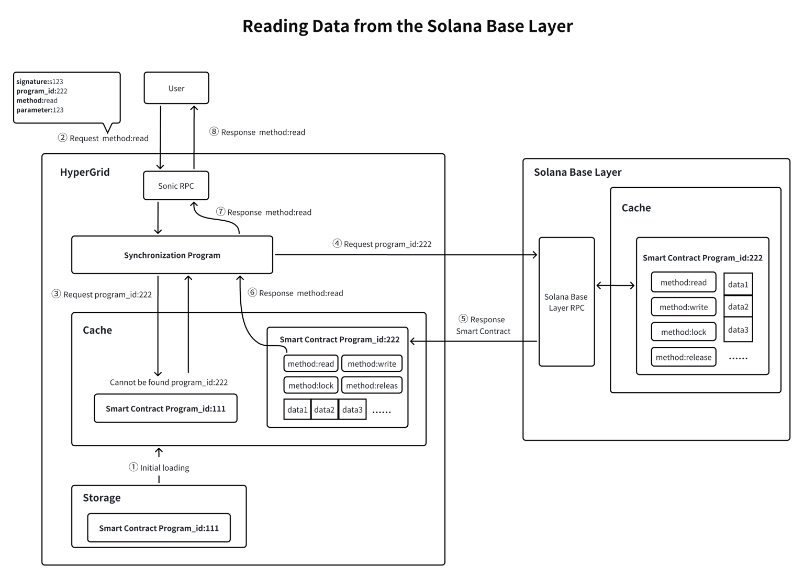
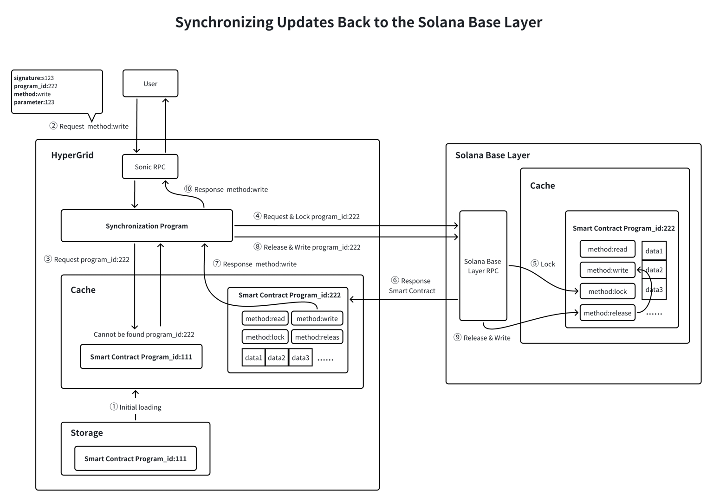

# **HyperGrid & Solana Data Synchronization: Key Points**  

## **📖 Reading Data from Solana to HyperGrid**  
1. **Initial Loading**:  
   - *Pre-existing Solana program loaded from Storage into HyperGrid's Cache.*  

2. **User Request**:  
   - *User sends a **read request** for a program via HyperGrid's **Sonic RPC**.*  

3. **Cache Check & Solana Fetch**:  
   - **Synchronization Program** checks Cache → *if not found*, requests data from **Solana Base Layer RPC**.  
   - Solana responds with **Program data**.  

4. **Cache Update & Response**:  
   - *Synchronization Program updates HyperGrid's Cache with new data.*  
   - *Read response sent back to **Sonic RPC** → forwarded to User.*  

---  

## **🔄 Synchronizing Updates from HyperGrid to Solana**  
1. **Initial Loading**:  
   - *Pre-existing Program loaded into HyperGrid's Cache.*  

2. **User Request**:  
   - *User sends a **write request** via **Sonic RPC**.*  

3. **Cache Check & Locking**:  
   - **Synchronization Program** checks Cache → *if not found*, requests **lock** on Solana Base Layer.  
   - *Solana locks the Program and sends data.*  

4. **Cache Update & Write Back**:  
   - *Synchronization Program updates Cache with new data.*  
   - *Requests **release of lock** and writes updated data to Solana.*  
   - *Solana confirms update → response forwarded to User via **Sonic RPC**.*  

---  

### **🔑 Core Concepts**  
- **HyperGrid Cache**: *Stores Solana program data for quick access.*  
- **Sonic RPC**: *Handles user read/write requests.*  
- **Synchronization Program**: *Manages data flow between HyperGrid & Solana.*  
- **Locking Mechanism**: *Ensures data consistency during writes.*