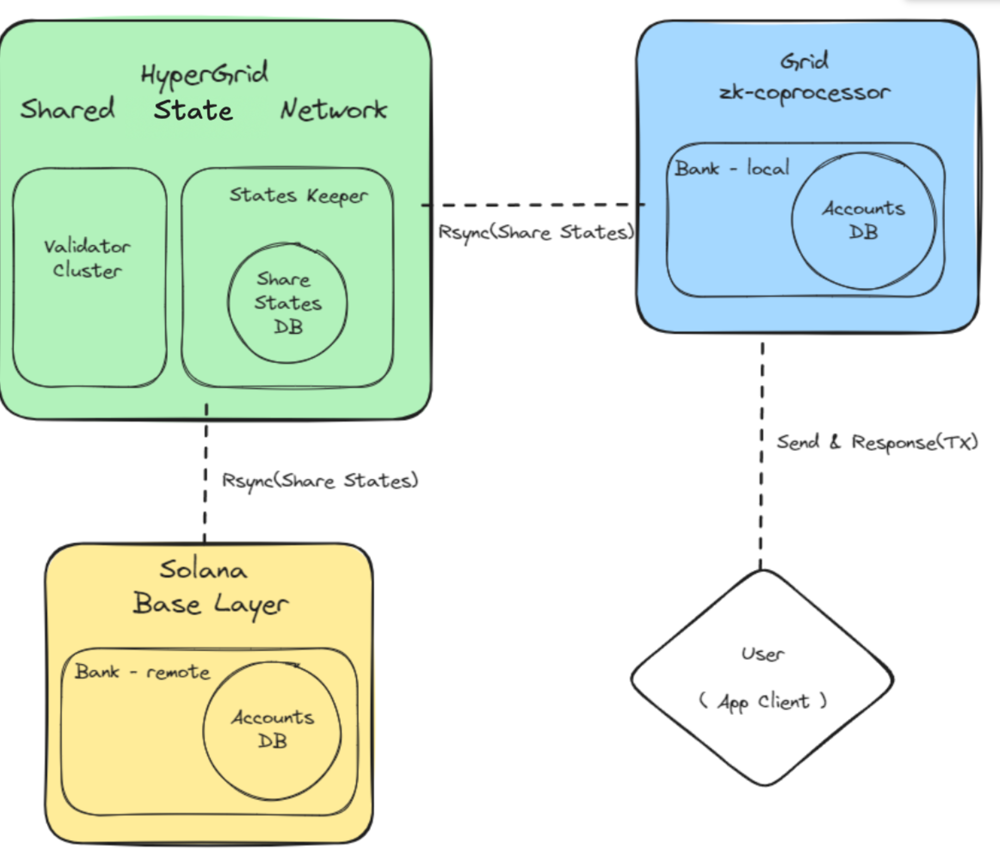

## 🌐 **Grids & Network Relationships — Key Concepts**

### 🔄 **HyperGrid Shared State Network Data Flow**

* **Application-Specific Networks** 🎯 → Supports *games, DeFi, AI agents*, and other high-demand dApps.
* **Load Reduction** 📉 → Minimizes strain on **Solana Base Layer** and prevents competition for block-space.
* **Custom Grid Instances** 🏗 → dApps can:

  * Instantiate their own **Grid** for a specific application
  * Build a **domain-specific SVM network**

---

### 🛠 **Key Features**

1. **Flexibility for Grid Creators** ⚙

   * Use **HyperGrid Public Network** 🌍
   * Horizontally scale into **dedicated networks** for specialized needs

2. **Performance & Cost Optimization** 💹

   * Choose **public** vs. **dedicated** networks based on performance and cost analysis

3. **Network Independence** 📴

   * Networks can be deactivated independently without affecting others

---

### 📋 **Operational Framework**

* **Validation** ✅ → Each network independently validates transactions & state changes
* **Logging** 🗃 → Transaction/state change logs maintained per network
* **Retrieval** 🔍 → Data retrieval handled autonomously within each network

---

### 🔗 **Integration with Solana**

* **Anchoring Mechanism** 🪝 → All Grid operations processed independently but **finalized on Solana** for consensus & security
* Combines **scalability & flexibility** with **Solana’s stability & trust**

------------

## 🌐 **HyperGrid Network Architecture**  
### Core Components
- **Shared State Network**  
  *Handles inter-Grid coordination & data flow while off-loading traffic from Solana.*  
- **Grid instances**  
  *Application-specific SVM networks (public or dedicated) that run independently.*  
- **Solana Base Layer**  
  *Provides final consensus & security anchor; minimal load.*  

---

## ⚙️ **Key Design Goals**
1. **Reduce Solana congestion** – Isolate high-demand dApps (games, DeFi, AI Agents).  
2. **Minimize block-space competition** – dApps no longer fight for Solana block inclusion.  
3. **Flexible deployment** – *Instantiate* a public Grid or spin up a **fully custom network**.  

---

## 🔧 **Developer Choices & Benefits**

| Option | When to Use | Perks |
|--------|-------------|-------|
| **Public HyperGrid** | Standard needs, lower cost | Shared infra, quick boot |
| **Dedicated Grid** | High perf / special rules | Horizontal scale, isolated fee market |

- **Network Independence** 🛠️ – *Pause or deactivate your Grid without harming others.*  
- **Performance vs. Cost trade-off** – Decide based on real workload metrics.

---

## 🔁 **Operational Autonomy per Grid**
- **Validation** – Each Grid self-validates transactions.  
- **Logging** – Local, independent transaction & state logs.  
- **Retrieval** – Data queries handled inside the Grid; no cross-Grid dependency.  

---

## 🔐 **Integration with Solana**
- **State Commitment** – Periodic checkpoints anchor to Solana → inherits security.  
- **Minimal Base Layer Load** – Only final proofs hit Solana; execution stays off-chain.