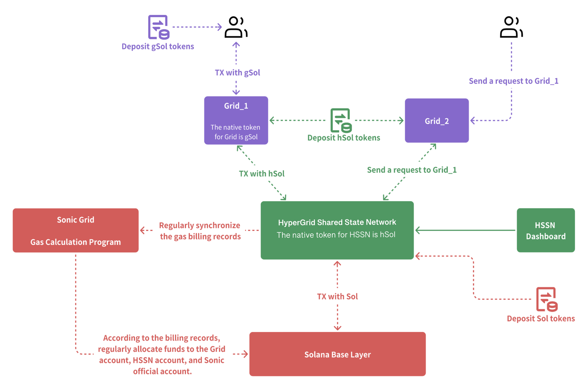

## HSSN Gas Fee Mechanism

### Core Concepts
- **Gas Fees**: *Costs for user-initiated transactions in the HSSN, distributed among network participants to incentivize processing and maintain ecosystem efficiency.*
- **HSSN Architecture**: *A system integrating Grid nodes, HSSN validators, Sonic Grid, and Solana Base Layer for fee calculation, validation, and distribution.*
- **Transparency**: *Achieved through the HSSN Dashboard, allowing users to view transaction and fee details.*

### Gas Fee Distribution Breakdown
- **Sample Transaction** 💰:
  - **Burned Fees**: *50% (0.00000125 SOL)*, *removed from circulation to control token supply*.
  - **HSSN Fees**: *12.52% (0.00000313 SOL)*, *allocated to HSSN validators for managing transaction data*.
  - **SONIC Fees**: *12.52% (0.00000313 SOL)*, *allocated to Sonic Grid for bill packaging and execution*.
  - **GRID Fees**: *25% (0.00000625 SOL)*, *allocated to Grid nodes for receiving and processing user requests*.
  - *Total Fee: 0.00000250 SOL (100%)*.
- **Variability**: *Actual fees and distributions vary based on network congestion, transaction complexity, and gas prices.*

### Gas Fee Distribution Process
1. **Transaction Request & Bill Generation** 📝
   - Grid node calculates **gas fee** based on *predefined rules*.
   - Generates **bill record** detailing fee distribution.
2. **Bill Forwarding & Viewing** 📤
   - **Hypergrid-aide program** on Grid nodes *forwards bills to HSSN validators periodically*.
   - Users view details on **HSSN Dashboard** under *Grid Block Fee tab*.
3. **Execution by Sonic Grid** ⚙️
   - **Sonic Grid** *packages and executes bills in batches*.
   - Users view executed bills on **HSSN Dashboard** under *Fee Settlement tab*.
4. **Final Distribution** 💸
   - Sonic Grid transfers fees to **Grid nodes**, **HSSN validators**, **Sonic Grid nodes**, and **Solana Base Layer nodes** based on *pre-calculated plan*.

### Key Insights
- **Efficiency**: *Streamlined process ensures quick and fair fee distribution across the ecosystem.*
- **Ecosystem Integration**: *Involves Grid nodes for initial processing, HSSN for validation, Sonic Grid for execution, and Solana for final distribution.*
- **User Accessibility**: *HSSN Dashboard provides clear visibility into fee calculations, bills, and settlements.*