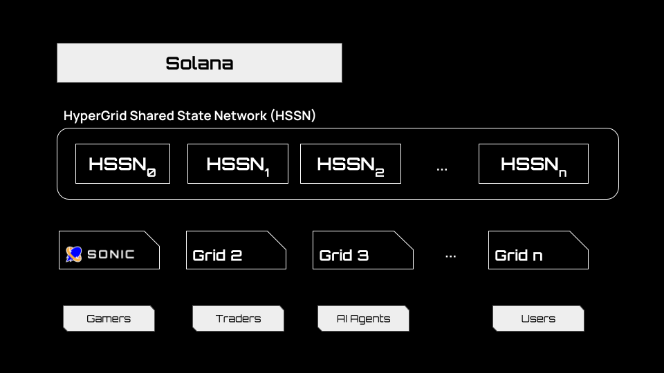
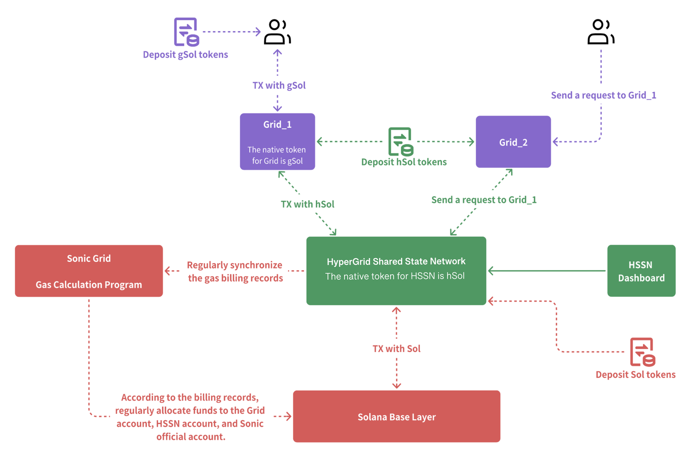

# **🚀 HyperGrid Shared State Network (HSSN) Overview**  

## **🌐 Introduction**  
- **HSSN** (*HyperGrid Shared State Network*) is a **consensus layer, communication hub, and state management cluster** for the Grid ecosystem.  
- Manages **state synchronization** between **Grids** and the **Solana base layer**, including **block data rollups**.  

---

## **🏗️ HSSN Architecture**  
### **🔹 Core Components**  
- Built on **Cosmos framework** for secure cross-chain communication.  
- **Key Data Structures**:  
  - Grid registration  
  - Communication data sources  
  - Versioning  
  - Read/write states  

### **🔹 Extended Features**  
- **Extended Account Data Fields**:  
  - Augments Solana’s native account data for **Grid state synchronization**.  
- **Refactored Grid RPC**:  
  - Enables **direct Grid ↔ HSSN communication** for interoperability.  

---

## **⛽ Gas Charging & Allocation**  

- **Users pay gas fees** for certain Grid requests.  
- **Sonic Grid** runs a **gas calculation program** for centralized management.  
- **Gas synchronization**:  
  - Billing records synced with HSSN.  
  - Funds allocated to **Grid accounts, HSSN accounts, and official accounts**.  

---

## **🔄 Interactions & Data Flow**  
### **📡 Grid ↔ HSSN Communication**  
- Grids send **state updates** to HSSN.  
- HSSN **synchronizes states** across Grids.  

### **⛓️ HSSN ↔ Solana Base Layer**  
- **Periodic block data rollups** for synchronization.  
- Manages **extended account data fields**.  

### **🔗 Inter-Grid Communication**  
- HSSN enables **state sharing between different Grids**.  

---

## **🔗 Relationship to Other Components**  
HSSN interacts with:  
- **Individual Grids**  
- **Solana Base Layer**  
- **Gas Calculation Program (Sonic Grid)**  

### **🎯 Role in the Ecosystem**  
- Enhances **scalability, interoperability, and efficiency** by serving as a **centralized state & communication layer**.