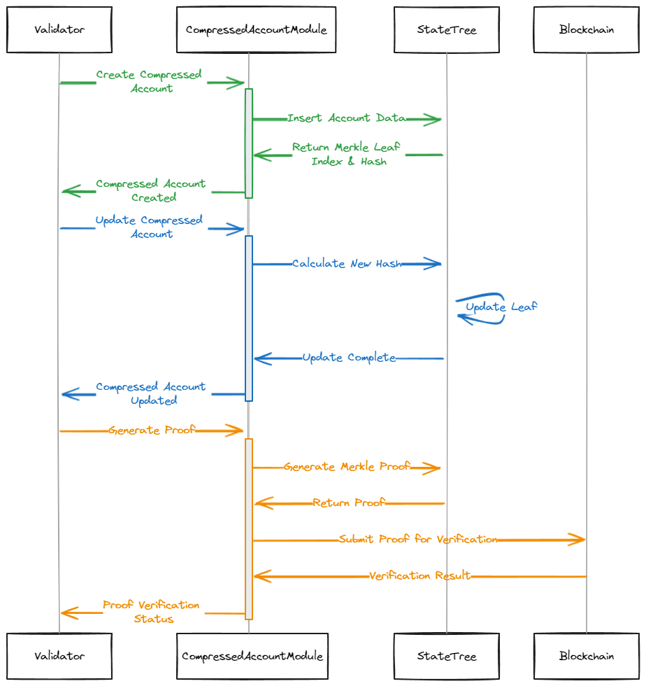

# ⚡ Verifiable Compute & Zero-Knowledge Proofing on HyperGrid

---

## 🖥 About the **Sonic zk-Coprocessor**

* **Purpose**: *Batch transaction processing & proof generation* for commitments to **Solana L1**.
* **Deployment**: Runs on **Sonic’s Grid instance** and other HyperGrid-orchestrated grids.
* **Note**: *Different from other chains’ co-processors; name may change in future.*

**Core Functions**

1. 🔄 **Transaction Processing & Compression** – Aggregate and optimize all transactions.
2. 🧮 **State Transition Proof Generation** – For each block.
3. 📜 **Commit Proofs to Solana Mainnet** – Ensuring verifiable integrity.

---

## 🛠 Implementation Phases

### **Phase 1 — HyperGrid Optimistic Rollup**

* **Goal**: *MVP launch & onboard games quickly*.
* **Approach**: Shorter dev time, optimistic rollup before full zk rollup.
* **Steps**:

  1. 📦 Compress transactions → aggregate into **Merkle Tree**.
  2. 🔗 Commit **root state hash** per block.
  3. 🛡 Generate & commit **validity proof** to Solana L1.
  4. ✅ **Verifier Program** checks proof; challenges possible if invalid.

**Protocols Considered**:

* Light Protocol’s Verifier
* In-house Verifier

---

### **Phase 2 — Full Zero-Knowledge Rollup Integration**

* **Goal**: *Instant finality & combined proof system*.
* **Enhancement**: Merge **validity proof** + **consistency proof** → single zk-proof.
* **Tech Stack**: zk-circuits for SVM via **Light Protocol** or native Solana zk primitives.

**Steps**:

1. 📦 Compress & aggregate transactions into Merkle Tree.
2. 🔗 Commit **root state hash** per block.
3. 🛡 Generate & commit **zk-proof** to mainnet.

**Milestones**:

* ⚙ Augment runtime to support zk-circuits for transaction processing.
* 🔍 Perform zk-runtime tracing from circuit outputs.
* 🏗 Generate proofs from runtime execution traces.

---

## 🧩 Sonic zk-Coprocessor Primitives

* **📄 Compressed Accounts**

  * *Each transaction = compressed account*.
  * Program-owned, optional **PDA**.
  * Uses **Light Compressed Account** format.

* **🌳 Concurrent Merkle Trees**

  * *Stores compressed transaction states*.
  * **Leaf node = data piece** created/consumed in transaction.
  * Only **32-byte root hash** stored on-chain.
  * Multiple state proofs → compressed into **single 128-byte validity proof** via Light’s ZK cryptography.

---

## 🔍 Why Light Protocol?

* **Advantage**: Pre-built **zkSVM primitives** needed for Sonic’s full zk-rollup.
* **Status**: Active collaboration & monitoring of updates.
