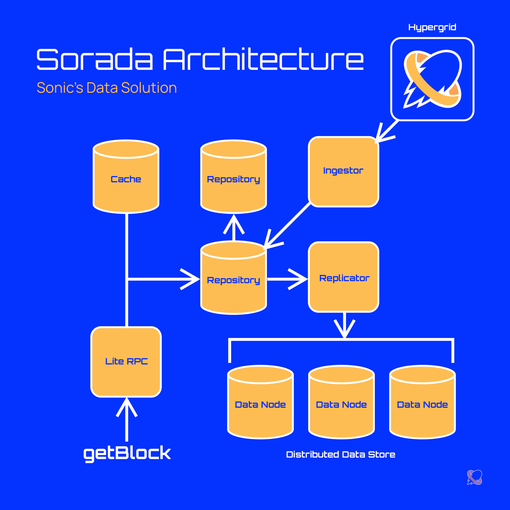

## 🏗 Sorada Architecture — Core Concepts

### ⚙ **Services**

* **Lite RPC** 🪶

  * *Optimized Solana RPC service*
  * Only keeps *data retrieval endpoints* (e.g., `getBlock`, `getTransaction`)
  * Stripped from a full Solana node to improve *read request performance*

* **Ingestor** 📥

  * *Pulls real-time data* from the **Sonic Hypergrid**
  * *Persists* the data into **Big Table storage**

* **Replicator** 🔄

  * *Replicates indexed data* from **Big Table**
  * Stores into a **distributed filesystem** for *resiliency and fault tolerance*

---

### 📦 **Data Repositories**

1. **Cache** ⚡

   * *Speeds up retrieval* of frequently requested data
2. **Big Table** 📊

   * *Primary data store* for persistent storage
3. **Distributed Filesystem** 🌐

   * *Self-replicating system* to preserve data across multiple nodes
