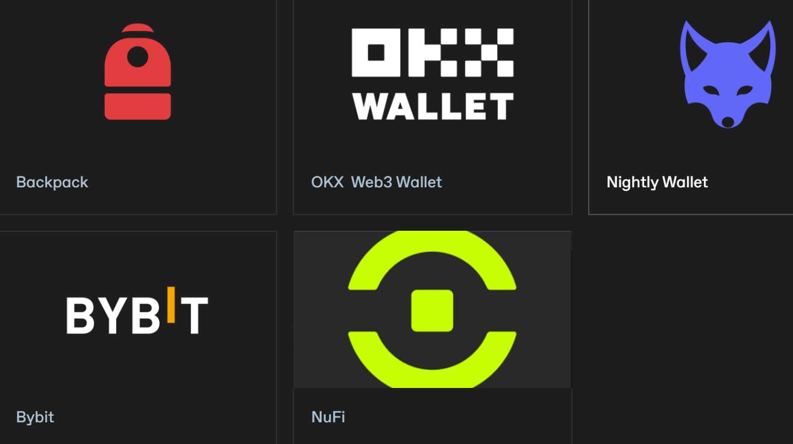

---

## **Overview**

* **Purpose of your wallet**
  *Your wallet acts as your digital identity on Sonic, enabling blockchain interactions, asset management, and transactions.* ([docs.sonic.game][1])

---

## **Supported Wallets**

You can set up Sonic using one of the following browser-extension wallets:

* **Backpack**
* **OKX Web3 Wallet**
* **Nightly Wallet**
* **Bybit**
* **NuFi** ([docs.sonic.game][1])

---

## **Setup Process Steps**

1. **Visit the wallet’s official website**
2. **Download and install the browser extension**
3. **Create a new wallet or import an existing one**
   *(Follow the wallet-specific setup instructions provided in the extension.)* ([docs.sonic.game][1])

---

## **Key Takeaways**

* **Wallet = Digital Identity**
  *Essential for engaging with Sonic’s ecosystem—everything from sending transactions to managing assets hinges on having a properly configured wallet.*

* **Multiple Options Available**
  *Flexibility to choose from various supported wallets based on personal preference or familiarity.*

* **Straightforward Setup**
  *Consistent, user-friendly steps across wallets: official website → install → create/import.*

---

## **Quick Reference**

| Step | Action                          | Purpose                           |
| ---- | ------------------------------- | --------------------------------- |
| 1    | Go to wallet’s official website | Ensures security and authenticity |
| 2    | Install browser extension       | Enables wallet functionality      |
| 3    | Create/import wallet            | Grants access to Sonic ecosystem  |

---

