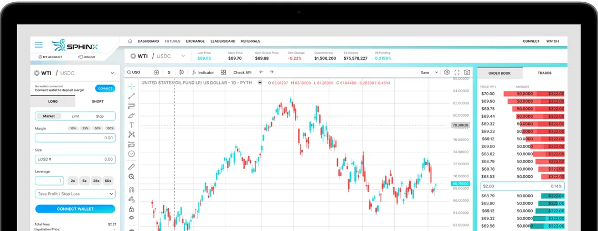

Sphinx

https://www.sphx.io/#

---------
At Sphinx, we reshape commodities derivatives trading by leveraging blockchain technology to build a more efficient, transparent, and
accessible market. Through innovative perpetual swaps and secure, scalable solutions, we enhance capital efficiency and reduce
costs. Committed to regulatory excellence and top-tier security, we empower traders and foster a fair, open financial ecosystem that
drives growth and innovation.

PERPETUAL SWAPS AND SIMPLIFIED TRADING
High Leverage, Low Margin, Instant Settlement
Enjoy capital efficiency and simplified trading via perpetual swaps, with access to inaccessible commodities and transparent funding rates for spot exposures.

-------------

## our partners
Sphinx Exchange collaborates with leading firms in finance and technology
to build a robust and secure trading platform. Our key partners include:

####  pyth
Pyth Network: A blockchain-based Oracle providing real-world data to smart contracts.

####  circle
A financial tech company known for managing USDC and facilitating blockchain payments + commerce.

####  TRUFLATION
Truflation: Focuses on tokenizing real-world assets via transparent, real-time financial data.

#### blockDelta
BlockDelta: A talent-base solutions agency specializing in blockchain, AI, metaverse, and tech innovation.

Clifford Chance: One of the world's largest law firms with extensive global resources.

#### alphastack
AlphaStack: Specialized marketing agency that guides clients through the complexities of Web3.