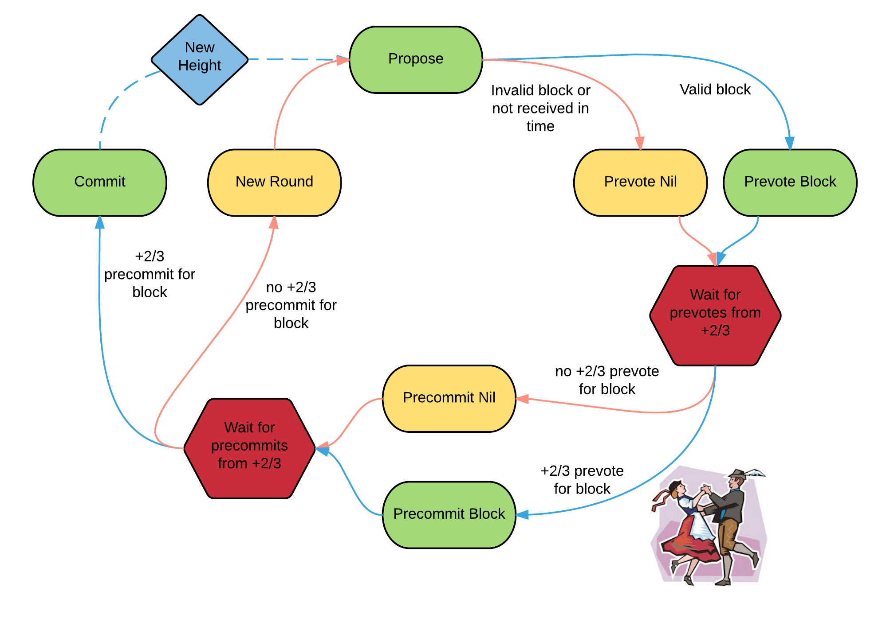

Q1: What are validators in the Tendermint consensus algorithm? A1: Validators are participants in the algorithm who take turns proposing blocks of transactions and voting on them.

Q2: How are blocks committed in Tendermint? A2: Blocks are committed in a chain, with one block at each height. A block is committed when more than 2/3 of validators pre-commit for the same block in the same round.

Q3: What are the two stages of voting required to commit a block? A3: The two stages are pre-vote and pre-commit.

Q4: What is a "polka" in Tendermint consensus? A4: A polka occurs when more than two-thirds of the validators pre-vote for the same block.

Q5: Why is there a picture of a couple doing the polka associated with Tendermint? A5: The picture is used because validators are doing something like a polka dance in the consensus process.

Q6: What happens if a block fails to be committed? A6: If a block fails to be committed, the algorithm moves to the next round, and a new validator gets to propose a block for that height.

Q7: Why might validators fail to commit a block? A7: Validators may fail to commit a block for reasons such as the current proposer being offline or the network being slow.

Q8: How does Tendermint handle situations where a validator should be skipped? A8: Tendermint consensus allows validators to establish that a validator should be skipped. Validators wait a small amount of time to receive a complete proposal block before voting to move to the next round.

Q9: Is Tendermint consensus a synchronous or asynchronous algorithm? A9: Tendermint consensus is a weakly synchronous algorithm due to its reliance on timeouts. However, most of the algorithm is asynchronous.

Q10: What is the safety guarantee of Tendermint consensus? A10: Assuming less than one-third of the validators are Byzantine, Tendermint consensus guarantees that safety will never be violated - validators will never commit conflicting blocks at the same height.

Q11: What are the locking rules in Tendermint consensus? A11: Once a validator precommits a block, it is locked on that block. It must prevote for the block it is locked on and can only unlock and precommit for a new block if there is a polka for that block in a later round.

-------

Since CometBFT can replicate arbitrary applications, it is possible to define a currency, and denominate the voting power in that currency. When voting power is denominated in a native currency, the system is often referred to as Proof-of-Stake. Validators can be forced, by logic in the application, to “bond” their currency holdings in a security deposit that can be destroyed if they’re found to misbehave in the consensus protocol. This adds an economic element to the security of the protocol, allowing one to quantify the cost of violating the assumption that less than one-third of voting power is Byzantine.