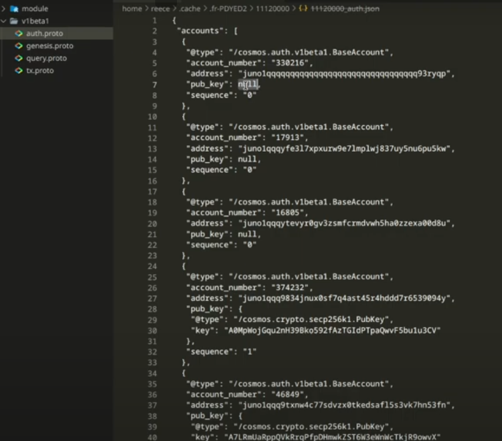
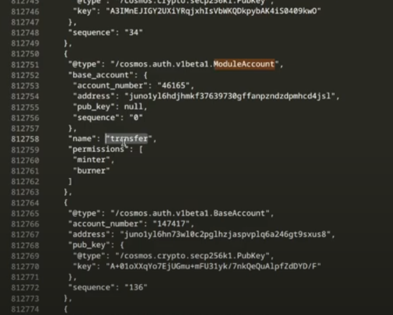
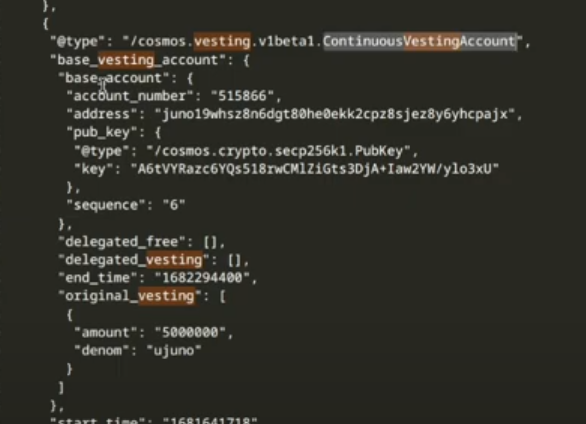

https://cosmos.directory/

**Cosmos SDK Account Types**

The Cosmos SDK has two main account types:

* **Base Account**: This is the type of account that the average user will have.
* **Module Account**: This type of account is owned by the chain and is used for specific purposes, such as governance or token management.

**Base Account**

* **Address**: A human-readable wallet address.
* **Public Key**: The public key associated with the account, which is used to verify transactions.
* **Account Number**: A unique number that is incremented by one for every new base account or module account.
* **Sequence**: A number that increases with every transaction that is made on the account.

**Module Account**

* **Account Name**: The name of the account, which is used to derive the wallet address.
* **Base Account**: The base account that is wrapped within the module account.
* **Permissions**: Additional permissions that are granted to the module account, such as the ability to mint or burn tokens.

**Account Export**

* **State Export**: The Cosmos SDK allows for the export of all accounts on a chain at a specific height.
* **Account Type**: The type of account, either base account or module account.
* **Account Number**: The unique account number.
* **Wallet Address**: The human-readable wallet address.
* **Public Key**: The public key associated with the account, if applicable.
* **Sequence**: The number of transactions that have been made on the account.

**Module Account Examples**

* **IBC Keeper**: The IBC keeper module account has permissions to mint and burn tokens.
* **Vesting Accounts**: Vesting accounts are a type of wrapped base account that have additional fields, such as delegated free vesting, vesting end time, and original vesting amount.

**Vesting Account Example**

* **Continuous Vesting Account**: A type of vesting account that has a specific vesting schedule.
* **Delegated Free Vesting**: The amount of tokens that are delegated to the account.
* **Vesting End Time**: The time at which the vesting period ends.
* **Original Vesting Amount**: The original amount of tokens that were vested.