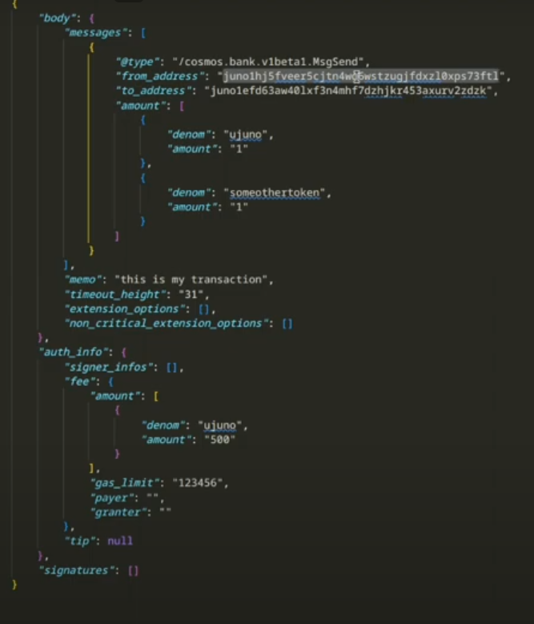

#### **Introduction to Transactions in Cosmos**

-   **Transactions:** In Cosmos, interactions with the blockchain are conducted via transactions.
-   **Contents of a Transaction:** Transactions contain all necessary data for validation, payment, and the specific requests being made to the blockchain.

* * * *

#### **Default Transaction JSON Structure**

-   **Messages:**

    -   **Definition:** Actions within a transaction.
    -   **Usage:** Can include various operations like sending tokens or interacting with smart contracts.
-   **Memo:**

    -   **Definition:** A field for arbitrary data.
    -   **Usage:** Often used by applications for transaction tracking, such as user identification by centralized exchanges.
-   **Timeout Height:**

    -   **Definition:** A block height after which the transaction becomes invalid if not processed.
    -   **Usage:** Protects against low-fee transactions being stuck indefinitely; transactions can be resubmitted or canceled if not validated by a certain block height.
-   **Extension Options:** Additional data fields for custom logic or extended functionality.

* * * *

#### **Fee and Gas Management**

-   **Fee Management:**

    -   **Details:** Fees are required to process transactions and can be paid by different accounts using the fee grant module.
    -   **Example:** If an account doesn't have enough tokens for fees, another account or smart contract can cover the fees.
-   **Gas Amount:**

    -   **Definition:** The computational cost required to process the transaction.
    -   **Usage:** Important for ensuring that the transaction has enough resources to be processed without exceeding limits.

* * * *

#### **Signatures and Authentication**

-   **Signatures Tab:**

    -   **Purpose:** Contains the signature of the transaction, proving ownership of the account performing the transaction.
    -   **Implementation:** Done through CLI or a frontend like kmJS, verifying the "from" address.
-   **Verification Process:**

    -   **Steps:** The transaction is signed with a private key and validated to ensure only the rightful owner can initiate transactions.

* * * *

#### **Detailed Exploration of Messages**

-   **Actions within Messages:**

    -   **Single Action Example:** Sending native tokens (e.g., Juno) from one address to another.
    -   **Multiple Actions:** Developers can combine multiple actions (e.g., sending tokens, executing contracts) into a single transaction for efficiency.
-   **Transaction Efficiency:**

    -   **Optimization:** Running multiple actions in a single transaction reduces computational overhead compared to running separate transactions.

* * * *

#### **Handling Transaction Failures**

-   **Failure Scenario:**

    -   **Description:** If a transaction tries to execute more actions than the account's balance allows, it will fail.
    -   **Process:** The transaction processes actions sequentially until it encounters insufficient funds, causing a rollback of all actions.
-   **Non-Atomic Transactions:**

    -   **Current Limitation:** All actions within a transaction must succeed, or the entire transaction fails.
    -   **Future Development:** The SDK may support atomic transactions, allowing partial successes.

* * * *

#### **Fees and DDoS Protection**

-   **Failed Transaction Fees:**
    -   **Reasoning:** Even if a transaction fails, fees are still charged to prevent abuse, such as DDoS attacks where many transactions are submitted to overload the network.

* * * *

#### **Advanced Transaction Types**

-   **Multi-Message Transactions:**
    -   **Example:** Combining multiple actions like minting tokens with a smart contract in a single transaction.
    -   **Failure Handling:** If one message fails, all messages in the transaction are reverted.

* * * *

#### **Example: Programmatic Transaction Handling**

-   **Smart Contract Interaction:**

    -   **Python Script Example:** Iterates over data to create and send multiple messages in a single transaction.
    -   **Efficiency:** Enables large-scale operations within a single block, ensuring all-or-nothing execution.
-   **Execution Flow:**

    -   **Steps:** Generate the transaction body, sign it, and broadcast it to the chain.
    -   **Convenience:** Streamlines complex interactions like batch minting NFTs.

* * * *

#### **Transaction Metadata and Logging**

-   **Transaction Hash:**

    -   **Definition:** A SHA-256 hash representing the transaction, useful for tracking and verification.
-   **SDK Response Codes:**

    -   **Code Zero:** Indicates a successful transaction.
    -   **Non-Zero Codes:** Signify errors like insufficient fees or incorrect sender information.
-   **Gas Usage and Efficiency:**

    -   **Observation:** Adding more messages to a transaction increases gas usage, but not linearly; the system becomes more efficient with multiple messages.

* * * *

#### **Event Logging and Analysis**

-   **Raw Logs:**

    -   **Usage:** Provide detailed information about events triggered by the transaction, such as token transfers.
    -   **Application:** Useful for tracking, tax reporting, and understanding blockchain activity.
-   **Gas Estimation:**

    -   **Efficiency:** As more messages are added, gas usage does not scale linearly, leading to more efficient processing of complex transactions.