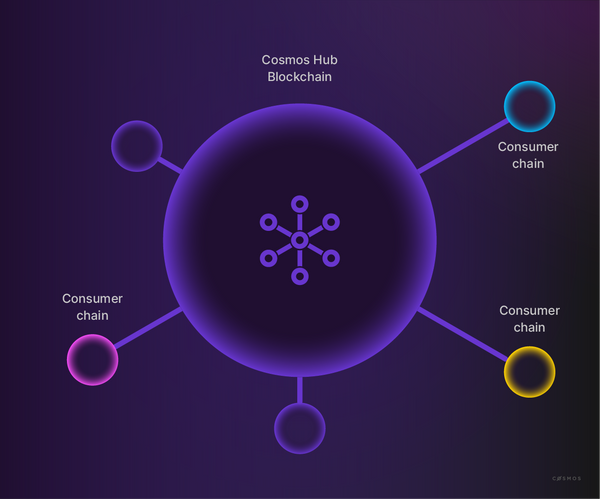

The interchain has emerged as the leading platform for building blockchains devoted to a single application. Chains created with the Cosmos SDK provide more scalability, configurability, and sovereignty than deploying a contract on a smart contract platform such as Ethereum.

However, Cosmos chains have historically had a major challenge to overcome: they must be secured by a decentralized validator set, with a valuable staking token. This has been a hurdle for many projects that would otherwise benefit from running on a Cosmos chain. Putting together a validator set can be a distraction from building a community of engaged users, and building in a staking token can complicate a project's tokenomics. Furthermore, the chain's security is directly tied to the market cap of the staking token, which may take time to increase in value, thereby subjecting the project to numerous security risks along the way to maturity.

With Interchain Security, developers will be able to launch a chain running their EVM, CosmWasm, or Cosmos SDK application. This chain will be secured by the validator set of the Cosmos Hub and the full market cap of the ATOM. This is known as a *consumer chain*, since it "consumes" security from the Hub (the *provider chain*).

### Sovereignty and incentivization

It is important to note that each consumer chain's transactions are *not* being executed on the provider chain. Each chain retains its sovereignty because both the execution layer and the data layer are independently hosted on-chain. This means that the Cosmos Hub maintains enough blockspace to keep executing its core functions, and that netto blockspace for the total Interchain Secured network is effectively increased. To achieve this, validators are obligated to run a separate validator node for the consumer chain, once this chain has been approved through an on-chain governance process.

As you might imagine, the validators and ATOM delegators who get to vote on such a governance proposal would rightfully ask what is in it for them, because running a validator node for a new chain comes with additional costs. This mechanism is intentionally designed to incentivize consumer chains to design their applications to benefit ATOM holders, through either providing native token rewards or additional value to the ATOM token that would otherwise not be generated on the Cosmos Hub itself.

At its core, Interchain Security is an implementation of the Cross-Chain Validation (CCV) specification. Using the [Inter-Blockchain Communication](https://ida.interchain.io/academy/3-ibc/1-what-is-ibc.html) (IBC) protocol, packets are relayed to make sure the consumer chain knows which validators are securing the Cosmos Hub and how much voting power they have. At the same time, the consumer chains need to tell the provider chain when there is evidence of misbehavior so that validators can get slashed on their ATOM tokens on the Cosmos Hub - an essential mechanism under Proof-of-Stake.

The IBC protocol is comprised of several Interchain Standards (ICSs) that make up the protocol. The specification for Cross-Chain Validation is known as [ICS-028 ](https://github.com/cosmos/ibc/blob/main/spec/app/ics-028-cross-chain-validation).

Each chain that is part of the Interchain Secured network contains either a provider or consumer [CCV module ](https://github.com/cosmos/interchain-security/tree/main/x/ccv)which takes care of the following tasks:

-   **Channel initialization:** After a governance proposal to add a consumer chain passes, the provider chain creates a [light client](https://ida.interchain.io/academy/3-ibc/4-clients.html) of the consumer chain which relayers use to initiate the [connection](https://ida.interchain.io/academy/3-ibc/2-connections.html). Once the consumer chain starts running at the [`spawn_time` ](https://github.com/cosmos/interchain-security/blob/main/proto/interchain_security/ccv/provider/v1/provider.proto#L36), validators are expected to have their nodes up and running on the consumer chain. Relayers then create the [channel](https://ida.interchain.io/academy/3-ibc/3-channels.html) which is dedicated to Cross-Chain Validation.
-   **Validator set changes:** If a validator on the Cosmos Hub changes its voting power through a change in delegations or through being jailed, this change needs to be communicated to all consumer chains. The provider CCV module sends what is called a *Validator Set Change* (VSC) using the IBC protocol. The consumer CCV module applies these changes to its consensus engine and communicates that the changes have been applied to the provider chain, which then registers its success in its own CCV module.
-   **Consumer initiated slashing:** If a validator misbehaves on the consumer chain, the provider chain needs to be informed so that it can slash a portion of the staked ATOM. Once the evidence has been submitted to and accepted by the consumer chain, it then uses the CCV channel to transfer a `SlashPacket` to the Cosmos Hub, which then executes a slashing operation on the staked ATOM. In some cases, a (temporary) jailing of the validator can also occur. This effectively means that if a validator misbehaves and gets jailed on one consumer chain, it will be affected on all consumer chains, as well as the Cosmos Hub.
-   **Reward distribution:** Similar to other Cosmos SDK chains, consumer chains can have a native token that gets paid out as a block reward for validators and delegators. At each block, a fraction of the block rewards is transferred to the consumer's CCV module. These tokens are then transferred to the distribution module on the Cosmos Hub at regular intervals through an [IBC token transfer](https://ida.interchain.io/academy/3-ibc/7-token-transfer.html). The distribution module then distributes the tokens to validators and delegators as it ordinarily would for ATOM tokens.

Why use Interchain Security?
----------------------------

There are many benefits for application developers who consume their security through the Cosmos Hub. Besides the obvious security bootstrapping that it enables, chains obtain a strong brand association with the Hub as well.

However, before considering using Interchain Security for your dApp, it remains important to keep in mind why Cross-Chain Validation was brought to the Cosmos Hub in the first place. Interchain Security was designed to enable *Hub minimalism*, which is a philosophy that positions the Cosmos Hub as a relatively lightweight and simple service provider to the interchain. For a Hub to be secure, the number of attack surfaces needs to be minimized as much as possible. So, instead of launching a plethora of features directly on the Hub, additional functionality can be extended onto sovereign chains, thus improving the interchain network's resilience. If one specific service goes offline, others can continue to function.

This was an argument that was made apparent when [a governance proposal ](https://www.mintscan.io/cosmos/proposals/69)recommended that the smart contracting language [CosmWasm](https://ida.interchain.io/academy/1-what-is-cosmos/2-cosmos-ecosystem.html#cosmwasm-multi-chain-smart-contracts) would be added to the Cosmos Hub. The community widely believed that a smart contracting platform would be useful to the Hub, but that it would not necessarily be required to run directly on the Hub itself, and that it potentially could have negative implications for the security of the chain.

As such, one of the primary questions dApp developers need to answer when considering Interchain Security is whether or not your application is aligned with the Cosmos Hub's mission.

[#](https://ida.interchain.io/academy/2-cosmos-concepts/14-interchain-security.html#building-with-interchain-security)Building with Interchain Security
-------------------------------------------------------------------------------------------------------------------------------------------------------

Before building out your chain to run on Interchain Security, it is recommended to make your intentions clear through a post on the [Cosmos Hub forum ](https://forum.cosmos.network/), and potentially in the future through a governance proposal.

If you find that your chain has significant support from the Cosmos Hub's community and you would like to go ahead with incorporating the consumer CCV Module into your chain, please have a look at the [repository ](https://github.com/cosmos/interchain-security)that contains the Go implementation of Interchain Security. Interchain Security generally does not require any changes to your application's core logic. If you really want to take a deep dive, read [the Cross-Chain Validation specification ](https://github.com/cosmos/ibc/blob/main/spec/app/ics-028-cross-chain-validation)to understand what functionality your chain will need to incorporate.

It is recommended to run a [local testnet ](https://github.com/cosmos/testnets/)of the latest version of `Gaia`, the binary that runs the Cosmos Hub. Make sure you have a good understanding of the [IBC Protocol](https://ida.interchain.io/academy/3-ibc/1-what-is-ibc.html) and [how to run the relayer](https://ida.interchain.io/academy/2-cosmos-concepts/13-relayer-intro.html) that moves the packages between your chain and the provider chain.