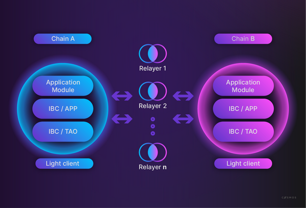

It is useful to briefly recap what relaying is and why it is important. IBC aims to offer blockchains a protocol to enable reliable, secure, and permissionless transfer of packets of data. The protocol is agnostic concerning the data, paving the way for application developers to develop a range of possible interchain services (fungible and non-fungible token transfers are an obvious candidate, but also arbitrary cross-chain messaging via [interchain accounts ](https://interchain-io.medium.com/welcome-to-the-ibc-gang-lets-talk-2f5b95133a5d)).

On a high level, this works as follows. A module on a source chain wants to send a packet to a destination chain. It submits a message to the source chain that stores a commitment proof on-chain and logs an event with the packet information. With this information and the proof, you can submit a message to the IBC client on the destination chain, which will verify the proof and (if successful) store a receipt on-chain and have the receiving module execute the required actions according to the packet data. The acknowledgement and timeout functionality has been discussed [previously](https://ida.interchain.io/academy/3-ibc/3-channels.html).

There are two important considerations to make based on this flow. First, on the receiving chain, you need to verify the commitment proof on the source chain. This is why a light client is used to track the state of the counterparty chain (in an efficient way). Second, blockchains cannot directly communicate with one another. So how do the proof and packet data arrive at the destination chain to continue the flow described above?

This is where the relayer operators come into the picture: they ensure the relaying of the packets over network infrastructure. **Relayers have access to full nodes of both source and destination chains, where they can query and submit messages.** They listen in on the chains they service for events that require an IBC packet to be sent. They run relayer software that enables them to rebuild the packet along with the proof and submit this to the destination chain. A similar process then happens upon storing the receipt on the destination chain, causing the acknowledgement message to be sent to the source.

The relayers are a crucial part of the IBC infrastructure. Remember that relaying is permissionless and trustless (the light client verification provides the trust).