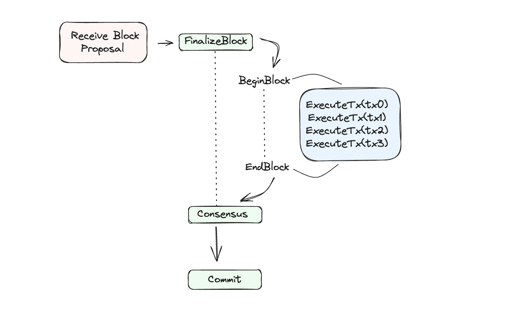

#### Transaction Execution[​](https://docs.cosmos.network/v0.52/learn/advanced/baseapp#transaction-execution "Direct link to Transaction Execution")

When the underlying consensus engine receives a block proposal, each transaction in the block needs to be processed by the application. To that end, the underlying consensus engine sends the transactions in FinalizeBlock message to the application for each transaction in a sequential order.

Since `FinalizeBlock` is an ABCI call, `Tx` is received in the encoded `[]byte` form. Nodes first unmarshal the transaction, using the [`TxConfig`](https://docs.cosmos.network/v0.52/learn/beginner/app-anatomy#register-codec) defined in the app, then call `runTx` in `execModeFinalize`, which is very similar to `CheckTx` but also executes and writes state changes.




efore the first transaction of a given block is processed, a [volatile state](https://docs.cosmos.network/v0.52/learn/advanced/baseapp#state-updates) called `finalizeBlockState` is initialized during FinalizeBlock. This state is updated each time a transaction is processed via `FinalizeBlock`, and committed to the [main state](https://docs.cosmos.network/v0.52/learn/advanced/baseapp#state-updates) when the block is [committed](https://docs.cosmos.network/v0.52/learn/advanced/baseapp#commit), after what it is set to `nil`.

The `FinalizeBlock` ABCI function defined in `BaseApp` does the bulk of the state transitions: it is run for each transaction in the block in sequential order as committed to during consensus. Under the hood, transaction execution is almost identical to `CheckTx` but calls the [`runTx`](https://docs.cosmos.network/v0.52/learn/advanced/baseapp#runtx) function in deliver mode instead of check mode.

Instead of using their `checkState`, full-nodes use `finalizeblock`:

<https://github.com/cosmos/cosmos-sdk/blob/v0.52.0-beta.2/baseapp/baseapp.go#L756-L791>

Transaction execution within `FinalizeBlock` performs the **exact same steps as `CheckTx`**, with a little caveat at step 3 and the addition of a fifth step:

1.  The `AnteHandler` does **not** check that the transaction's `gas-prices` is sufficient. That is because the `min-gas-prices` value `gas-prices` is checked against is local to the node, and therefore what is enough for one full-node might not be for another. This means that the proposer can potentially include transactions for free, although they are not incentivised to do so, as they earn a bonus on the total fee of the block they propose.
2.  For each `sdk.Msg` in the transaction, route to the appropriate module's Protobuf [`Msg` service](https://docs.cosmos.network/v0.52/build/building-modules/msg-services). Additional *stateful* checks are performed, and the branched multistore held in `finalizeBlockState`'s `context` is updated by the module's `keeper`. If the `Msg` service returns successfully, the branched multistore held in `context` is written to `finalizeBlockState` `CacheMultiStore`. Meaning, Protobuf `Msg` service is responsible for executing each message in the `Tx` and causes state transitions to persist in `finalizeBlockState`


During the additional fifth step outlined in (2), each read/write to the store increases the value of `GasConsumed`. You can find the default cost of each operation:


```
v1.1.1/store/types/gas.go
// KVGasConfig returns a default gas config for KVStores.
func KVGasConfig() GasConfig {
	return GasConfig{
		HasCost:          1000,
		DeleteCost:       1000,
		ReadCostFlat:     1000,
		ReadCostPerByte:  3,
		WriteCostFlat:    2000,
		WriteCostPerByte: 30,
		IterNextCostFlat: 30,
	}
}
```

At any point, if `GasConsumed > GasWanted`, the function returns with `Code != 0` and the execution fails.

If there are any failed state changes resulting from a `Tx` being invalid or `GasMeter` running out, the transaction processing terminates and any state changes are reverted. Invalid transactions in a block proposal cause validator nodes to reject the block and vote for a `nil` block instead.

Each transaction returns a response to the underlying consensus engine of type [`abci.ExecTxResult`](https://docs.cometbft.com/v1.0/spec/abci/abci++_methods#exectxresult). The response contains:

-   `Code (uint32)`: Response Code. `0` if successful.
-   `Data ([]byte)`: Result bytes, if any.
-   `Log (string):` The output of the application's logger. May be non-deterministic.
-   `Info (string):` Additional information. May be non-deterministic.
-   `GasWanted (int64)`: Amount of gas requested for transaction. It is provided by users when they generate the transaction.
-   `GasUsed (int64)`: Amount of gas consumed by transaction. During transaction execution, this value is computed by multiplying the standard cost of a transaction byte by the size of the raw transaction, and by adding gas each time a read/write to the store occurs.
-   `Events ([]cmn.KVPair)`: Key-Value tags for filtering and indexing transactions (eg. by account). See [`events`](https://docs.cosmos.network/v0.52/learn/advanced/events) for more.
-   `Codespace (string)`: Namespace for the Code.