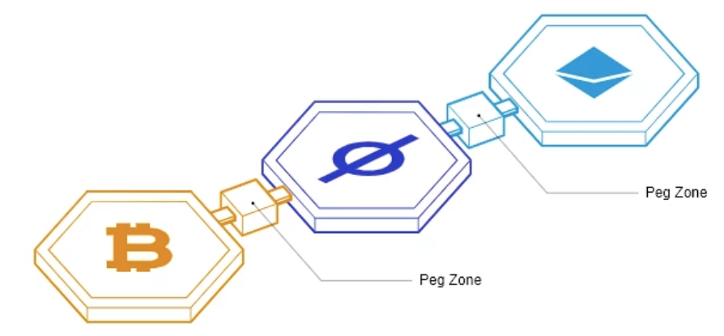

Cosmos is basically an **ordered system**.

All this works based on a consensus mechanism called Tendermint. Tendermint can handle more than ten thousand (10,000) transactions per second.

Cosmos can connect **Proof of Work (POW) and Proof of Stake (POS)** blockchains through Zones and Hubs. **Hubs** represent blockchains that connect Zones, and when a Zone is connected to a Hub it automatically communicates with all the other Zones connected to the Hub. **Zones are** independent blockchains that can communicate with each other through a Hub. We can simply say that a **Zone is a cosmos smart contract.**
So let’s say you want to communicate or carry out a transaction between Bitcoin, Ethereum, and Binance smartchain all you need to do is connect to a cosmos Hub, and, behold you can now carry out your transactions and communicate with each other.

Cosmos (ATOM) is the **1st Hub** in the Cosmos Network

--------
A Zone is a heterogeneous group of Blockchains. The Hub is a blockchain that was specifically designed to connect Zones together. And the 1st hub launched was the Cosmos Hub. It is the Proof-of-Stake blockchain that we know of that uses the token ATOM.

---------

The way it works is that Blockchain-1 tries to send 100 “token1” over to Blockchain-2 which uses” token2”. Well each Blockchain has a light-client of each other tracking the validator set of each other. The 100 token1 is locked up on Blockchain1 and 'sent' over to Blockchain2. Whatever the value of token1 is, that same amount of token2 is created on Blockchain2. Now I know what you are thinking, once there are hundred of Blockchains created with this protocol there will be thousands of connections as each Blockchain will need to be in constant communicated with every other Blockchain. This is where the brilliance of Cosmos really shines in my opinion.

----

-   In Cosmos blockchains, the state-machine is typically connected to the underlying consensus engine via an interface called the [ABCI](https://docs.cometbft.com/v0.37/spec/abci/). This interface can be wrapped in any programming language, meaning developers can build their state-machine in the programming language of their choice.
    
-   Developers can choose among multiple frameworks to build their state-machine. The most widely used today is the Cosmos SDK, but others exist (e.g. [Lotion](https://github.com/nomic-io/lotion), [Weave](https://github.com/iov-one/weave), ...). Typically the choice will be made based on the programming language they want to use (Cosmos SDK and Weave are in Golang, Lotion is in Javascript, ...).
    
-   The ABCI also allows developers to swap the consensus engine of their application-specific blockchain. Today, only CometBFT is production-ready, but in the future other consensus engines are expected to emerge.
    
-   Even when they settle for a framework and consensus engine, developers still have the freedom to tweak them if they don't perfectly match their requirements in their pristine forms.
--------------------
## State machine[​](https://docs.cosmos.network/v0.50/learn/intro/sdk-app-architecture#state-machine)

At its core, a blockchain is a [replicated deterministic state machine](https://en.wikipedia.org/wiki/State_machine_replication).

A state machine is a computer science concept whereby a machine can have multiple states, but only one at any given time. There is a state, which describes the current state of the system, and transactions, that trigger state transitions.

Given a state S and a transaction T, the state machine will return a new state S'.

In practice, the transactions are bundled in blocks to make the process more efficient. Given a state S and a block of transactions B, the state machine will return a new state S'.

----------

[CometBFT](https://docs.cometbft.com/v0.37/introduction/what-is-cometbft) is an application-agnostic engine that is responsible for handling the networking and consensus layers of a blockchain. In practice, this means that CometBFT is responsible for propagating and ordering transaction bytes. CometBFT relies on an eponymous Byzantine-Fault-Tolerant (BFT) algorithm to reach consensus on the order of transactions.

The CometBFT [consensus algorithm](https://docs.cometbft.com/v0.37/introduction/what-is-cometbft#consensus-overview) works with a set of special nodes called Validators. Validators are responsible for adding blocks of transactions to the blockchain. At any given block, there is a validator set V. A validator in V is chosen by the algorithm to be the proposer of the next block. This block is considered valid if more than two thirds of V signed a prevote and a precommit on it, and if all the transactions that it contains are valid. The validator set can be changed by rules written in the state-machine.

**CometBFT** is a Byzantine Fault Tolerant (BFT) middleware that securely replicates a state transition machine, which can be written in any programming language. It is a fork of Tendermint Core and implements the Tendermint consensus algorithm. CometBFT is designed to be easy-to-use, simple-to-understand, highly performant, and useful for a wide variety of distributed applications. It consists of two chief technical components: a blockchain consensus engine and a generic application interface called the Application BlockChain Interface (ABCI). The consensus engine ensures that the same transactions are recorded on every machine in the same order, while the ABCI delivers transactions to applications for processing

Cosmos scales by allowing different blockchains to communicate in a trust-minimized way. Each blockchain (or hub) can connect with different hubs in an archipelago of blockchains. Furthermore, each blockchain can have its own application-specific blockchains, **or app-chains (called zones in the Cosmos ecosystem)** to scale its hub.