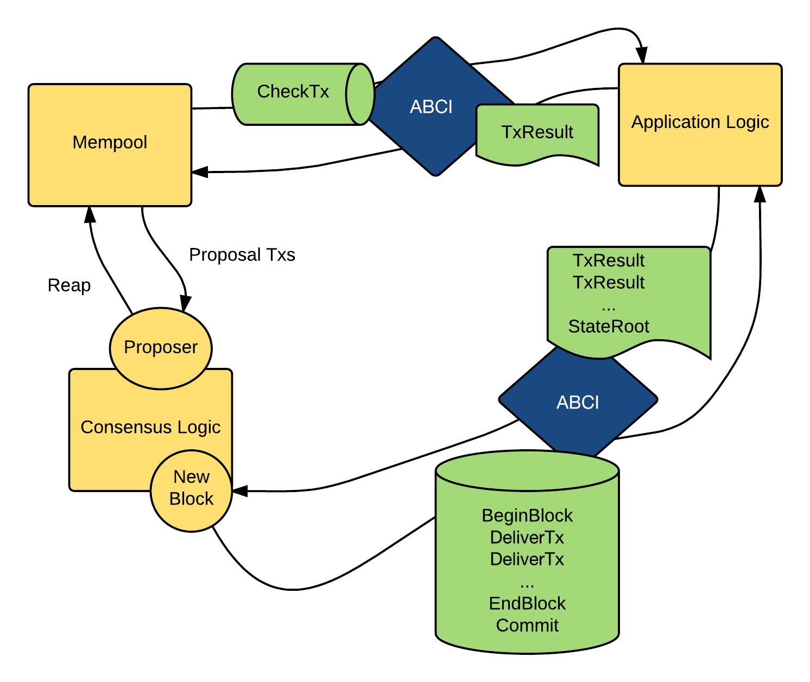

[CometBFT](https://github.com/cometbft/cometbft), the "consensus engine", communicates with the application via a socket protocol that satisfies the ABCI, the CometBFT Socket Protocol

To draw an analogy, let's talk about a well-known cryptocurrency, Bitcoin. Bitcoin is a cryptocurrency blockchain where each node maintains a fully audited Unspent Transaction Output (UTXO) database. If one wanted to create a **Bitcoin-like** system on top of ABCI, **CometBFT** would be responsible for

-   Sharing blocks and transactions between nodes
-   Establishing a canonical/immutable order of transactions (the blockchain)

The application will be responsible for

-   Maintaining the UTXO database
-   Validating cryptographic signatures of transactions
-   Preventing transactions from spending non-existent transactions
-   Allowing clients to query the UTXO database.
-   

--------

The ABCI consists of **3 primary** message types that get delivered from the core to the application. The application replies with corresponding response messages.

The messages are specified here: [ABCI Message Types](https://github.com/cometbft/cometbft/blob/v0.38.x/proto/tendermint/abci/types.proto)

1.  **What is the purpose of the FinalizeBlock message?**

    -   The FinalizeBlock message is crucial for the application as it finalizes each transaction in the blockchain. It validates each transaction against the current state, application protocol, and cryptographic credentials. However, it only prepares the update and does not change the application state, which is committed later during the commit phase.
2.  **How does the CheckTx message function in the application?**

    -   The CheckTx message is used for validating transactions. CometBFT's mempool utilizes CheckTx to verify the validity of a transaction before relaying it to peers. For example, it may check an incrementing sequence number and return an error if the sequence number is outdated. Alternatively, a capabilities-based system might require capabilities to be renewed with each transaction.
3.  **What role does the Commit message play in the application?**

    -   The Commit message is used to compute a cryptographic commitment to the current application state, which is then included in the next block header. This helps detect inconsistencies as blockchain forks, simplifying the development of secure lightweight clients by allowing Merkle-hash proofs to be verified against the block hash, which is signed by a quorum.
4.  **How many ABCI socket connections can an application have, and what are their purposes?**

    -   An application can have multiple ABCI socket connections. CometBFT establishes four connections: one for validating transactions when broadcasting in the mempool, another for the consensus engine to run block proposals, a third for creating snapshots of the application state, and a fourth for querying the application state.