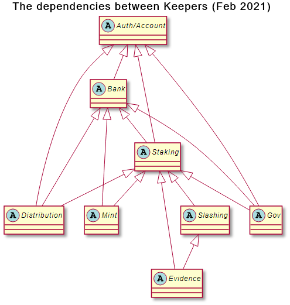

> The structural properties of object capability systems favor modularity in code design and ensure reliable encapsulation in code implementation.
>
> These structural properties facilitate the analysis of some security properties of an object-capability program or operating system. Some of these --- in particular, information flow properties --- can be analyzed at the level of object references and connectivity, independent of any knowledge or analysis of the code that determines the behavior of the objects.
>
> As a consequence, these security properties can be established and maintained in the presence of new objects that contain unknown and possibly malicious code.
>
> These structural properties stem from the two rules governing access to existing objects:
>
> 1.  An object A can send a message to B only if object A holds a reference to B.
> 2.  An object A can obtain a reference to C only if object A receives a message containing a reference to C. As a consequence of these two rules, an object can obtain a reference to another object only through a preexisting chain of references. In short, "Only connectivity begets connectivity."

For an introduction to object-capabilities, see this [Wikipedia article](https://en.wikipedia.org/wiki/Object-capability_model).

