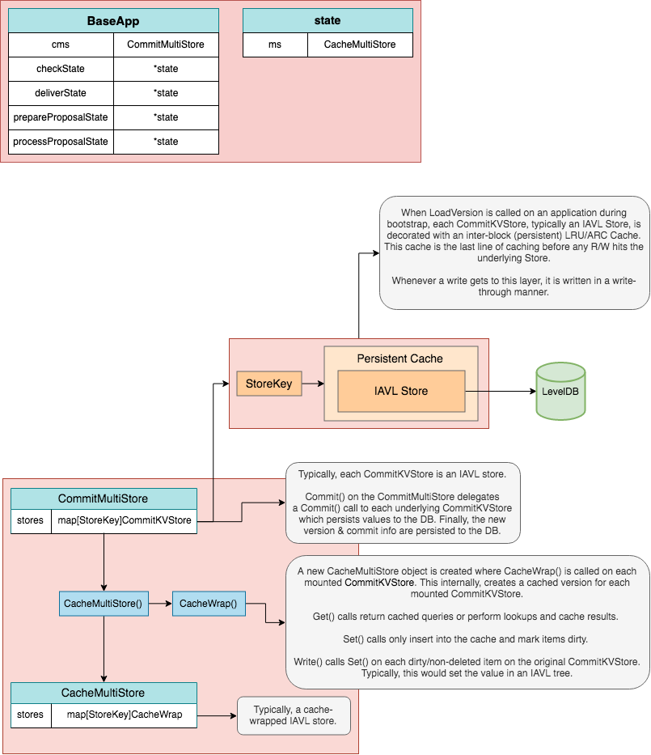
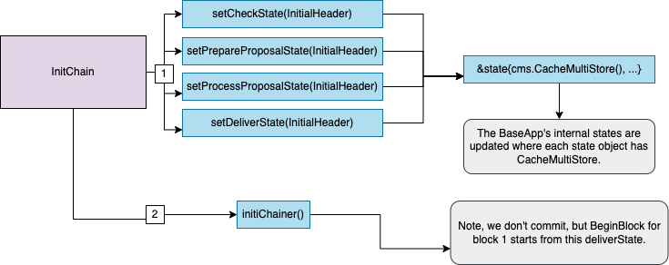

The `BaseApp` maintains four primary volatile states and a root or main state. The main state is the canonical state of the application and the volatile states, `checkState`, `prepareProposalState`, `processProposalState` and `finalizeBlockState` are used to handle state transitions in-between the main state made during [`Commit`](https://docs.cosmos.network/v0.50/learn/advanced/baseapp#commit).

Internally, there is only a single `CommitMultiStore` which we refer to as the main or root state. From this root state, we derive four volatile states by using a mechanism called *store branching* (performed by `CacheWrap` function). The types can be illustrated as follows:

### InitChain State Updates[​](https://docs.cosmos.network/v0.50/learn/advanced/baseapp#initchain-state-updates "Direct link to InitChain State Updates")

During `InitChain`, the four volatile states, `checkState`, `prepareProposalState`, `processProposalState` and `finalizeBlockState` are set by branching the root `CommitMultiStore`. Any subsequent reads and writes happen on branched versions of the `CommitMultiStore`. To avoid unnecessary roundtrip to the main state, all reads to the branched store are cached.

