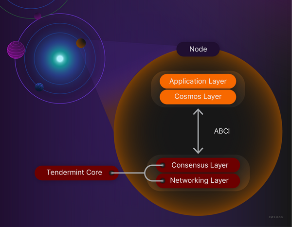

What are Tendermint and CometBFT?
---------------------------------

Created in 2014, [Tendermint ](https://tendermint.com/)accelerates the development of distinct blockchains with a ready-made networking and consensus solution, so developers do not have to recreate these features for each new case. You may already use Tendermint without being aware of it.

Tendermint modules **attend to consensus and networking**, which are important components of any blockchain. This frees developers to focus on the application level without descending into lower-level blockchain concerns such as peer discovery, block propagation, consensus, and transaction finalization. Without Tendermint, developers would be forced to build software to address these concerns, which would add additional time, complexity, and cost to the development of their applications.

A blockchain node for an application-focused Cosmos blockchain consists of a state-machine, built with the Cosmos SDK, and the consensus and networking layer, which are handled by [CometBFT ](https://docs.cometbft.com/v0.37/).

What is CometBFT?

CometBFT is a blockchain application platform which supports state machines in any language. The language-agnostic CometBFT helps developers securely and consistently replicate deterministic, finite state machines.
CometBFT is maintained even when 1/3rd of all machines fail, by providing two components:

-   A blockchain consensus engine.
-   A generic application interface.