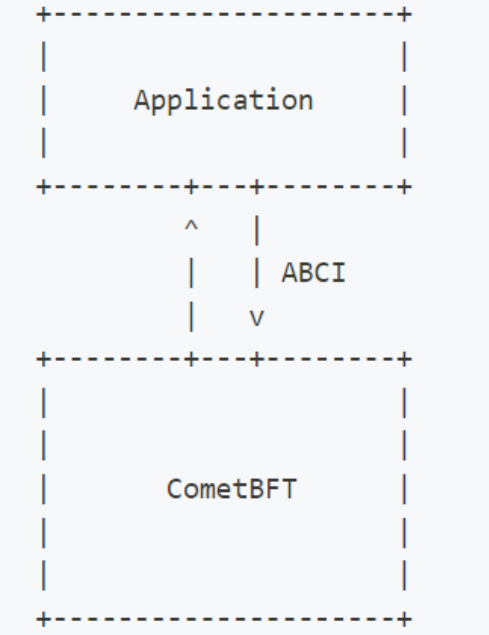

Note that **CometBFT** only handles transaction bytes. It has no knowledge of what these bytes mean. All CometBFT does is order these transaction bytes deterministically. CometBFT passes the bytes to the application via the ABCI, and expects a return code to inform it if the messages contained in the transactions were successfully processed or not.

Here are the most important messages of the **ABCI**:

-   **CheckTx**: When a transaction is received by CometBFT, it is passed to the application to check if a few basic requirements are met. CheckTx is used to protect the mempool of full-nodes against spam transactions. . A special handler called the [AnteHandler](https://docs.cosmos.network/v0.50/learn/beginner/gas-fees#antehandler) is used to execute a series of validation steps such as checking for sufficient fees and validating the signatures. If the checks are valid, the transaction is added to the [mempool](https://docs.cometbft.com/v0.37/spec/p2p/messages/mempool) and relayed to peer nodes. Note that transactions are not processed (i.e. no modification of the state occurs) with CheckTx since they have not been included in a block yet.
    
-   **DeliverTx**: When a [valid block](https://docs.cometbft.com/v0.37/spec/core/data_structures#block) is received by CometBFT, each transaction in the block is passed to the application via DeliverTx in order to be processed. It is during this stage that the state transitions occur. The AnteHandler executes again, along with the actual [Msg service](https://docs.cosmos.network/v0.50/build/building-modules/msg-services) RPC for each message in the transaction.
    

- **BeginBlock/EndBlock**: These messages are executed at the beginning and the end of each block, whether the block contains transactions or not. It is useful to trigger automatic execution of logic. Proceed with caution though, as computationally expensive loops could slow down your blockchain, or even freeze it if the loop is infinite.
--------------
Find a more detailed view of the ABCI methods from the [CometBFT docs](https://docs.cometbft.com/v0.37/spec/abci/).

Any application built on CometBFT needs to implement the ABCI interface in order to communicate with the underlying local CometBFT engine. Fortunately, you do not have to implement the ABCI interface. The Cosmos SDK provides a boilerplate implementation of it in the form of [baseapp](https://docs.cosmos.network/v0.50/learn/intro/sdk-design#baseapp).

-----------
**The Cosmos Hub is built using the [Cosmos SDK](https://github.com/cosmos/cosmos-sdk) and compiled to a binary called gaiad (Gaia Daemon). The Cosmos Hub and other fully sovereign Cosmos SDK blockchains interact with one another using a protocol called [IBC](https://github.com/cosmos/ibc) that enables Inter-Blockchain Communication. In order to understand what the Cosmos Hub is you can read this [introductory explanation](https://hub.cosmos.network/main/hub-overview/overview.html).**

------
# IBC-Go Documentation

[IBC-Go Documentation | IBC-Go (cosmos.network)](https://ibc.cosmos.network/v8/)

Welcome to the documentation for IBC-Go, the Golang implementation of the Inter-Blockchain Communication Protocol! Looking for information on ibc-rs?  [Click here to go to the ibc-rs github repo](https://github.com/cosmos/ibc-rs).

The Inter-Blockchain Communication Protocol (IBC) is an end-to-end, connection-oriented, stateful protocol for reliable, ordered, and authenticated communication between heterogeneous blockchains arranged in an unknown and dynamic topology.

IBC is a protocol that allows blockchains to talk to each other. Chains that speak IBC can share any type of data as long as it's encoded in bytes, enabling the industry’s most feature-rich cross-chain interactions. IBC is secure and permissionless.

---------

**CosmJS** is the primary JavaScript library for interacting with the Cosmos network, including the Cosmos Hub. It provides developers with tools to connect to a Cosmos blockchain, query data, send transactions, interact with smart contracts, and more, all within a JavaScript environment. This makes it an essential tool for web developers building applications on top of the Cosmos ecosystem.

---------