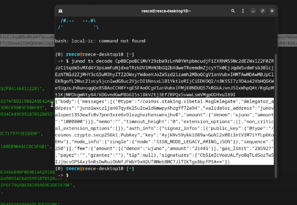

Decoding transactions in Cosmos can be challenging. This guide explains how to decode transactions found via the REST API or RPC on cosmos.directory.

Initial Approach
----------------

1.  Start with an array of transactions
2.  These transactions are in a non-human readable format
3.  Initial instinct: Try base64 decoding

### Base64 Decoding

-   Use a base64 decoder
-   Result: Some data is visible (e.g., "message delegate", "Juno")
-   **Problem**: Not an ideal format, fee information unclear

Using Cosmos Binaries for Decoding
----------------------------------

### Steps:

1.  Use the Juno Network binary
2.  Utilize the `TX` command for decoding
3.  Enter the JSON Amino base64 encoded transaction

### Command:

```

Copy

`juno tx decode [JSON_AMINO_BASE64_ENCODED_TRANSACTION]`

```

### Output Format:

-   JSON format (use `output=json` if not default)

### Benefits:

-   Provides detailed information:
    -   Message type (e.g., delegate)
    -   Sender information
    -   Signer information
    -   Public keys

Alternative Decoding Methods
----------------------------

-   Build other Proto languages based on Proto files
-   Decode using Python, TypeScript, or Java
-   Mass decoder for multiple transactions (useful for indexers)

Obtaining Transaction Hash
--------------------------

### Process:

1.  Decode the base64 Amino
2.  Wrap the decoded data in a SHA256 hash
3.  Verify on an explorer

### Commands:

```
bash
Copy

`echo[BASE64_AMINO]| base64 -d | sha256sum`

```

### Verification:

-   Search the resulting hash on a blockchain explorer
-   Verify transaction details (e.g., delegation amount, fees)

Implementation in Other Languages
---------------------------------

### Python/TypeScript Approach:

1.  Take the base64 Amino
2.  Convert and decode the bytes
3.  For transaction hash:
    -   Take SHA256 of decoded bytes
    -   Hex digest the result
    -   Return as uppercase string
-   
------------------


**Decoding Transactions in Cosmos**

**The Problem**

-   Transactions in Cosmos can be difficult to decode
-   Raw transaction data is not human-readable

**Decoding Transactions**

-   **Method 1: Using the `tx` command**
    -   Use the `tx` command with the `decode` option
    -   Provide the base64-encoded transaction data
    -   Returns the transaction data in a JSON format
-   **Example:**
    -   `junod tx decode <base64-encoded-transaction-data>`
    -   Returns the transaction data in a JSON format

**Decoding Transactions using `tx` command output**

-   **JSON Output:**
    -   `output=json` option can be used to get the output in JSON format
    -   Returns the transaction data in a JSON format
-   **Example:**
    -   `junod tx decode <base64-encoded-transaction-data> --output=json`
    -   Returns the transaction data in a JSON format

**Getting the Transaction Hash**

-   **Method 1: Using `sha256sum` command**
    -   Decode the base64-encoded transaction data
    -   Use the `sha256sum` command to get the transaction hash
    -   Returns the transaction hash
-   **Example:**
    -   `echo <base64-encoded-transaction-data> | base64 -d | sha256sum`
    -   Returns the transaction hash

**Getting the Transaction Hash in Other Languages**

-   **Python:**
    -   Use a base64 decoder to decode the transaction data
    -   Use a SHA256 hash function to get the transaction hash
    -   Return the transaction hash as an uppercase string
-   **Typescript:**
    -   Use a base64 decoder to decode the transaction data
    -   Use a SHA256 hash function to get the transaction hash
    -   Return the transaction hash as an uppercase string

**Notes**

-   The `tx` command can be used to decode transactions in a more readable format
-   The `sha256sum` command can be used to get the transaction hash
-   Other languages can use similar methods to decode transactions and get the transaction hash.